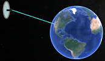
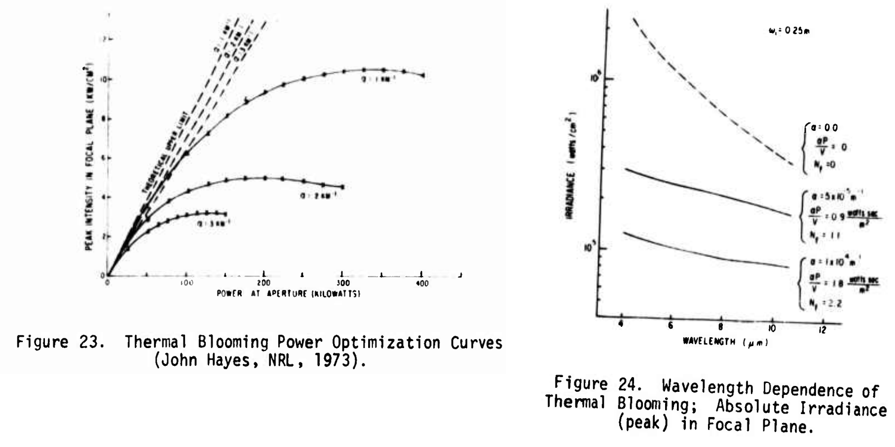

```{r, out.width = 800,   echo=FALSE, fig.cap="Source: https://www.cbsnews.com/sanfrancisco/news/bay-area-lawmakersmarjorie-taylor-greene-camp-fire-jewish-space-laser-conspiracy-theory/", include=F}
knitr::include_graphics('marjorietaylorgreene-campfire.png')

library(ggpubr)
library(metathis)

meta() %>% meta_social(image = "https://jmdavis0352.github.io/What-are-we-doing/laserparam.png")

```


Solaren has not yet launched their space-based solar generation system (which didn't include lasers anyway) [@solarenFacebookPostReferencing2021] when Rep Greene made her original post (since deleted)^[], so this particular claim cannot be true ^[A skeptical reader may consider Solaren an unreliable source for refuting the claim that Solaren Energy systems never actually launched and so could not have started the fires with energy beams from space. We counter argue that Rep. Greene's initial assessment of the launch came from Solaren press material and propose that were a nefarious company trying to obfuscate the launch of it's space laser system the original press release announcing the plan seems implausible]. However, since the system is still under development, a design opportunity exists for Jewish space laser enthusiasts. We develop a crude feasible design region for Jewish Space Lasers capable of igniting wood or grass from geosynchronous orbit with respect to wavelength (visible spectrum), laser aperture, and total system power. These calculations represent a rough order of magnitude estimate for system requirements and will facilitate the development of future Jewish Space-based laser platforms. 

<aside>

Jewish Space Laser Architecture 
(not to scale)


</aside>

## System Requirements
The authors conducted user base surveys to elicit the needs of the Jewish Space Laser enthusiast community using a modified Delphi panel method^[There were some facebook comments exchanged]. The modifications to the panel method reduced cost and facilitated rapid requirements development. For this analysis the laser system under examination must:

* Occupy a geosynchronous orbit above North America
* Change orientation (targeting) using reaction wheel assemblies and magnetic torquers (based on Hubble Space Telescope design) ^[We didn't actually consider this in the design at all, but the authors enjoy the phrase "magnetic torquers"]
* Produce a beam in the blue wavelengths ($\lambda = 450 nm$, based on user surveys)
* Support variable output power range such that the beam energy density at earth surface can either toast a bagel to perfection or destroy all threats (ignite wood and brush, instill fear and suspicion)
* Produce a flat top beam profile (because it makes our calculations for energy density requirements at Earth surface simpler)


## Assumptions
Since this effort was executed without funding or expertise, we make the following simplifying assumptions:

  * Total wall plug efficiency of the laser system accounting for power required for cooling systems, communications, satellite orientation, navigation, computer controls systems, heat loss, and orbit maintenance is 15%. This number is commensurate with various other laser systems [@shammiVariableLaserWallplug2018] and the 2.2 MJ pulse laser at the National Ignition Facility [@bayramianCompactEfficientLaser2011].
  * The laser beam quality is evaluated for assumed values of beam propagation ratios ($M^2$) where $M^2 \in [3,20]$. High energy multi-modal lasers tend to exhibit poor beam quality [@newportcorporationLaserBeamSpatial2021]. Zlobina et al [-@zlobinaGeneratingHighqualityBeam2017] demonstrate techniques to improve beam quality, reducing $M^2$ in a 50W CW Raman laser from 26 to 2.6. High energy pulse lasers with near diffraction limited Gaussian beams are possible [@millerGenerationHighenergyGaussian2020], but nanosecond pulse laser systems are probably ill suited for fire starting. Additionally a nano-second pulse laser is less likely to be visually observed by conspiracy minded individuals. A tertiary consideration for expending the resources required to deploy an extraordinarily expensive and impractical technology solution into orbit (that achieves the same effect as a plausibly deniable gender reveal party) is the subtle fear we may inspire in our adversaries as they whisper of space laser threats to their blood and soil. There is no purer mechanism to burn the blood and scorch the soil than the raw essence of the universe, packaged into photons descending from the heavens at Jewish wavelengths. 
  * Feasible laser apertures or beam waists ($W_0$ ) range from 40cm - 200 cm. Larger apertures are desirable because they minimize beam divergence. The National Ignition Facility laser elements each use an optical aperture of 40 cm so we know this is feasible (for a multi-pass pulse laser architecture on Earth surface anyway). Laser apertures up to 10 km may be possible with coherent laser arrays such as those suggested for light sail propulsion [@fugateSharshotPropulsionSystem2017], but the complexities of constructing and tuning such an array for an orbital platform seem daunting so we ignore them here.
  
The next section describes assumptions related to beam propagation in the atmosphere. Simple assumptions regarding high energy laser propagation through the atmosphere are not evident in the literature, so we present a short discussion before giving up. 
  
  
### The Atmosphere
The atmosphere is...problematic. Experiments and theoretical work performed in the 1960's and 70's demonstrate that high energy lasers suffer from beam wander and wave front errors propagating through a turbulent medium [@hoggePropagationHighEnergyLaser1974]. The wave front errors seem particularly challenging because the beam itself heats the atmosphere as it propagates, which modifies the refractive properties of the atmosphere, which modifies the propagation of the beam (thermal blooming). Hogge [-@hoggePropagationHighEnergyLaser1974] provides some incomprehensible equations and charts^[Literally incomprehensible, the pdf is a scanned print and it's not possible to read some of the notation] that describe these effects. Figure \@ref(fig:PowerOpt) seems to illustrate relationships between beam energy at aperture and beam energy in the focal plane (for an unspecified distance and unspecified wavelength) in turbulent conditions. The linear relationships represent theoretical maximums. The sad reveal is that there is a point of optimal beam energy in the focal plane after which increased aperture energies actually *reduce* focal plane energies (presumably because of increased thermal blooming). This affect may not be as pronounced for our system because the beam diameter will be quite large at Earth atmosphere, but without advanced calculations specific to this problem it's not possible to assess how this particular beam will behave. 


<aside>
We gave up on the atmosphere.
Seems hard.
</aside>
 
```{r PowerOpt, echo=F, fig.cap="Some incomprehensible charts from: https://apps.dtic.mil/sti/tr/pdf/AD0781763.pdf", out.extra="class=external"}

```

Suppose we consider our beam originating at the edge of earth atmosphere rather than at geosynchronous orbit. It still must propagate through about 96 km of atmosphere to earth surface where dry vegetation awaits combustion. If we assume for the present that combustion of dry wood is achievable with a 1W laser focused to a 6mm^2^ spot this results in an energy density of 166,666 $\frac{W}{m^2}$. 

<aside>
Is it a coincidence that a hypothesized energy density to create fire (hell) includes the mark of the Beast? We merely pose this question for the reader.
</aside>

Even a Gaussian beam originating at geosynchronous orbit would  be over 20m in diameter at the edge of the atmosphere for the range of apertures considered here. Further simplifying this discussion, if we assume the beam does not diverge for the remainder of the trip and there is no energy loss for the last 96km, the total energy in the beam at the edge of earth atmosphere to the meet the energy density required for ignition we speculate above would be: 

$$\frac{166,666W}{m^2}[\pi(10m)^2]= 52,359,668W$$

A 20m diameter laser with total beam energy of 52MW puts us well beyond Hogge's calculations above. We frankly have no idea what will happen and suggest consulting with a team of laser and atmospheric physicists and photonics and optics experts. 
   

***We assume the total energy density effect of the atmosphere on the beam is 1/10 (irrespective of wavelength or laser aperture), but we have no idea what we're doing, this might not work at all] ***
  

## Methods
### Determining required beam energy density at earth surface
We estimated the beam energy density required to ignite vegetation and toast bagels by experimenting with a low power (~$10^0 W$) retail laser at 450nm. Figure \@ref(fig:laserexp) illustrates the layout of the experiments. Two experiments of the same design evaluate power requirements to either toast bagels or destroy all threats (ignite dry biomass). Destroying threats requires more energy density than toasting bagels, so this paper is limited to that use case as a design driver. We secured the laser in a 2-axis machining vice with the aim point at either various segments of the bagel or at a pile of dry sticks. Distance deviations achieved by moving the machining vice along the axis of beam prorogation modified the beam convergence at the target and thus simulated lasers of different energy densities. Beam spot size was measured directly at the target distance with dial calipers (to calculate energy density for a known laser power output). We recharged the laser batteries between tests to ensure power output did not diminish over the experiment. 

<aside>
This experiment proved quite tedious, so these results are approximate, and possibly fabricated. We feel such a methodology is appropriate for this genre of research. 
</aside>

```{r laserexp,  fig.cap="Laser ignition experiment configuration", echo=FALSE}
knitr::include_graphics('laser_experiment.jpg')

```

Is it a coincidence that the result of our experiment was exactly the previously hypothesized power requirement? 

### Calculating the resulting orbital platform power requirement
A basic calculation is possible with a few simple formulas. The beam divergence half angle $\theta$, in radians, is given by:

$$
\theta = M^2\frac{\lambda}{\pi W_0}
$$
So we can calculate the area of the beam $B_A$ at a given distance (assuming a circular beam shape with M^2^ equal in both axes) with some simple geometry as:

$$
B_A = \pi(\theta d)^2
$$
where $d$ is the propagation distance from the aperture in meters (from geosynchronous orbit $d = 35,786,000m$). 

Adding some notation we let:

&nbsp;&nbsp;&nbsp;&nbsp;&nbsp;${E_d}^*$ *be energy density required at Earth surface to ignite vegetation or toast bagels*  
&nbsp;&nbsp;&nbsp;&nbsp;&nbsp;$A = 0.1$ *be the total effect of the atmosphere on the beam energy*  
&nbsp;&nbsp;&nbsp;&nbsp;&nbsp;$Ef_{wp} = 0.15$ *be the total wall-plug efficiency of the laser system*  
&nbsp;&nbsp;&nbsp;&nbsp;&nbsp;$P_s$ *be the total system power in geosynchronous orbit* 
  
Since the energy density at Earth surface will be the total energy in the beam distributed over the beam area then 

$$
E_d = \frac{P_sAEf_{wp}}{\pi(\theta d)^2} 
$$
We can rearrange this equation with all the original terms to solve for a system power requirement that will yield the required energy density of our laser system at Earth surface ${E_d}^*$ based on our assumptions above.

$$
P_s = \frac{{E_d}^*{\pi(M^2\frac{\lambda}{\pi W_0} d)^2}}{AEf_{wp}} 
$$

## Results  


```{r, echo=F}

library(ggplot2)
## don't know if i'll use this but it's awesome:
## https://space.stackexchange.com/questions/88/what-is-the-total-mass-sent-into-orbit-over-all-history


powerReq <- function(aperture, energyDensity , wavelength = 450, distance, efficiency = .2, atmosphere = .1, M2 ){
  
beamdivergence <- M2*wavelength/(pi*aperture)
spotsize  <- pi*(beamdivergence*distance*1000)^2
  
return(list(Watts = (166666*spotsize)/(atmosphere*efficiency), BeamArea = spotsize ))
  
}

ap <- seq(.4, 2, .01)
wl <- 450
m2 <- seq(3,20, 1)

LaserParam <- expand.grid(Aperture = ap, Wavelength = wl, M2 = m2 )

## Geosynch orbit = 35786km

LaserParam$PowerReq <- apply(LaserParam, 1, FUN = function(x){powerReq(aperture = x[1], M2= x[3], energyDensity = 166666, wavelength = x[2]*(1e-9), distance = 35786)$Watts})
LaserParam$BeamArea <- apply(LaserParam, 1, FUN = function(x){powerReq(aperture = x[1], M2= x[3], energyDensity = 166666, wavelength = x[2]*(1e-9), distance = 35786)$BeamArea})
LaserParam$MWatts <- LaserParam$PowerReq/1e6
LaserParam$GWatts <- round(LaserParam$PowerReq/1e9, 2)
LaserParam$BeamDiameter <- sqrt(LaserParam$BeamArea/pi)*2


library(plotly)
library(ggsci)

LaserParam$tip <- paste0("Aperture: ", LaserParam$Aperture, "m</br></br>", "Power:", round(LaserParam$GWatts, 2), "(GW)</br>M2:", LaserParam$M2)


```

We executed the calculation developed in the previous section at the values of laser aperture and $M^2$ defined above for a beam with $\lambda = 450nm$ (a lovely vibrant blue). We also examined the effect of wavelength on the requirements between $445nm$ and $490nm$ but the effect is very small compared to the aperture and beam propagation ratio so we did not include those results. Figure \@ref(fig:result) illustrates the relationship between laser aperture and system power requirements for a given beam propagation ratio ($M^2$). Achieving a large aperture will be critical to feasibility. A 40cm aperture requires *at least* `r round(min(LaserParam$GWatts[LaserParam$Aperture == .4]),0)` GW of power in geosynchronous orbit, which doesn't seem feasible, or at least affordable. For reference the Palo Verde nuclear power plant in Arizona is the largest in the U.S with a maximum capacity of about 4 GW.

<aside>
4 GW of Nuclear Power at Palo Verde


</aside>


```{r result,  fig.cap="Sensitivity of system power requirements to laser characteristics", echo=FALSE }

ggplotly(

  ggplot(subset(LaserParam, M2<=20) ,
                aes(x = Aperture, y = GWatts, colour = M2)) + geom_line() + scale_colour_viridis_c() +
           labs(y = 'GigaWatts Required in Orbit', x = 'Laser Aperture (m)')  + scale_y_continuous(breaks = seq(0,max(LaserParam$GWatts),100))

  )


```

Solaren's planned solar power generation plant will generate 200 MW by design. Based on our assumptions regarding feasible apertures,  propagation ratios, wall plug efficiency, and the effect of the atmosphere, the minimal power plant capacity required to support this system is `r round(min(LaserParam$GWatts), 2)*1000` MW. 

We encourage the Jewish Space Laser enthusiast community to use these results to inform future system designs and technology investments. Developing large aperture, high quality beams is critical to the feasibility of deploying such a ridiculous system. While staging a pyrotechnic gender reveal party or having an agent toss a lighter is astronomically cheaper, these tactics lack the Bond villain essence of parody that apparently smacks of truth to some members of Congress. 

## Acknowledgements {.appendix}
I think we all know who's behind this.