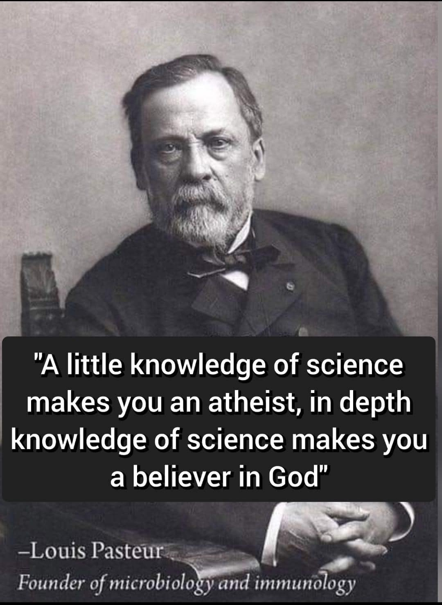

```{r setup, include=FALSE}
knitr::opts_chunk$set(echo = FALSE)

library(tidyverse)
pewdata <- read.csv('PewData.csv') %>% pivot_wider(id_cols = c(Affiliation, Color, ynudge, ynudge_c), names_from = Transition, values_from = Effect)

```

Memes excel at attracting attention and focus for short duration, high impact information injections. The combination of a compelling image with just the right words can effect a specific psychological response in the viewer and we would be naive to reject the suggestion that at least some of the memes flitting across the internet are precision-guided information munitions crafted by our adversaries and targeted with malign intent. Most are probably cats, many are probably just constructed by people trying to amplify a viewpoint that conforms to the in-group's viewpoint. Today's examination is of one more closely aligned to the last category. 

### What's in a Meme?
Frequently, memes contain misleading information, misinformation, logical fallacies, and manipulative intent. I recently came across the following:

```{r pasterur, preview=TRUE }


```


This meme, like many memes, has a lot going on, and presents an interesting opportunity for study.

It seems like that statement (or similar forms of it) has been misattributed to Pasteur since around 1920 (consult the google). It is almost certainly a reconstruction of Francis Bacon's essay "Of Atheism" (written ~1612) which includes the passage

>"It is true, that a little philosophy inclineth man’s mind to atheism, but depth in philosophy bringeth men’s minds about to religion" [@bacon1612]. 

The change in attribution likely seeks to exploit Pasteur's household name recognition (all the kids learn about Pasteurized milk). 

The attribution to a widely recognized scientific figure, amplified by the annotation indicating Pasteur is the father of two fields of study is probably intended as a, logically fallacious, appeal to authority. Being the father of two fields of study is better than one but at least with respect to microbiology that attribution usually goes further back to Leeuwenhoek who discovered protists and bacteria and reported results in a 1677 paper [@lane2015]. 

Pasteur's place as the father of immunology is more credible but still debated by some scholars. Smith [-@smith2012] recognizes Pasteur's achievements but candidly discusses seeming breeches of integrity in the competition with M. Toussaint in 1880 when they were both developing an anthrax vaccine. Toussiant developed a vaccine that incorporated dead bacteria that was effective in a trials of dogs and sheep. Pasteur's theory at the time insisted on live pathogens depleting the host of some essential nutrient required to support pathogen reproduction and he sharply criticized Toussaint's methods. A challenge arose and Pasteur administered a vaccine that succeeded well. In his public discussion of methods he stated "...living vaccines, cultivatable at will, transportable anywhere without alteration, and, lastly, prepared by a method that one may consider capable of generalization since it served a previous time for a discovery of the chicken cholera vaccine." The actual vaccine he used in the test was not based on live cultured bacteria, but was based on another method similar to Toussaint's that killed the bacteria with potassium bichromate. Pastuer was lauded and Smith [-@smith2012] reports that "Toussaint subsequently published only 2 more scientific papers before he died in 1890 at the age of 43, after suffering a mental breakdown." 

Of course that history isn't particularly relevant to the analysis of our meme, but it was interesting to learn. So what else is going on? The statement of the meme itself, misattributed to authoritative appeal, is demonstrably false in the sense that such a relationship is not evident. Available data is mixed, but most likely supports the opposite trend, particularly respecting deep scientific knowledge. 

A 2017 Pew survey [@pew2017] found that "Overall, U.S. adults with college degrees are less religious than others, but this pattern does not hold among Christians". The specificity of these results is low. Measures are self reported frequency of prayer and belief in God etc. The Pew Survey acknowledges the previous work of Schwandel [-@Schwadel2011] that finds "education negatively affects exclusivist religious viewpoints and biblical literalism but not belief in God or the afterlife" and other positive associations between education levels and religious activities.  

The Pew survey examines relationships within denominational groups and finds opposing trends depending on group affiliation. Catholics, Latter-Day Saints, Historically black Protestants and Evangelicals all exhibit positive correlations between education levels (High School --> Undergraduate Degree) and the percentage believing "in God with absolute certainty". Mainline Protestants and the religiously unaffiliated exhibit negative correlations between High School and College education levels (Figure \@ref(fig:pewtable))

```{r pewtable, fig.width=10, fig.height = 8,fig.cap="Percentage of Survey Participants who \"believe in God with absolute certainty\", change from high school to college education. Data from: [@pew2017]"}

ggplot(pewdata, aes(x = Affiliation)) + 
  geom_segment(aes(xend = Affiliation, y = `High School`, yend = College, colour = Color), 
               size = 2,arrow = arrow(length = unit(0.5, "cm")), show.legend = T ) + scale_color_discrete(type = c('red', 'green')) + 
  geom_text(aes(y = `High School`, label = scales::percent(`High School`) ), nudge_y = pewdata$ynudge, hjust = 0.3) +
    geom_text(aes(y = College, label = scales::percent(College) ), nudge_y = pewdata$ynudge_c, hjust = 0.3) +
  scale_y_continuous(labels = scales::percent, limits = c(0,1)) + theme_minimal() + 
  theme(text = element_text(size = 16), axis.text.x = element_text(angle = 90, hjust = 1, vjust = .5), 
        axis.title = element_text(size = 15), legend.title = element_blank(), legend.position = 'top',
        legend.text = element_text(size = 14)) +
  labs(x = NULL, y = NULL )

```

A limitation in the data above to the analysis of our meme is that those results are related to education in general, most of which probably falls under the "little science" bracket. So what does depth of knowledge impart to religiosity? 

An international survey of 9,422 physicists and biologists in 2016 [@Ecklund2016] found the percentage of respondents indicating an absolute belief in God was less than or equal to 20% for all countries included except Turkey (61%) and India (26%).^[The majority of the scientists in Turkey were Muslim and the majority in India were Hindu.] **The proportion of physicists and biologists indicating absolute belief in God in the United States was 10%.** A 2009 Pew Research Survey [@pew2009] among members of the American Association for the Advancement of Science found 

>"just over half of scientists (51%) believe in some form of deity or higher power; specifically, 33% of scientists say they believe in God, while 18% believe in a universal spirit or higher power. By contrast, 95% of Americans believe in some form of deity or higher power" 

That same survey found Physics and Astronomy to exhibit the highest rate of non-belief (46% do not believe in God or in a universal spirit or higher power) and that older scientists were less likely to believe (48% do not believe among 65+ vs 32% among 18-34)

Larson and Witham [-@Larson1998] illustrate that this trend is not new, reporting that 

>US psychologist James H. Leuba [found in] his landmark survey of 1914...that 58% of 1,000 randomly selected US scientists expressed disbelief or doubt in the existence of God, and that this figure rose to near 70% among the 400 “greater” scientists within his sample. Leuba repeated his survey in somewhat different form 20 years later, and found that these percentages had increased to 67 and 85, respectively. In 1996, we repeated Leuba's 1914 survey and reported our results in Nature. We found little change from 1914 for American scientists generally, with 60.7% expressing disbelief or doubt. This year, we closely imitated the second phase of Leuba's 1914 survey to gauge belief among “greater” scientists, and find the rate of belief lower than ever — a mere 7% of respondents.

So a brief examination of the literature suggests that Bacon may have gotten it wrong back in 1612 -- of course he might have gotten it exactly right in 1612 but we don't have any contemporaneous data. At the very least I have not found any evidence in the literature that supports the notion that the deeper the science knowledge a person attains the more likely they are to be "a believer in God." The data seem to indicate the opposite. 

