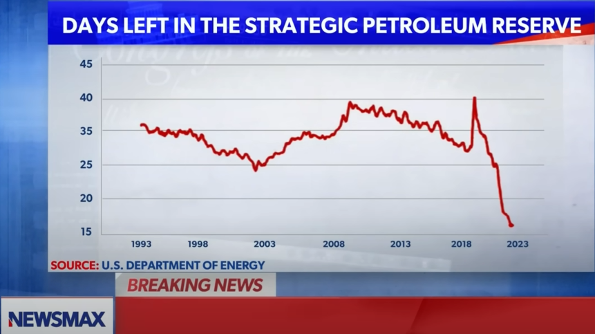

```{r setup, include=FALSE}
knitr::opts_chunk$set(echo = FALSE)

library(plotly)
library(tidyverse)
library(scales)
library(foreach)

################### Prepare data ###############

## SPR inventory
SPR <- read.csv('Weekly_U.S._Ending_Stocks_of_Crude_Oil_in_SPR.csv')
SPR$Week.of <- mdy(SPR$Week.of)
SPR$Barrels <- SPR$SPR_ThousanBarrels*1000 ## convert to raw numbers of barrels
SPR$Month <- my(paste(month(SPR$Week.of), year(SPR$Week.of), sep = '-'))

SPRmeanMonth <- SPR %>% group_by(Month) %>% summarise(Barrels = mean(Barrels))

## Net imports
Net <- read.csv('U.S._Net_Imports_of_Crude_Oil_and_Petroleum_Products_clean.csv')
Net$Month <- my(Net$Month)
Net$Barrels <- Net$Net_thousands*1000 ## convert to raw numbers of barrels

## Total US Consumption
OilConsume <- read.csv('Weekly_U.S._Product_Supplied_of_Petroleum_Products.csv')
OilConsume$Week.of <- mdy(OilConsume$Week.of)
OilConsume$Barrels_C <- OilConsume$Thousand_Barrels*1000 ## convert to raw numbers of barrels

## Calculate SPR Iventory as a total days of gross imports
Imports <- read.csv('U.S._Imports_of_Crude_Oil_clean.csv')
Imports$Month <- my(Imports$Month)
Imports$Barrels_I <- Imports$U.S..Imports.of.Crude.Oil.Thousand.Barrels.per.Day*1000
  
TotalImports_SPRDays <-  SPRmeanMonth %>% left_join(Imports) %>% filter(is.na(Barrels_I) == F)
TotalImports_SPRDays$Days <- TotalImports_SPRDays$Barrels/TotalImports_SPRDays$Barrels_I

## reproduce Newsmax graphic
NewsMAXSPRdays <- SPR %>% left_join(OilConsume) %>% filter(is.na(Barrels_C) == F)
NewsMAXSPRdays$Days <- NewsMAXSPRdays$Barrels/NewsMAXSPRdays$Barrels_C
NewsMAXSPRdays$Month <- floor_date(NewsMAXSPRdays$Week.of, 'month')

smooth_NewsMAXSPRdays <- NewsMAXSPRdays %>% group_by(Month) %>% summarise(AvgDays = mean(Days))


Production <- read.csv('U.S._Field_Production_of_Crude_Oil.csv')
Production$Month <- my(Production$Month)
Production$Barrels <- Production$ThousandBarrels*1000


Party <- readxl::read_excel('Party_control.xlsx')

```

## A Very Brief History of the SPR
Any reasonably thorough treatment of such a history will require much more time and effort than I will expend; this history is very brief indeed, and I'm going to quote most of it from other sources such as from this Congressional Research Services report [@bamberger_strategic_2009]:

>Congress authorized the Strategic Petroleum Reserve (SPR) in the Energy Policy and Conservation Act (EPCA, P.L. 94-163) to help prevent a repetition of the economic dislocation caused by the 1973-1974 Arab oil embargo. The program is managed by the Department of Energy (DOE). The capacity of the SPR is 727 million barrels, and by the end of 2009, was virtually filled to its capacity at 726 million barrels of crude oil.

But the SPR is not a unilateral construct. The development of the US SPR occurred in concert with the creation of the International Energy Agency (IEA). During the embargo and the global petroleum supply chain chaos that followed, it became evident that little machinery existed for the global governance of the oil supply chain.^[The stability of which is vital for a global economy. Despite any particular ideological view on isolationism, the economy *is* global and the United States must either lead in cooperation with international partners or be subject to economic changes driven by other nations likely to be US competitors (China, Russia).] 

>In February 1974, the United States convened the major oil consumers in an international energy conference aimed at filling such governance gaps. The negotiations led to agreement in November of that year on an International Energy Program (IEP), which the IEA was created to implement....Under the IEP, all member states agreed to maintain oil reserves equivalent to at least 60-days of net oil imports (later increased to 90-days). [@florini_international_2011]

The founding members included Austria, Belgium, Canada, Denmark, Germany, Ireland, Italy, Japan, Luxembourg, The Netherlands, Norway, Spain, Sweden, Switzerland, Turkey, the United Kingdom, and the United States. 

The general idea was that countries that were major oil *importers* maintained reserves to act as a deterrent to the potential threat of another embargo from oil *exporters*.

Today there are 30 member states and other nations have looser associations with the IEA, including China, India, Israel and many others.


## Criticisms of President Biden's SPR Drawdown

It's easy to understand how many Americans may believe the 2021-2023 SPR draw down to be a seriously irresponsible use of a national security asset. Depending on the spectrum of media consumed, a Republican viewer may have encountered statements and reporting as below without any counter-argument or contextual analysis. 

A NewsMax article [@barney_biden_2023] quotes former House Speaker Kevin McCarthy as saying

>Our Strategic Petroleum Reserve is down to nothing.

A Newsmax video segment (https://www.youtube.com/watch?v=TYuQRR0F57w) hosted by Carl Higbie included his assertion that: 

>We all remember how President Biden treated the SPR, as his personal ATM, making withdrawal after withdrawal after withdrawal, without a care in the world for the long term repercussions which we all warned him about. 

During this same video segment the guest, Larry Elder, asserted that this draw down demonstrated how

>The Biden administration has jeopardized national security in so many different ways 

The same video displays the graphic below -- the commentary implies that 17 days remaining in the SPR is a national security risk:

```{r Newmax, preview = TRUE, out.width=980, fig.cap="Source: Newsmax video segment https://www.youtube.com/watch?v=TYuQRR0F57w"}

```


In a March 2023 House Committee hearing titled “Burning the Midnight Oil: Why Depleting the Strategic Petroleum Reserve is Not a Solution to America’s Energy Problem, Part 1.” the following remarks were publicized [@united_states_house_committee_on_oversight_and_accountability_hearing_2024]:

> * Instead of responding to high gas prices by reversing his own anti-American energy policies, President Biden chose to manipulate short-term prices by depleting our SPR.
  * President Biden must take responsibility for his abuse of the SPR, which has put America’s national security at risk.
  * Rep. Fallon [to Mr. Alex Epstein, President of the Center for Industrial Progress]: “Does the decision to deplete the SPR to historically low levels mean the Biden Administration has no real plan for American energy policy?”    
  Mr. Epstein: “I think saying ‘no real plan’ is too charitable. I think they have a very bad plan. The basic plan is to rapidly eliminate fossil fuels as soon as possible, and then pretend that they can be replaced by unreliable solar and wind.”


Congressman Tom Cole (R. OK) released the following statement [@cole_cole_2022]:

>President Biden's decision to release more oil from the Strategic Petroleum Reserve is misguided, reckless and completely irresponsible....The answer is to unleash domestic energy production to supply more oil and gas. America is producing nearly two million barrels a day less than we were in 2020. President Biden could easily reverse the policies he implemented on day one, including restarting the Keystone XL pipeline, reopening federal lands for more exploration and production and adopting policies that encourage, rather than disparage, our domestic energy industry.

In a letter to Energy Secretary Jennifer Granholm,  Representative James Comer (R. KY) and Representative Pat Fallon (R. TX) [@comer_comer_2024] write

>Committee Republicans are concerned the Biden Administration abused the SPR for political gain — to lower skyrocketing gas prices before the 2022 midterm election — rather than for its intended purpose of mitigating severe energy supply interruptions or fulfilling obligations to the International Energy Agency (IEA).


Former Energy Secretary and former Texas Governor Rick Perry [@perry_strategic_2022] writes in a Fox News opinion piece:  

>The SPR is not the president’s personal oil supply. Yet, Biden has been treating it as a political band-aid since he took office. According to the Energy Information Administration (EIA), U.S. petroleum reserves are down 230 million barrels since Biden’s Inauguration and are at the lowest they've been since the Summer of 1984. With levels dangerously low, the administration just requested the release of another 15 million barrels. By the end of the year, U.S. reserves will be down a staggering 255 million barrels. 

Dozens more such reporting and official statements exist; consult your favorite search engine. But I include one more because its examination is important. 

As reported in Forbes [@rapier_no_2022] and announced through his spokesperson on X^[ https://x.com/realLizUSA/status/1509521690803507208], Former President Trump made the following assertion:

> So after 50 years of being virtually empty, I built up our oil reserves during my administration, and low energy prices, to 100% full. It’s called the Strategic National Reserves, and it hasn’t been full for many decades. In fact, it’s been mostly empty. It's supposed to only be used for large-scale emergency or conflict. Now I see where Biden has just announced he's going to take what we so carefully and magically built, and what will be a futile attempt to reduce oil and gasoline prices. They will soon bring it down to empty again. It just never ends!


## Examining these Criticisms Critically

A reasonable observer with moderate knowledge of political science and history might categorize some of these criticisms as normal^[Normal here refers to statistical frequency and does not impart any sense of these actions being ethically acceptable.] political brinkmanship in that one side finds it necessary to always criticize what the other side is doing as undesirable or unacceptable, mostly regardless of what is actually being done. Normal brinkmanship includes the full spectrum of rhetorical devices (many of which are logically fallacious) to argue that the other side is not good at all. I'm not going to examine every assertion in every statement^[I intended to when I set out, but it will take too long and no one is paying me for this.], but in a broad review, I will argue that all of the statements above are either:  (1) misleading political rhetoric because they ignore critical context, exaggerate, and cherry pick data; or (2) patently false or intentionally misleading propaganda -- beyond what I would think of as normal political rhetoric. 

### "Down to Nothing"

When former House Speaker McCarthy stated that the SPR was "down to nothing" in Oct of 2023 he defined "nothing" as about 350 Million barrels^[Stocks of crude oil in the SPR for 10/13/2023 were 351,274,000 barrels per https://www.eia.gov/dnav/pet/hist/LeafHandler.ashx?n=PET&s=WCSSTUS1&f=W ]. That volume is about 48% of the physical capacity of the SPR, but in mid-March, 2021, just before the Biden Administration began the exchanges and sales, the SPR only contained 637M barrels. So the volume in the SPR at the Time of McCarthy's statement was about 55% of the initial volume prior to executive actions. So we're running at about half a tank, so to speak. 

What kind of practical volume is that? is that level strategically dangerous? There are different ways to conceptualize the mission of the SPR. The formal requirement under the IEP is that member states maintain 90 days of net imports. The United States "has been a net exporter of crude oil and petroleum products from September 2019 through [June 2024]. The IEP does not require net exporters to maintain a petroleum stockpile" [@greenley_strategic_2020]. 

The data below illustrate long term trends in U.S Net Oil and Petroleum imports.^[When I downloaded this data the latest month included was May 2024, but as I'm writing now on Sep 8, 2024 the website has added data for the month of June.]  

```{r netimports, fig.width=9, fig.cap= "Source: Energy Information Agency (https://www.eia.gov/dnav/pet/hist/LeafHandler.ashx?n=pet&s=mttntus2&f=m)" }


NetImports <- plot_ly(data = Net, x = ~Month) %>% add_trace( y = ~Barrels, name = 'Net Imports', mode = 'lines')  %>%
  layout(title = list(text = 'US Net Imports of Oil and Petroleum Products per Day', x = 0, xref = 'paper',xanchor = 'left'),
         yaxis = list(title = 'Barrels', rangemode = "tozero" ), 
         xaxis = list(title = '') 
         )
NetImports


```


Examining SPR inventory in relation to total US oil imports is another possibility. Even though the US is currently a net exporter, we still import about 6-8M barrels per day. Below we examine the total number of import days to which the SPR inventory equates (i.e. how many days could the SPR supply total US oil import requirements remained static day 0). The SPR can not, and is not intended to, replace the entire bulk of US imports because its distribution throughput is limited to 4.4M^[Maximum distribution from all sites combined (https://www.energy.gov/sites/default/files/2023-03/2023%20SPR%20Distribuiton%20Brochure_0.pdf)] barrels per day, so this isn't a realistic measure of strategic safety, just a relative measure of how SPR inventory was related to total US oil imports over time. 

```{r ImportDays, fig.width=9, fig.cap="Source: SPR inventory from: https://www.eia.gov/dnav/pet/hist/LeafHandler.ashx?n=PET&s=WCSSTUS1&f=W ; US Imports from:https://www.eia.gov/dnav/pet/hist/LeafHandler.ashx?n=pet&s=mcrimus2&f=m "}


ImportDays <- plot_ly(data = TotalImports_SPRDays, x = ~Month) %>% add_trace( y = ~Days, name = 'Import Days', mode = 'lines')  %>%
  layout(title = list(text = 'Number of Days of Total US Oil Imports equivalent to SPR Inventory', x = 0, xref = 'paper',xanchor = 'left'),
         yaxis = list(title = 'Days', rangemode = "tozero" ), 
         xaxis = list(title = '') 
         )
ImportDays

```

Viewed this way, it's reasonable to state that the SPR level is historically low. When we think of the SPR as equivalent to days of total oil imports, the current SPR inventory is about the same as it was in 2001 (as of May 2024 -- the most recent data available -- it was 52.2 days, compared to April 2001 when it was 53.6 days). 

But one other factor complicates the interpretation of this data. The origin of US imports has gradually shifted away from OPEC and other potentially adversarial nations toward allies and partners. **In 2001, the US imported 28% of its oil from Canada and Mexico and similarly about 28% from OPEC nations or Russia; in 2023 the US imported 61% of its oil from Canada and Mexico while importing 12% from OPEC nations or Russia.^[See https://afdc.energy.gov/data/10621]** So does the SPR today need to be the same size (relative to US imports) as it was in 2001?

To state that the SPR inventory is "down to nothing" or that it has been "depleted"^[One strict definition of deplete is simply to "lessen markedly in quantity" but most connotations and I argue, most American English usage implies "a reduction in number or quantity so as to endanger the ability to function". See https://www.merriam-webster.com/dictionary/deplete] is inaccurate political rhetoric. It is accurate to state that SPR levels are low relative to historical levels, but the national security implications and policy implications of this level are ambiguous at best and **it is *demonstrable* that Republican lawmakers in general are not significantly concerned about an SPR inventory at this level -- we will see why later in this analysis**. 


### "Personal ATM" 
The statement from Carl Higbie that "President Biden treated the SPR, as his personal ATM" has no basis in fact and is intentionally crafted propaganda designed to plant in the viewers' minds the idea that President Biden is *personally* using the funds from the sale of oil from the SPR. Some energy policy scholars used the "ATM" metaphor because the government used SPR sales to fund legislation [@razek_can_2023]. Proceeds from SPR sales go to the general fund for deficit reduction or to specific funds for SPR modernization and maintenance by law. But, some people who saw this video probably believe it. It has been viewed ~20,000 times in 10 months as of this writing. Some comments include:

> * Brandon has committed so many traitorous acts n got rich doin it!!  
  * That's just what we know about. He was caught selling a portion of it to china^[He was not 'caught' selling SPR oil "to China". DOE sells SPR oil on the global market to the highest bidder, by law; Chinese companies have purchased some of the oil sold from SPR. This is not unusual because China is the 2nd largest buyer of US petroleum products after Mexico, each purchasing 11% and 10% of US petroleum sold on the global market respectively, every day. This claim likely originates from assertions made by Rep. James Comer (R. KY) in committee meetings and in letters to the Energy Secretary implying the sale to this particular company may enrich Hunter Biden because an equity firm to which H.Biden has ties invested a large sum of money in that company several years prior. Rep. Comer does not expound on why that company paying the highest price for US oil on the market on a particular day would enrich H.Biden. Thoroughly examining this claim would require another one of these documents and another 10-20 hours of labor. See: https://www.eia.gov/tools/faqs/faq.php?id=727&t=6 ]
  * Bring Donald Trump back and we can start selling and imported gas and be the number one seller of gas and oil^[At the time this comment was made (late 2023), the United States **was** the number one "seller" of oil if sales include domestic sales. The US has been the highest oil producing country in the world for every year since 2018, continuing a long trend that started around 2009. See: https://www.eia.gov/todayinenergy/detail.php?id=61545#:~:text=The%20United%20States%20produced%20more,six%20years%20in%20a%20row.]

There are many such comments; comments above are reproduced without changes to grammar or spelling. 

Legal action against such misrepresentations is unlikely to succeed. The individual or organization can assert the statement was just a metaphor, just entertainment, obviously not meant to be taken seriously and no reasonable person would believe it. We know this argument works because it is the successful legal defense mounted by Tucker Carlson and Fox News against a libel suit brought by Karen McDougal -- the Playboy model who allegedly had an affair with former President Trump and to whom President Trump allegedly paid \$150,000 for keeping the story out of the public^[Not to be confused with Stormy Daniels, the adult film star to whom former President Trump certainly paid \$150,000 to keep information about his affair with her (which he denies) out of the public, and for which he was convicted of 34 felony counts of falsifying business records.] . Carlson widely implied McDougal was extorting the former President. The judge wrote in the ruling that

> Fox persuasively argues . . . that given Mr. Carlson's reputation, any reasonable viewer arrives with an appropriate amount of skepticism about the statements he makes...[w]hether the Court frames Mr. Carlson's statements as exaggeration, non-literal commentary, or simply bloviating for his audience, the conclusion remains the same—the statements are not actionable [@fawbush_tucker_2020] .

The ruling makes no consideration for the effects of such media on "unreasonable" viewers, nor does it attempt to ascertain the proportion of the audience that might reasonably be classified as "reasonable". I hypothesize that proportion to be relatively small. 

### 17 Days Remain

Now...that graphic; let's see it again.

```{r Newmax2, out.width=980, fig.cap="Source: Newsmax video segment https://www.youtube.com/watch?v=TYuQRR0F57w"}

```

Above we examined a time equivalent for the SPR that was days worth of total US imports and those numbers were quite different (never below 49), so we need to figure out what this data actually is. 

Before we do, there are some evident signs that this graphic was intended to deceive rather than to inform. These signs are worth discussing because their usage is common in media without journalistic standards (which is rather a lot of media).

* The y-axis starts at 15 to make the visual line appear near "zero" at the lowest point. This may be intentional. There are circumstances where a truncated y-axis is appropriate (I use them sometimes, and will do so later in this document -- when I want to examine changes in the data that are small in scale relative to the total magnitude of the data), and some graphics libraries will truncate axes to the range of the data by default. Axis truncation is generally not best practice for data visualization. 
* What is *certainly* intentional is that horizontal grid lines all represent a change of 5 except the jump from 25-35 which is just *bizarre*^[After I reverse engineered how the content creators generated this data, I confirmed the jump from 25-35 was not just a labeling error -- the data track those lines as labeled -- this change is very strange. It doesn't even change they visual dynamics of the graphic that much]. 
* The title indicates that the line represents "Days Left in the SPR", sourced to DOE -- as we will examine below, these data do not actually appear on the DOE data portals -- the calculation and title were constructed specifically to create an impression of a drastic and undesirable state. "Days left" implies a clock actively counting down rather than a static value transformed into a time equivalent.  

I couldn't find any data indicating a number of days remaining in the SPR for some specific mission on DOE data access portals, so I reverse engineered the graphic by guessing how the content creator might have produced it until I found a procedure that duplicates these results. Here is what I produced^[The values in my graph don't exactly match the Newsmax graphic, but they are pretty close. The spike in April of 2020 coinciding with plummeting oil consumption due to the COVID-19 pandemic in my data peak at 43.8 days, compared to the Newsmax peak of just over 40 days. My raw data were weekly, it seems certain the Newsmax creator aggregated data monthly and that could have been done in many ways (4 week moving average, ceiling to month, floor to month etc.). My graph is average calculated "days remaining" by calendar Month with dates floored by month. My data is also 10 months newer and it's possible that corrections for past data occur. still, despite the minor differences this a close approximation of their calculation.]:

```{r newsmax, fig.width=9, fig.cap="Source: Nonsensical Calculation (SPR Inventory/Total US Petroleum Consumption, average values by month). Data for SPR inventory (https://www.eia.gov/dnav/pet/hist/LeafHandler.ashx?n=PET&s=WCSSTUS1&f=W) and total US consumption (https://www.eia.gov/dnav/pet/hist/LeafHandler.ashx?n=pet&s=wrpupus2&f=w) " }

figdays <- plot_ly(data = smooth_NewsMAXSPRdays, x = ~Month) %>% add_trace( y = ~AvgDays, name = 'SPRDays', mode = 'lines', color = 'darkred')  %>%
  layout(title = list(text = 'Newsmax "Days Left in the SPR"', x = 0, xref = 'paper',xanchor = 'left'),
         yaxis = list(title = 'Days', rangemode = "tozero" ), 
         xaxis = list(title = '') 
         )
figdays

```


The only way to calculate "Days left in the SPR" and get these numbers is to assume that on day 0: **ALL domestic oil production ceases; ALL oil imports from every source cease; the ENTIRE normal daily US consumption of petroleum is extracted from the SPR every day**. 

The specific calculation is 

$$Days = \frac{SPR Inventory}{Total US Petroleum Consumption}$$


calculated by week, averaged over each month.

The DOE does not provide this calculation because it's nonsensical, and beyond the intended purpose of the SPR. IEP obligations are 90 days of *net* imports. The SPR can only physically distribute 4.4M barrels per day. I'm reasonably confident the content creators chose this calculation specifically to make the situation seem dire.


```{r USOilConsumption, fig.width=9, fig.cap="Source: Energy Information Agency (https://www.eia.gov/dnav/pet/hist/LeafHandler.ashx?n=pet&s=wrpupus2&f=w)", include=FALSE }


figconsume <- plot_ly(data = OilConsume, x = ~Week.of) %>% add_trace( y = ~Barrels_C, name = 'US Consumption', mode = 'lines')  %>%
  layout(title = list(text = 'Approximate US Oil Consumption', x = 0, xref = 'paper',xanchor = 'left'),
         yaxis = list(title = 'Barrels of Oil', rangemode = "tozero" ), 
         xaxis = list(title = '') 
         )
figconsume

```

A final thought on this graphic may influence our perception of the SPR inventory levels in the minds of those critical of the Biden Administration's sales. In this segment, in reference to this graphic, the discussion was that prior to the Biden administration's SPR sales, the number of "Days Left in the SPR" was fine and good. Typically 30-35 days. If 35 days worth of SPR for [*some SPR purpose*] is a good number of days, and our calculation above where the SPR supplies total oil imports gives us ~ 50 days of reserves, can we conclude these commentators actually find the current levels fine and good for any plausible scenario? I think all we can really conclude is that this presentation only seeks to portray the Blue party negatively and the Red party positively and that the content creators either do not possess any real, principled position on SPR inventory and policy, or that they only imagine such principled positions without actually understanding any of the information they are discussing. 


### Burning the Midnight Oil

I don't want to expend the effort required to examine specific claims and points in these exchanges but it is worth noting  that Mr. Epstein has a BA in Philosophy from Duke University and has no formal training or practical experience in foreign policy or energy policy. The CIP is a self described "for profit think tank" that promotes fossil fuel use. See their own information here: https://industrialprogress.com/about/ 

His comments and many others referenced above imply Democrat policies that are hostile to American oil production. The phrase "Democrat War on Oil" is popular among lawmakers and commentators. How goes the war effort?


```{r Production, fig.width=9, fig.cap= "Source: Energy Information Agency (https://www.eia.gov/dnav/pet/hist/LeafHandler.ashx?n=pet&s=mcrfpus2&f=m). Shaded blocks indicate political party in power. " }

House <- foreach(s = Party$Start) %do% {
  
  col <- ifelse(Party$House[Party$Start == s] == 'D', 'blue', 'red')
  
  list(
    type = "rect",
    fillcolor = col,
    line = list(color = col),
    opacity = 0.2,
    x0 = ymd(s),
    x1 = ymd(Party$End[Party$Start == s]) ,
    xref = "x",
    y0 = 0,
    y1 = 1.5e6,
    yref = "y"
)
}

Senate <- foreach(s = Party$Start) %do% {
  
  col <- ifelse(Party$Senate[Party$Start == s] == 'D', 'blue', 'red')
  
  list(
    type = "rect",
    fillcolor = col,
    line = list(color = col),
    opacity = 0.2,
    x0 = ymd(s),
    x1 = ymd(Party$End[Party$Start == s]) ,
    xref = "x",
    y0 = 2.5e6,
    y1 = 4e6,
    yref = "y"
)
}

Exec <- foreach(s = Party$Start) %do% {
  
  col <- ifelse(Party$Executive[Party$Start == s] == 'D', 'blue', 'red')
  
  list(
    type = "rect",
    fillcolor = col,
    line = list(color = col),
    opacity = 0.2,
    x0 = ymd(s),
    x1 = ymd(Party$End[Party$Start == s]) ,
    xref = "x",
    y0 = 1.5e6,
    y1 = 2.5e6,
    yref = "y"
)
}


Productionplot <- plot_ly(data = Production, x = ~Month) %>% add_trace( y = ~Barrels, name = 'Production', mode = 'lines')  %>%
  layout(title = list(text = 'US Field Production of Crude Oil per Day', x = 0, xref = 'paper',xanchor = 'left'),
         yaxis = list(title = 'Barrels of Oil', rangemode = "tozero" ), 
         xaxis = list(title = ''), shapes = c(House,Senate, Exec) 
         ) %>% add_annotations(x = rep( my('01-1970'),3), y = c(.75e6, 2e6, 3.25e6), text = c('House', 'President', 'Senate'), xref = 'x', yref = 'y', showarrow = FALSE)
Productionplot

```

Not well it seems. 

US Oil Production seems uncorrelated with the political parties happening to hold power in Congress and in the White House. In a largely free, mixed economy like the U.S., oil production is mostly driven by market calculus -- what about the dip in production from April 2015 to Sept 2016? Was it the Obama Administration's war efforts finally taking effect? Or was it market response to the price of oil falling from \$87 a barrel in Sept 2014 to \$27 in Jan 2016^[Price data are not inflation adjusted: https://www.eia.gov/dnav/pet/hist/LeafHandler.ashx?n=pet&s=f000000__3&f=m] combined with lower than expected global economic growth [@world_bank_group_global_2018]? The dip in 2020? Was it the Biden Administration's leash on American Oil Production or the market response to depressed demand during the COVID-19 pandemic?

Policy may make some difference; I argue policy differences are minor effects compared to global market dynamics. What drove the long decline from 1986 until it flattened in 2005 and began climbing in 2008-2009? Prices dropped from \$24 a barrel in Dec 1985 to \$10 a barrel by April 1986 and remained mostly stagnant until an upward trend began in 2002 and accelerated in 2004. 

### Statement from Representative Cole

Here it is again

>President Biden’s decision to release more oil from the Strategic Petroleum Reserve is misguided, reckless and completely irresponsible….The answer is to unleash domestic energy production to supply more oil and gas. America is producing nearly two million barrels a day less than we were in 2020. President Biden could easily reverse the policies he implemented on day one, including restarting the Keystone XL pipeline, reopening federal lands for more exploration and production and adopting policies that encourage, rather than disparage, our domestic energy industry.

As above, I don't think the data support the notion that domestic energy production was politically constrained -- production had declined when the pandemic reduced global demand and production was steadily increasing when Russia invaded Ukraine. This statement was made on March 31, 2022. I hypothesize that in late March, Rep Cole would have had access to production data through either Jan or Feb of 2022^[I'm writing this on Sep 6, 2024 and the latest month on EIA website is June 2024; when I downloaded this data a few weeks ago the latest data point was May -- so it seems to lag by about 2-3 months]. Perhaps Congress has advance access to data that isn't publicly available and it's possible Rep Cole was thinking in Fiscal years, so let us recall the US Oil production data from above and zoom in on the time period from Oct 2019 through March 2022. 

```{r Cole, fig.width=10, fig.cap="US oil production Jan 2020 - March 2022; same production data as above"}

Productionplot <- plot_ly(data = subset(Production, Month >= my('10-2019') & Month <= my('03-2022') ), x = ~Month) %>% add_trace( y = ~Barrels, name = 'Production', mode = 'lines')  %>%
  layout(title = list(text = 'US Field Production of Crude Oil per Day (Oct 2019 - March 2022)', x = 0, xref = 'paper',xanchor = 'left'),
         yaxis = list(title = 'Barrels of Oil per Day' ), 
         xaxis = list(title = '') 
         )
Productionplot

Prod_2020 <- subset(Production, Month >= my('10-2019') & Month <= my('12-2020') ) %>% mutate(Month_2020 = Month, Barrels2020 = Barrels) %>% select(Month_2020, Barrels2020) 
Prod_not2020 <- subset(Production, Month >= my('01-2021') & Month <= my('03-2022') ) %>% mutate(Month_n2020 = Month, Barrelsn2020 = Barrels) %>% select(Month_n2020, Barrelsn2020)

Combination <- crossing(Prod_2020, Prod_not2020) %>% mutate(Diff_2020 = Barrels2020 - Barrelsn2020) %>% filter(Diff_2020 > 1500000  &Diff_2020 < 2e6  )
Combination <- crossing(Prod_2020, Prod_not2020) %>% mutate(Diff_2020 = Barrels2020 - Barrelsn2020) %>% filter(Month_2020 == my('12-2020') )
Combination <- crossing(Prod_2020, Prod_not2020) %>% mutate(Diff_2020 = Barrels2020 - Barrelsn2020) %>% filter(Month_2020 == my('12-2020') )

ProdJ21 <- subset(Production, Month == my('02-2021')  ) %>% mutate(Jan21 = Month, BarrelJ2021 = Barrels) %>% select(Jan21, BarrelJ2021) 

Combination_2021 <- crossing(ProdJ21, Prod_not2020) %>% mutate(Diff_2020 = BarrelJ2021 - Barrelsn2020) 
Combination_2020 <- crossing(Prod_2020, Prod_not2020) %>% mutate(Diff_2020 = Barrels2020 - Barrelsn2020) %>% 
  filter(Diff_2020 > 1500000  &Diff_2020 < 2e6  ) 


```

Is it possible to interpret this data in a way such that we are "currently" producing "nearly two million barrels a day less than we were in 2020"? We are constrained to choose an origin in the calendar or fiscal year 2020, but could plausibly choose an end point for 'current' production sometime in the recent past relative to March 2022, which could be interpreted broadly. 

If we interpret "nearly" to "mean rounds up to but is strictly less than", there are 29 pairs of months where the difference in oil production meets these criteria; all of these comparisons require an origin in April 2020 or before -- Before the Biden Administration began (Figure \@ref(fig:pairs)). 

Why do we suppose that is? Surely we don't imagine the arms of the Democrat War on Oil are so long that they reach backward through time to fix their leash round the necks of American energy producers? 

```{r pairs, fig.height = 5.5, fig.width=10, fig.cap= "Possible data comparisons Rep Cole could have used to make the claim that 'America is producing nearly two million barrels a day less than we were in 2020'"  }

ggplot(subset(Production, Month >= my('10-2019') & Month <= my('03-2022') ), aes(x = Month, y = Barrels)) + geom_line(colour = '#00468B', size = 1.2) + 
  theme_minimal() + scale_y_continuous(labels = unit_format(unit = "M", scale = 1e-6)) + labs(title = 'US Field Production of Crude Oil per Day (Oct 2019 - March 2022)', subtitle = "Rep Cole's possible comparisons", x = NULL) + theme(text = element_text(size = 17)) +
  geom_segment(data = Combination_2020, aes( x = Month_2020, xend = Month_n2020, y = Barrels2020, yend = Barrelsn2020, group = Diff_2020), alpha = .3) + 
  geom_point(data = Combination_2020, aes(x = Month_2020, y = Barrels2020), colour = 'red', alpha = .1, size = 6) + 
  annotate('text', x = my('11-2021'), y = 12.6e6, hjust = .4, label = 'Origin date for comparison', size = 5 )  +
  annotate('point', x = my('07-2021'), y = 12.6e6, colour = 'red', size = 6, alpha = .6 ) +
  geom_vline(xintercept = my('02-2021')) + 
  annotate('text', x = my('02-2021'), y = 13.1e6, hjust = 0,   label = ' ~ Biden Inauguration', size = 4 )  


```

If we fix our origin in Feb 2021, the earliest the "policies he implemented on day one" could have taken effect^[Biden took office Jan 20, 2021. It seems unlikely policy changes would effect measurable production changes in 10 days, and our data is aggregated by month so Feb seems the most reasonable start time to measure any potential effect of 'day one' policy change.], then of 14 possible date comparisons available to Rep Cole, *all* are positive (an increase in production). Of course this is semi-random -- February 2021 happened to be a particularly low production month but the trend in production since May of 2020 has been positive. 

**It is implausible that this comparison is a mistake. Rep Cole (or someone in his office who prepared the statement) intended to portray U.S. oil production as suffering directly from some imagined Biden Administration action and found data that would allow them to construct a statement of condemnation that wasn't quite *entirely* false.**

Rep Cole mentions the Keystone XL pipeline, and the construction of the sentence groups that specific item within the discussion of American energy production. The Keystone XL pipeline would have been a transport mechanism for the U.S. to *import* petroleum products from Canada.^[For the 1 billionth time.]

I started researching the federal land issue but I'm running out of energy on this topic and it seems difficult find information that's clear and easy to understand -- the counter argument is that granting new leases is unlikely to affect production because industry already has access to vast tracts of federal land with approvals for exploration that are unused. Tracking down how the process actually works and whether anything anyone says about this is true would be another one of these documents and another 40-80 hours of labor.  

I find representative Cole's statement to be a normal political lie. The essence of it is untrue, but there are technical and narrow ways in which the basic premises could be true if interpreted in a specific way (a way that doesn't really make any sense, but still). This is how normal political lying works. A common caricature might be: "My budget cuts the deficit over 10 years" -- but only if Congress renews these 8 provisions every 2 years and the U.S. experiences constant year over year GDP growth of 4.6% -- both of which are unlikely. 

The next section is something a little different -- normal political lies and rhetoric usually originate from partial truths -- a truth that holds under unlikely assumptions or narrow circumstances. Or, they may be statements that while basically true omit critical context and alter the perception of those consuming the statement. The normal notion of political lies has been shifting.  

### Statement from former President Trump

This statement is assertion dense, so I will examine one piece at a time.

> So after 50 years of being virtually empty,

The SPR has not been anything remotely resembling "virtually empty" at any point in it's history. There is no way to interpret the data that is even vaguely commensurate with this statement. The actual, weekly SPR inventory since 1982 is below:

```{r Propaganda, fig.width=9, fig.cap= "Source: Energy Information Agency (https://www.eia.gov/dnav/pet/hist/LeafHandler.ashx?n=PET&s=WCSSTUS1&f=W)." }


fig <- plot_ly(data = SPR, x = ~Week.of) %>% add_trace( y = ~Barrels, name = 'SPR Inventory', mode = 'lines')  %>%
  layout(title = list(text = 'Strategic Petroleum Reserve Inventory', xanchor = 'center'),
         yaxis = list(title = 'Barrels of Oil', rangemode = "tozero" ), 
         xaxis = list(title = '') 
         )
fig

```

>I built up our oil reserves during my administration, and low energy prices, to 100% full. 

He did not do this. In Jan of 2017 when former President Trump was sworn in, the SPR contained ~695M barrels (pretty full). When he left office the SPR contained about 637M barrels (still pretty full but 58M barrels lighter). SPR inventory declined during this period because "since 2015, Congress has enacted seven laws containing provisions mandating the sale of SPR oil.These mandated sales from the SPR have committed 271 million barrels of oil for sale through FY2028" [@greenley_strategic_2020].^[It's possible President Trump was mis-remembering a proposal from his administration in March of 2020 after oil prices fell sharply to spend \$3 Billion buying 77M barrels of oil from US producers to fill the SPR as part of a pandemic stimulus bill. The Democrat controlled Senate stripped that funding from the bill, characterizing it as a "bail out for big oil" [@hulac_oil_2020]. Republicans asserted the purchases were to be made from smaller oil suppliers but the practicality of such a plan may not have been viable as small producers had limited access to pipeline bandwidth or other transportation to move stocks to the SPR salt caverns in Texas [@kumar_drowning_2020]. Regardless, the program was never implemented, but previously scheduled mandated SPR sales were delayed because it didn't make sense to add more oil to a supply rich market, sold at a low price [@hulac_oil_2020] Understanding the data and political motivations related to this event would require another one of these documents and another 15-30 hours of labor.]

The largest commitment to SPR mandatory sales (100M barrels) came from the FY 2018 budget. *President Trump's budget*. In it, his administration states: 

>"the Budget proposes to sell approximately 270 million barrels of SPR crude by 2027, leaving roughly half of the remaining SPR inventory after all sales currently authorized by law are completed (approximately 250–260 million barrels). Given the long-term trajectory of domestic energy production and transportation capabilities, a smaller SPR is projected to be able to continue to meet international obligations and emergency needs. As sales progress, the proposal closes two of the four Gulf Coast SPR sites as determined by a comprehensive analysis of footprint and operations to be conducted" [@office_of_management_and_budget_appendix_2018]. 

The remaining uncommitted SPR inventory after these sales would be "less than 400 million barrels" [@pirog_strategic_2019]. This target amount was likely influenced by U.S. net import levels in 2017, when this budget would have been written. The IEP requirement for 90-days of net imports in 2017 was around 340M barrels.  

Of a 700M barrel SPR:

>"It’s no longer necessary," said [President Trump's] White House budget chief Mick Mulvaney recently [2017]. "I don’t need to take this much of your money to bury in the ground out in West Texas someplace for domestic security and national security reasons when we have domestic surpluses — supplies like we do." Conservative and free-market groups, like the Heritage Foundation and Cato Institute, have long called for draining the Strategic Petroleum Reserve, but the idea has caught hold with the Trump White House. More than two dozen Heritage staffers worked on the White House transition team earlier this year and drafted a conservative budget blueprint that proposed selling the reserve [@koss_congress_2017].

The same article [@koss_congress_2017] reports 

>Congressional Democrats, though, are signaling some opposition to a large-scale sale of the oil supply, citing national security.  
Sen. Maria Cantwell (D-Wash.), ranking member of ENR, noted the SPR’s past role in quelling markets disrupted by hurricanes. "You could have a Katrina, you could have a terrorist attack," Cantwell said. "The ways these guys are cyberattacking energy, you could have all sorts of things happen."

hmmm...interesting. 

All of the legislation mandating these sales was passed between 2015 and 2018. Beginning with the legislative session in 2015 Republicans enjoyed majorities in both the House of Representatives and the Senate; most of this of this legislation was signed into law by President Trump. The 2018 budget plan to reduce SPR inventories was reported in various outlets at the time ([@gramer_trump_2024], [@mufson_trump_2017], [@koss_congress_2017]) including Newsmax [@flavelle_perry_2017].

Representative Comer was not in Congress for the earlier laws, but voted against the 2018 budget at large, yes, to a reconciliation Bill for the 2018 budget, and no to the Consolidated Appropriations Act of 2018. Representatives McCarthy and Cole voted yes for all of this legislation ^[Bipartisan Budget Act of 2015, 21st Century Cures Act, Fixing America’s Surface Transportation Act, An Act to Provide for Reconciliation Pursuant to Titles II and V of the Current Resolution on the Budget for Fiscal Year 2018, Bipartisan Budget Act of 2018, Consolidated Appropriations Act 2018]

But I digress. Let's continue our examination of President Trump's statement. 

>It’s called the Strategic National Reserves

It is not called this. 

>and it hasn’t been full for many decades.

This is technically true, the SPR has not been at physical capacity most of its history -- It reached capacity in the spring of 2009 and remained full until July of 2011 when the emergency sale of 30M barrels was authorized as part of coordinated IEA release in response to disruptions to global supplies from unrest in Libya.  

>In fact, it’s been mostly empty. 

It has not been.

>It's supposed to only be used for large-scale emergency or conflict. Now I see where Biden has just announced he's going to take what we so carefully and magically built, and what will be a futile attempt to reduce oil and gasoline prices. They will soon bring it down to empty again. It just never ends!

The Biden Administrations SPR withdrawals occurred via distinct legal mechanisms. Some of the sales were accelerations of the already *Congressionally mandated* sales of 270M barrels by 2027. Others were exchanges (required to be replaced) but the bulk were direct sales. Those replacements for exchanges began in August of 2023 and have since brought SPR inventory back to 378M barrels.^[As of the date when I downloaded the data from EIA -- Aug, 30 2024.] 


## Short-Term Political Gain? Do We Even Need an SPR?

Conservative outlets aren't always opposed to tapping the SPR to reduce gas prices ahead of an election. One Newsmax writer [@cunningham_trump_2018] suggests that 

>If U.S. President Donald Trump wants to lower pump prices, he doesn’t have to rely on OPEC. He has a 660-million-barrel emergency oil stockpile at his disposal. Releasing some of that crude in September or October could dampen gasoline prices ahead of November mid-term elections. 

As far as I can tell President Trump did not take that advice, but the publication of such an article suggests that outrage at gas price reduction via SPR sales ahead of an election, at least in some media, is predicated on the color of the party occupying the White House. I hypothesize that most Americans, absent any media consumption, would be ambivalent on whether such a concept was good or bad. How many hours a year does an average American spend studying energy policy? I don't have any data but my guess is a number of hours statistically identical to zero^[Prior to writing this document in response to a statement I heard, I had spent approximately 0 hours per year studying energy policy. I have now spent perhaps 30-40 hours studying petroleum markets and policy, the SPR, and related politics.]. Sharing those sick memes does not count. For an average American, gaining sufficient knowledge and expertise to really understand the pros, cons, secondary and tertiary effects of, limitations on, and motivations behind SPR actions relative to the global petroleum market and geopolitical machinations likely requires thousands of hours of study. One example of scholarly analysis of the Biden Administrations SPR release that's publicly available is [@razek_can_2023]. I encourage anyone reading this document to scan it and observe the differences between news press and actual research. 


Scholarship regarding the continued value of strategic petroleum stock is widely varied. A 2006 study [@considine_is_2006] finds 

>The importance of SPR ... largely depends upon the effect of stock sales on market prices. To address this question, this study develops a monthly econometric model of the world crude oil market. Inventories, consumption, production, and prices for crude oil are determined within a dominant producer pricing framework in which Saudi Arabia adjusts output based upon market demand and competitive fringe supply ... [The analysis] indicates that while SPR sales can lower world prices during a supply shock, the required drawdown would be so substantial the reserve would be significantly depleted after just a few months. These findings suggest that once played, the SPR card has modest impacts on world prices and could be easily trumped by actions of other players, including output adjustments by world oil producers.

The more recent study mentioned above [@razek_can_2023] of the Biden Administration 2022 SPR releases in response to Russia's invasion of Ukraine concludes that while SPR release and other global supply additions generally reduce price inflation in some circumstances,

>The impacts of U.S. SPR releases [in 2022] on global crude oil prices are likely to be short-lived and trivial, if there is any impact at all. Hence, it would be misguided to attribute global oil price decreases solely to SPR releases, as doing so would dismiss the impact of the fundamentals of global markets, expectations, and geopolitical risks. Through the use of Granger causality and threshold cointegration, we presented empirical evidence in support of the view that SPR releases—even exceptionally large ones—are unlikely to affect OPEC production, which vitally influences global oil prices. Thus, the recent SPR releases may not be an effective price control mechanism, beyond the temporary psychological impacts on commodity exchanges.


Some actual policy analysts on the more distant right (Heritage Foundation) or libertarian (Cato Institute) parts of the political spectrum argue that the SPR is obsolete or ineffective and that the US should divest from it entirely ([@loris_why_2015], [@taylor_case_2005]). 

But scholarship does not universally suggest the SPR itself is of limited value. Scholars at Columbia University's Center on Global Energy Policy [@bordoff_new_2018] argue vigorously and convincingly for the continued advantages of an SPR but acknowledge challenges to its effective management and usage. The statements below are from various sections in the report but summarize key points

>Decisions [writing in 2018 this refers to the Congressional mandates for SPR draw downs] to sell off the SPR to fill near-term budget holes unrelated to energy security are shortsighted...Strategic stocks remain valuable as a tool of international cooperation and soft power. They also enhance America’s ability to take foreign policy actions that may adversely affect oil markets, such as the recent decision to reimpose oil sanctions on Iran... Assessing the right size of the US SPR is, in some ways, an impossible task. An early version of the stochastic dynamic programming models developed in the 1980s, for example, concluded that the “optimal” size of the SPR could be anywhere between 0.8 and 4.4 billion barrels, depending on the DOE’s assumptions...Given the level of ambiguity about future oil market trends, the changing nature of supply risks to the oil market, and the risk of increased volatility in a period of a highly uncertain energy transition, policymakers would be well advised to proceed with caution rather than sell off the nation’s oil security arsenal.


### What's the Real Answer?

I don't know. But after reading the material referenced in this discussion (and many other un-referenced articles and reports) I'm reasonably confident that the majority of Republican criticism of the 2021-2023 SPR draw-downs does not originate from an objective and principled policy stance, and I find most of it flatly hollow^[I must credit Rick Perry who at least has been consistently critical of SPR sales for short term gas price stability across administrations -- but I would still characterize his op-ed in Fox News as misleading and intentionally excluding critical context -- the analysis of which would be another document and another 5-10 hours of work.] in light of Congressional SPR sale mandates in laws passed by a Republican Congress and mostly signed by President Trump. The position that a planned SPR inventory of ~400M barrels and the closure of 2 of the 4 storage sites by the end of 2027 is fine and good (we don't need them) but an SPR of ~350M in 2023 with requirements for partial replacements in law is a national security catastrophe exhibits at the very least, some incoherence. 

I'm also tremendously confident that assessing whether a particular SPR action was "good", "bad", "short-sighted", "brilliant", 'reckless' etc. is very, very difficult and people who spend decades studying such problems disagree. 

**Were the Biden Administration's SPR sales a reckless abuse of a national security asset for political gain?** I'm reasonably certain that politics was part of the calculus but it is inaccurate to characterize those actions as entirely reckless or as an abuse of the SPR solely for political gain ahead of the election. I find such a characterization inaccurate because:

* As the economy emerged from pandemic induced reductions of petroleum demand, and subsequent reductions in petroleum supplies, increasing demand outpaced increasing supply production. U.S. petroleum consumption returned to pre-pandemic levels by late June of 2021, while U.S. and global petroleum production wouldn't return to pre-pandemic levels until 2023^[U.S. production data illustrated above. Global production by year: https://www.statista.com/statistics/265203/global-oil-production-in-barrels-per-day/]. Suppliers follow market signals and production ramp ups take time. In this supply constrained market, the price of crude oil climbed from \$15.18 a barrel in April 2020 to \$78.51 a barrel by April 2021 -- a 7 year high^[Not inflation adjusted.]. 

* Sharp spikes in petroleum prices frequently precede global recessions (eg. 1973, 1980–82, 1990, 2000 and 2008) [@reynolds_strategic_2022]. 

* In Feb 2022 Russia invaded Ukraine. Anticipation of a global supply disruption resulting from war in Europe amid rapidly increasing oil prices climbing from the post-pandemic economy was a legitimate concern. By March, 2022 crude oil was trading at \$107 a barrel (a 10 year high). SPR sales in March and April of 2022 were part of a coordinated release among IEA member states who voted unanimously to execute the action. Conservative policy analyst Alan Reynolds^[https://www.cato.org/people/alan-reynolds] characterized the 2022 release as "...only the second time that the SPR has been used for the purpose Congress intended in 1975 – to counteract temporary spikes in the global price of oil due to cartel extortion or foreign wars" [@reynolds_strategic_2022].

There are of course legitimate criticisms of the SPR releases. Most scholars seem to agree that the sales were largely ineffective and argue that SPR releases in general have limited capability to impact global markets. 

**Was the Republican and conservative media reaction to Biden Administration SPR sales a political stunt for short term political gain?** I find the data indicates the characterizations of SPR sales reviewed in this document were either misleading political rhetoric or plainly false propaganda.

## Caveats {.appendix}
At most, this documents reflects about 50 hours of labor. It almost certainly contains errors, omissions that should have been included, and misunderstandings. I think to gain a *thorough* understanding of this issue would require, for me, perhaps 200-400 hours. I do not typically study energy policy and before writing this, knew nothing about the Strategic Petroleum Reserve beyond the basic fact of its existence, and was unfamiliar with any of these specific statements or articles.

My hope in writing this is to illuminate the nature of political rhetoric around complex geopolitical and economic issues. Every topic is like this. Every statement from every politician or pundit requires 10's of hours of study to verify and understand because politicians are *almost exclusively*  seeking to influence voters to vote for their party and pundits are *almost exclusively* seeking to sell clicks and advertisements to their audiences, who mostly come seeking bias confirmation and viewpoint validation (I'm on the good side) -- no one wants to buy a pile of "...its complicated and everyone is lying to you."
