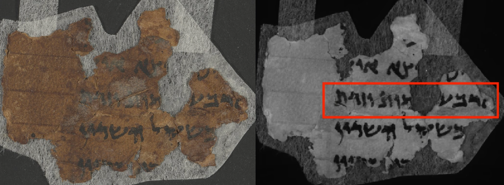
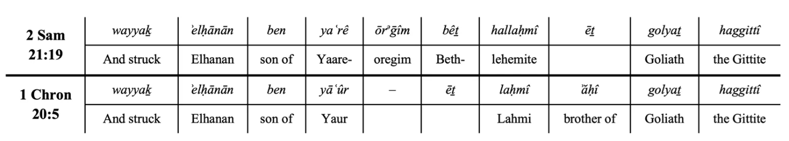
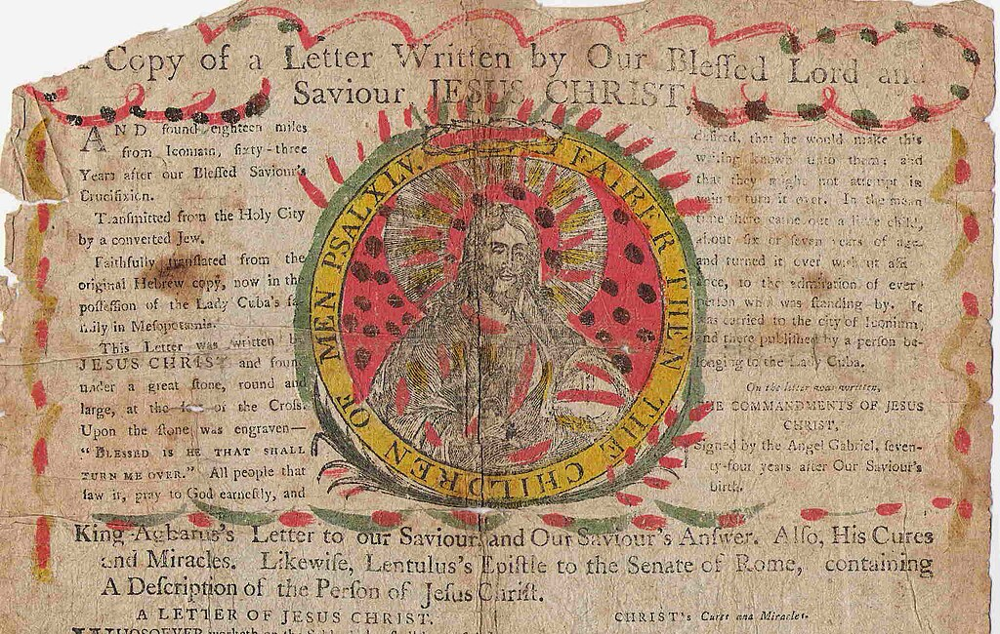
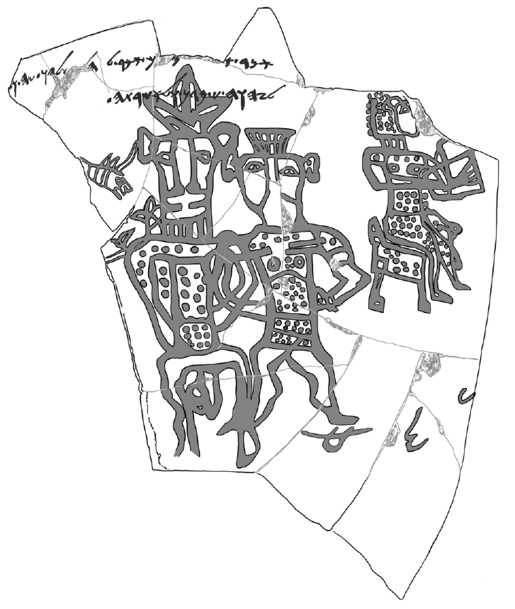
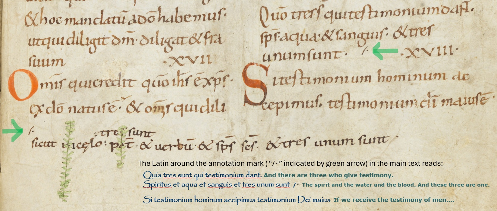
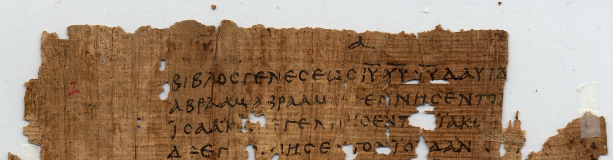
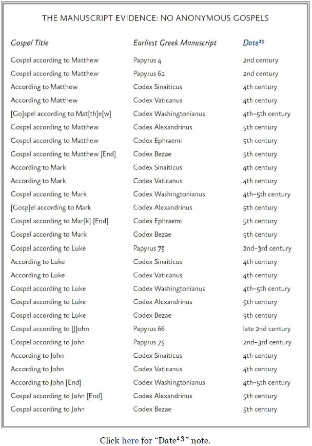
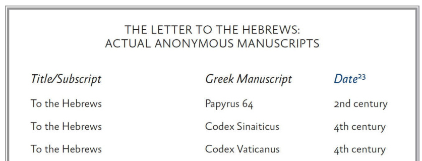
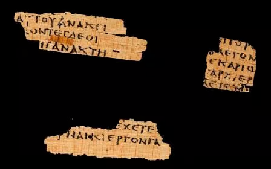

```{r setup, include=FALSE}
knitr::opts_chunk$set(echo = FALSE)
 
hrs_spent <-  168
 
shabur <- enc2utf8("שָׁבַר")
harus <- enc2utf8('חָר֣וּץ')
yahweh <- enc2utf8('יהוה')
arian <- enc2utf8('ὁμοιούσιος')
athanasius <- enc2utf8('ὁμοούσιος')

library(metathis)

meta() %>% meta_social(image = "https://jmdavis0352.github.io/What-are-we-doing/manger.jpg")


```

## The Lamb Symbology Narrative in Question

Here we have the version of this narrative that is the focus of our
study today. A friend shared it on social media with the imperative,
"Because I care...Ponder on this my dears":

> No matter how many times I read this, I just cannot do it without
> getting chills all over me! 😲 I bet you didn't know the following
> about the manger that Jesus was laid in. Of course mangers are animal
> feeding troughs but in ancient Israel they were made of stone - not
> what you would see in a modern day nativity scene[^1]. Not
> comfortable, but great for protection. That's why those who were
> experts in this matter, the priests, would put their newborn lambs in
> them for protection. But not just any lamb, the unblemished perfect
> lambs that were used in the sacrifice for sins. And Bethlehem, where
> Jesus was born was FAMOUS for their UNBLEMISHED LAMBS used for the
> sacrifice. These lambs had to be perfect so they would wrap them
> tightly in cloth and lie them in the manger to keep them safe. This is
> exactly why the only time mangers are mentioned in Jesus' birth story
> it is being told to shepherds. In Luke 2 it says "This will be a sign
> for you, you will find a baby wrapped in cloth and lying in a manger."
> The shepherds would have understood this powerful parallel! THEY KNEW
> what the cloth and the manger meant! This baby would be THE PERFECT
> LAMB OF GOD! The Messiah who would sacrifice His life for the sins of
> the whole world. He wasn't just a baby wrapped in swaddling clothes
> lying in a manger, He was GOD: perfect, sinless and Holy, humbling
> Himself to become the perfect sacrifice to reconcile us back to
> Himself!! THAT my friend, that Perfect Lamb, is WHY we celebrate
> Christmas!!

[^1]: To get the "modern day nativity scene", we must combine the
    contradictory accounts in Matthew and Luke. Mark is the earliest
    gospel, most likely written around 70 CE, and it doesn't contain any
    birth narrative at all -- we only hear that Jesus "came from
    Nazareth". The author of Mark doesn't mention Bethlehem at all.
    Matthew was likely written in the 80's CE and doesn't mention
    mangers or shepherds or their accommodations at all -- in Matthew we
    get astrologers from Iran who follow the star in the east that led
    them around until it hovered over "the place where the child was"
    like a quest marker in a video game, but no description of that
    place. Then they flee to Egypt because Herod issues a decree to kill
    all the male infants. From Egypt they return to Nazareth after
    Herod's death. Luke makes no mention of the star or the Herod's
    decree. Mary and Joseph travel to Bethlehem for a census and here we
    get most of the nativity elements -- the stable and manger and
    shepherds. After the birth they travel to Jerusalem, then back to
    Nazareth -- there is no flight to Egypt to await Herod's death. In
    the course of writing this I discovered another error in the
    "modern" nativity scene -- The translation of κατάλυμα in Luke 2:7
    as "inn", is almost certainly incorrect. The most likely meaning
    intended by the author was "guest room" in family house -- see
    @mickelson_improbable_2015, @carlson_accommodations_2010,
    @swan_away_2014, @lefebvre_jesus_2021 or consult the Google for many
    more). The guest rooms in a traditional four room Palestinian house
    were on upper floors. It seems likely that a manger would have been
    in the first floor courtyard where animals would have been housed
    and where fodder would have been stored [@botha_houses_1998]

I pondered it for a few minutes, then left it alone. I went back and
pondered it a little more, then studied it for an hour or so. After
pondering the result of that hour long study, and particularly because
of the qualifying clause of the imperative to ponder ("Because I care")
-- I decided to study it rigorously and to formally document that study.

I'm writing this very much because I share that sentiment of caring. I
care about the world we live in, about educating ourselves to discover
the nature of the universe, about how we author the rules of civil
society, and fundamental to all of these concerns, I care about
constructing our world views from reasoning that is logically valid and
premises that are true. 

## Results of Superficial Pondering

The first time I read the narrative my initial impression was that it
was fabricated (like the stories in chain emails where my friend found
this letter in a Vietnam Vet's closet after he died that comments
poignantly on a phenomenon strongly resembling a recent political
event). This initial impression stemmed from the use of two rhetorical
devices employed in the first two sentences that are common in
fabricated stories crafted to attract attention and promote rapid
transmission:

-   The first sentence is an assertion that the content is so compelling
    it causes a physical reaction to which one is never inured
    regardless of the total number of exposures -- this is an accurate
    description of the physiological response to an addictive substance
    to which humans do not develop a tolerance.[^2] The intent of this
    sentence is to assure the reader that something unimaginably
    powerful must lie waiting in the following paragraph -- what could
    it possibly be? we are meant to ask ourselves.

-   The second sentence is a confident assertion that that the reader
    has never heard the content to follow, through the specific phrase
    "I bet you didn't know..." -- this is a rhetorical device to engage
    audiences by accusing them of ignorance -- the most common and
    immediate reaction to such assertions is a defensive desire to
    demonstrate the accuser to be incorrect -- how can we ascertain that
    the author who asserts we don't know is wrong? by reading what
    follows to see if we have in fact heard of it of course -- which is
    the desired effect of the accusation.

[^2]: Lysergic Acid Diethylamide (LSD) is such a substance. Tolerance
    builds within 24 hours and reaches maximum by the fourth day but a
    five-day abstinence period entirely reverses tolerance
    [@buchborn_chapter_2016]

No human just sharing information they discovered writes this way --
these are hallmarks of content that was engineered to propagate on social media. Such hallmarks, in my experience, are usually followed by marketing material, fiction,
or fraud. Alone however, these devices don't provide any data regarding
the value or nature of whatever follows -- but they do make me
suspicious. The second time I pondered, I pondered with an elevated
level of critical thought.

## Results of More Critical Pondering and some Mild Googling

Evaluating content critically is difficult. It requires focus, energy, and an
active application of all of our knowledge and faculties to examine
claims and arguments on their own merits. It takes time, work, and care.
I hypothesize that when we consume media, particularly on social media,
we are frequently not thinking critically. That hypothesis is supported by the findings of researchers. @munusamy_psychological_2024
conduct a meta analysis of 23 studies examining disinformation
propagation on social media and assert "There is a lower likelihood
that social media users will research the content they read or post." I
think this may simply be because we are busy and tired, and when
scrolling memes and posts, we're mostly there for the low effort
dopamine reward (see [@firth_online_2019], [@maza_association_2023]). If
consuming social media non-critically is a typical behavior, this may be
one reason why @butler_predicting_2024 reports data indicating social
media as a common vector for misinformation propagation and highlights
the importance of critically consuming information on such platforms.
@munusamy_psychological_2024 similarly concludes that because social
media users are less likely to research content they encounter, "Any
unconfirmed content can therefore be swiftly shared and distributed over
social media platforms". This phenomenon is a serious societal problem.

The subsections below document my critical examination of the text of this content. Several components are problematic or seem
implausible to me. These elements motivated a more rigorous study.

### Mangers for Protection?

The narrative *seems*[^3] to be correct that water or feeding troughs in
1st century Palestine were commonly made from limestone, which
apparently means these troughs are

[^3]: There are plenty of pictures of these types of stone basins -- but
    all of these pictures I can find are on website articles that
    generally allude to this birth narrative -- I can't find any
    archaeological or academic assessment of these basins that indicate
    their likely use or their dating. Evidence of wooden troughs in the
    Levant exists. @rosenberg_unseen_2023 report what is most likely a
    wooden trough that "may have been used as a container for feeding
    livestock or various household uses" that dates to 5th millennium
    BCE from a submerged site just off the coast near modern Haifa in
    Israel.

> Not comfortable, but great for protection.

Are they really? The suggestion that a stone trough offers protection to
a lamb sitting on top of it, bound tightly in cloth, doesn't seem
plausible.

***How does the stone trough provide protection? protection from
what?***

Recalling the specific reason the lambs needed protection in the
narrative, it was because these were:

> ...not just any lamb, the unblemished perfect lambs that were used in
> the sacrifice for sins...These lambs had to be perfect so they would
> wrap them tightly in cloth and lie them in the manger to keep them
> safe.

***Safe from what? What are these blemishes that disqualify the animal for ritual
slaughter?***

This language certainly refers to the requirements in the Pentateuch
that the animals used in most sacrifices be "unblemished". But what does
"unblemished" actually mean in the context of 1st Century BCE temple
sacrifice in Judaism?

The authors of the Hebrew Bible don't provide too much detail but
relevant verses with specific sections highlighted are below:

Exodus 12:5-13 (NRSVUE)

> 5 **Your lamb shall be without blemish, a year-old male; you may take
> it from the sheep or from the goats.** 6 You shall keep it until the
> fourteenth day of this month; then the whole assembled congregation of
> Israel shall slaughter it at twilight. 7 They shall take some of the
> blood and put it on the two doorposts and the lintel of the houses in
> which they eat it. 8 They shall eat the lamb that same night; they
> shall eat it roasted over the fire with unleavened bread and bitter
> herbs. 9 Do not eat any of it raw or boiled in water but roasted over
> the fire, with its head, legs, and inner organs. 10 You shall let none
> of it remain until the morning; anything that remains until the
> morning you shall burn with fire. 11 This is how you shall eat it:
> your loins girded, your sandals on your feet, and your staff in your
> hand, and you shall eat it hurriedly. It is the Passover of the Lord.
> 12 I will pass through the land of Egypt that night, and I will strike
> down every firstborn in the land of Egypt, from human to animal, and
> on all the gods[^4] of Egypt I will execute judgments: I am the Lord.
> 13 The blood shall be a sign for you on the houses where you live:
> when I see the blood, I will pass over you, and no plague shall
> destroy you when I strike the land of Egypt.

[^4]: I don't think any of the gods of Egypt (or of any culture)
    actually exist or ever existed but the authors of Exodus portray the
    patron deity of Israel as believing the gods of Egypt to be real,
    and deserving of His judgement. It may be worth noting for those new
    to any sort of critical analysis of the Bible that I say "authors"
    of Exodus because since the 19th century when critical analysis of
    the Bible began in Germany, the overwhelming consensus among
    scholars is that Exodus and the other books in the Pentateuch were
    composed by different groups of writers and sources from different
    periods -- scholars identify these as the J (Yahwist), E (Elohist),
    D (Deuteronomist), and P (Priestly) sources. Not all scholars agree
    with all of those designations but the overwhelming majority argue
    for different groups of writers with different rhetorical goals
    working over a period of perhaps four or five centuries. It is
    incontrovertible that the Pentateuch can be clustered into distinct
    portions based on grammar and language styles using statistical and
    machine learning algorithms ( [@van_der_schans_clustering_2019],
    [@van_peursen_computational_2023], [@rachmuth_behold-na_2022],
    [@hallo_approaches_2020], [@faigenbaum-golovin_critical_2025] and many many other). Most scholars
    conclude the writings in Exodus were authored during the period
    starting from around 700 BCE and up to around 350 BCE by different
    scribal groups in different places at different times with final
    edits and redaction by P [@society_of_biblical_literature_sbl_2023].
    For a general discussion see [@smith_literary_1996]; for a detailed
    discussion of P's redaction of the Plague narratives see
    [@zevit_priestly_1976]

Leviticus 22:21-25 (NRSVUE)

> 21 When anyone offers a sacrifice of well-being to the Lord, in
> fulfillment of a vow or as a freewill offering, from the herd or from
> the flock, **to be acceptable it must be perfect; there shall be no
> blemish in it. 22 Anything blind or injured or maimed or having a
> discharge or an itch or scabs---these you shall not offer to the Lord
> or put any of them on the altar as offerings by fire to the Lord. 23
> An ox or a lamb that is deformed or stunted you may present for a
> freewill offering, but it will not be accepted for a vow. 24 Any
> animal that has its testicles bruised or crushed or torn or cut, you
> shall not offer to the Lord; such you shall not do within your land,
> 25 nor shall you accept any such animals from a foreigner to offer as
> food[^5] to your God; since they are mutilated, with a blemish in
> them, they shall not be accepted on your behalf.**

[^5]: **The notion that the gods "ate" the sacrifices is not unique to
    writers in Israel -- more on this in a later section.**

Deuteronomy 17:1 (NRSVUE)

> You must not sacrifice to the Lord your God an ox or a sheep that has
> a defect, anything seriously wrong, for that is abhorrent to the Lord
> your God.

The passage in Leviticus provides the most detail. Of all of these
blemishes, only the injury/maiming variety could possibly be prevented
by any kind of physical precautions -- the "itch or scabs" requirement
refers to skin diseases. Commentary on the Hebrew from the Jewish
Virtual Library indicates "injured or maimed" (Hebrew **`r shabur`**
[shah-VAHR]: break shatter or destroy, or **`r harus`** [harus]: maimed
or broken) means "broken or cracked limbs that cause the animal to be
lame"[^6].

[^6]: For discussion see [Jewish Virutal
    Library](https://www.jewishvirtuallibrary.org/blemish) and consult
    your favorite Hebrew lexicon -- link to
    [Strongs](https://biblehub.com/text/leviticus/22-22.htm) (Strong's
    is free but it is also quite dated and not your best resource --
    forgive me for having forgotten the other lexicon that is generally
    better and available as a pdf download)

Different translations similarly indicate this meaning. The New American
Standard Bible proposes:

> Those that are blind, fractured, maimed, or have a wart, a festering
> rash, or scabs, you shall not offer to the LORD

as the English for Leviticus 22:22. Other translations use "broken or
maimed" (KJV), "disabled or mutilated" (ESV), "crippled or injured"
(CSB). Given all of the above I think it's reasonable to interpret
"injury" as something serious -- a significant sprain or fracture that
makes the animal lame in some way. The Mishnah is a later source (we
will revisit the Mishnah below) and it expounds on the definition of
blemishes but doesn't mention physical injury at all (see the Mishnah
text on blemishes
[here](https://www.sefaria.org/English_Explanation_of_Mishnah_Bekhorot.6.12.2?lang=bi)).

Based on the definition of "blemish" in the context of animals slated
for ritual slaughter, I don't think swaddling them in a manger would
provide any protective benefit from such defects.

An image search reveals many pictures of these troughs, and suggests
heights from the ground between 12 - 24 inches and basins maybe 4-8
inches deep, all open from the top. Unless the 1st Century CE shepherds
needed to protect the lambs from vertically oriented Improvised
Explosive Devices^[Please forgive a little frivolity -- stone mangers wouldn't actually provide meaningful protection from an IED directly below either -- the stone would almost certainly fracture and augment the shrapnel pattern, and the overpressure from the blast would cause internal organ damage. Severe injury or death would be certain.], I'm not sure how they offer protection against
becoming fractured or maimed. Common threats to lambs capable of
inflicting physical harm would include local predators (canines, hyenas,
birds etc.)......and I can't really think of anything else -- a lamb
wouldn't be physically damaged from stumbling and falling -- maybe some
accidents could occur where lambs would be trampled by larger animals --
but for the most common threats that come to mind - I don't see how
immobilizing a lamb in a stone trough provides a protective benefit.
Other options would be better: an enclosed room or pen for instance.

### The Priests are the Shepherds?

The narrative suggest that priests are the "experts in this matter" and
though it's not precisely clear which matter that is, the following
sentences suggest the priests are the ones raising the lambs. This seems
odd to me. Before studying this narrative I had a rudimentary knowledge
of the priestly order in pre-Christian Judaism, but have never heard any
suggestion that the Levite priests raised their own special flocks
specifically for ritual slaughter. I wonder where this information came
from. There are no passages in the Bible suggesting that the priestly
order functioned as shepherds that I was able to find.

### Bethleham is FAMOUS for Unblemished lambs?

This sentence suggests invention to me. Would there really be a place
that produced especially good lambs for sacrificing? so much so that
everyone would have known and it would be FAMOUS?

When there was no mass communication? When most people in 1st Century CE
Palestine were illiterate[^7] and would have to hear it word-of-mouth?
By the first century CE sacrifices and worship were well centralized at
the Temple in Jerusalem[^8] -- so most animals for sacrifice would have
come from around Jerusalem anyway (the animals being sold in the temple
when Jesus disrupts the sellers were animals being sold as sacrifices to
Jews who came to offer sacrifices; the money changers were converting
currency to pay the temple tax -- see [@seeley_jesus_1993],
[@mcgrath_jesus_nodate])

[^7]: Estimates of literacy rates range from 3%
    [@bar-ilan_illiteracy_1992] to 10% [@harris_ancient_1989]

[^8]: This centralization started with Josiah's reforms around 623 BCE
    and these reforms also present an interesting case study in how
    religious ideology evolves which we'll examine in more detail later
    (actually no we won't -- I'm running out of time to finish this so
    I'm not going to get to it -- for reference see [@wright_why_2023]
    and [@romer_invention_2015].

This doesn't seem likely to me.

## The Results of Study

The concerns expressed above motivated a rigorous study seeking to
evaluate the origin and veracity of the narrative. In this section I
summarize the results of Biblical scholar Wave Nunnally who has written
a detailed analysis tracing the origins of this narrative -- apparently
identified as the "New Birth Narrative" (NBN). Nunnally is Professor
Emeritus of Early Judaism and Christian Origins at Evangel University,
Springfield, MO.[^9]

[^9]: He holds an MA in Hebrew Language from Jerusalem University
    College, an MA in Old Testament from Reformed Theological Seminary,
    and an MPhil and PhD in Hebraic Cognate Studies (Jewish backgrounds
    of the Bible) from Hebrew Union College [full
    bio](https://wavenunnally.com/wave-nunnally/).

This section further includes tangential studies on topics motivated by
the examination of this narrative.

### Tracing the Origins of the Narrative

As with most every topic of inquiry a normal human (i.e. anyone who
isn't an expert on the leading edge of their field) may explore -- the
veracity of this particular narrative has already been well examined by
others who are more qualified and knowledgeable than myself. The most
well supported discussions I found are from Chad Bird[^10] writing at
1517.org [@bird_debunking_2021] and Dr. Wave Nunnally writing on his own
website [@nunally_modern_2023].

[^10]: Bio from 1517: Chad Bird is a Scholar in Residence at 1517. He
    has served as a pastor, professor, and guest lecturer in Old
    Testament and Hebrew. He holds master's degrees from Concordia
    Theological Seminary and Hebrew Union College. He has contributed
    articles to Christianity Today, The Gospel Coalition, Modern
    Reformation, The Federalist, Lutheran Forum, and other journals and
    websites. He is also the author of several books, including The
    Christ Key & Limping with God.

I encourage anyone reading this to read both of those discussions in
full, but I will summarize the results of Nunally's analysis here along
with my own thoughts.

Nunnally traces the most recent incarnations of the NBN -- the narrative
I'm examining at the beginning of this document -- to a 2012 book titled
*Jesus: a Theography* by Frank Viola and Dr. Leonard Sweet[^11] . The
fundamental premises in this 2012 book almost certainly originate in an
1883 work by Alfred Edersheim titled *The Life and Times of Jesus the
Messiah*. **Prior to 1883 the notion that priestly shepherds raised
lambs for sacrifice in Bethlehem did not exist in human thought**.[^12]

[^11]: Viola is an author and Dr. Sweet is a Theologian -- currently the
    E. Stanley Jones Professor Emeritus at Drew Theological School, Drew
    University.

[^12]: At least that we have any record of, but as we will see below --
    there is no reason for such a notion to exist in human thought.

@edersheim_life_1883 writes

> That the Messiah was to be born in Bethlehem, was a settled
> conviction[^13]. Equally so was the belief, that He was to be revealed
> from Migdal Eder, "the tower of the flock".[^14] This Migdal Eder was
> not the watchtower for the ordinary flocks which pastured on the
> barren sheep-ground beyond Bethlehem, but lay close to town, on the
> road to Jerusalem. **A passage in the Mishnah leads to the conclusion
> that the flocks which pastured there, were destined for
> Temple-sacrifices, and accordingly, that the shepherds, who watched
> over them, were not ordinary shepherds**... [emphasis mine, Edersheim
> argues here that raising flocks was banned in this area, so if flocks
> were being raised, they must be special flocks raised by priests --
> See Nunnally's detailed review of the Mishnah and other sources
> Edersheim points to for reasons why this is not the case -- Edersheim
> chooses a particular passage but ignores several others that clarify
> shepherding was allowed outside urban centers]... Thus, Jewish
> tradition in some dim manner apprehended the first revelation of the
> Messiah from that Migdal Eder, where shepherds watched the
> Temple-flocks all the year round. Of the deep symbolic significance of
> such a coincidence, it is needless to speak.

[^13]: Nunally points out he might have cited Micah 5:2 or the quote of
    Micah in Matthew. Edersheim doesn't cite these verses here but
    points to Targum pseudo-Jonathan after the next sentence.

[^14]: Edersheim references Targum Pseudo-Jonathan on Genesis 35:21 but
    doesn't quote it. It reads "And Jakob proceeded and spread his tent
    beyond the tower of Eder, the place from whence, it is to be, the
    King Meshiha (Messiah) will be revealed **at the end of the days.**"
    (emphasis is mine). Obviously Jesus was not revealed at the end of
    days, so this prophecy fails if Jesus is supposed to be the Messiah
    -- but this is a *Jewish* text written centuries after the time of
    Jesus. The Messiah here isn't even *supposed* to be Jesus. The
    Targum dates no earlier than the 4th Century and some scholars argue
    for dates as late as the 14th Century. The Targum is a translation
    and interpretation of the Torah into Aramaic and incorporates
    extra-biblical material. Genesis 35:21 ends with Jacob spreading his
    tent and doesn't include any discussions of the Messiah. Why would
    Edershiem reference the Targum? My opinion is that his rhetorical
    goal is to create symbolism and synergy unveiled as the discovery of
    a previously unknown secret -- because people like reading such
    things -- and the Targum provided some words that create that
    symbolism if you don't think too hard or look too closely.

***So what is the Mishnah?***

It is rabbinic literature that dates to the *2nd Century CE*,
two-hundred years after the estimated date of Jesus' birth. The temple
in Jerusalem was destroyed by the Roman's in 70 CE and temple sacrifices
no longer occurred, so as Dr. Dan McClellan[^15] notes in his analysis
of the this same NBN (<https://youtu.be/U00gZq7s2VA?t=31>), "...nobody
who had anything to do with the Mishnah had ever seen a temple sacrifice
or knew the circumstances regarding where the temple got their
sacrifices from around the end of the 1st Century BCE and the beginning
of the 1st Century CE so again, there are no data that support this
claim."

[^15]: Dan McCellan "received his PhD in theology and religion from the
    University of Exeter, where he wrote his dissertation on the
    conceptualization of deity and divine images in the Hebrew Bible
    through the methodological lenses of cognitive linguistics and the
    cognitive science of religion. Since March of 2021, he has been
    confronting misinformation on social media related to the academic
    study of the Bible and religion."-- From his website bio
    (<https://www.maklelan.org/about>)

But let's see for ourselves -- Edersheim's actual text (URL is linked in
the reference at the bottom of this document) includes a footnote
indicating this Mishnah passage is Shekalim 7:4, so what does it
actually say? We can read it
[here](https://www.sefaria.org/Mishnah_Shekalim.7.4?lang=bi)

> If an animal that is fit for the altar was found straying, from
> Jerusalem and as far as Migdal Eder, and similarly if it was found
> within that distance from Jerusalem in any other direction, it is
> presumed that the animal came from Jerusalem. Most of the animals in
> Jerusalem were designated for offerings, and presumably this one was
> as well. Males are presumed to be burnt-offerings, as only males are
> brought as burnt-offerings. Females are presumed to be
> peace-offerings, as it is permitted to bring a female peace-offering.
> Rabbi Yehuda says: An animal that is fit for the Paschal offering,
> i.e., a one-year-old male lamb or kid, is presumed to be a Paschal
> offering, provided that it was found within thirty days before the
> Festival of Passover. -- Mishnah, Shekalim 7:4

Two immediate observations emerge:

1.  Shekalim 7:4 doesn't say anything about flocks being raised or
    managed *in* Bethlehem, or *in* Migdal Eder. This text clearly
    asserts that if the animals are *found* there *or anywhere in any
    direction as far as Migdal Eder*, that it's reasonable to assume
    they came *from Jerusalem*. The sense of the word for found is that
    the animal was previously lost -- unattended, unclaimed. The only
    reason Migdal Eder seems to be mentioned is as a landmark for
    distance from Jerusalem (about six miles).

2.  Shekalim 7:4 doesn't say anything *at all* about shepherds. This
    entire passage merely states that any unattended animals within
    about six miles of Jerusalem in any direction are assumed to have
    come from Jerusalem, and that the ones from Jerusalem were probably
    meant to be sacrifices, so this one probably was too -- so if you
    run across one you can pluck it up and offer it.

There is no logical pathway between Shekalim 7:4 and the conclusion that
special shepherds watched over flocks of lamb and goat in Migdal Eder
that were specifically raised for sacrifice. Edersheim just imagined
this to be the case and declared that it was supported by the Mishnah
which isn't a valid information source for early 1st Century CE
practices anyway.

***The entire premise of this narrative was invented in 1883. No data
from the ancient world support this notion and Edersheim's 1883 work is
the first record of it.***

But Edershiem's proposition doesn't quite provide all the details of the
narrative we're examining here. There was no mention of lambs being
swaddled and placed in mangers. So where does that come from? From the
2012 book *Jesus: a Theography*. I don't have access to their text but
@nunally_modern_2023 reproduces relevant sections:

> But before they were slaughtered, each lamb was required to be a pet
> in the family for at least four days. So the day after the final
> Sabbath before Passover, shepherds from the Bethlehem hills drove
> thousands of lambs into Jerusalem, where they were taken in by Jewish
> families for at least two days and treated as members of the family.
> Before sacrificing the lamb, the Jewish priest would ask, "Do you love
> this lamb?" If the family didn't love the lamb, there would be no
> sacrifice (Sweet/Viola, p. 66).

Really? This procedure is not extant in the Bible or even the Mishnah --
so where did Sweet and Viola get it?

> Bethlehem's priestly shepherds had to learn and follow special
> techniques and rituals during the lambing season. Bethlehem lambs born
> for slaughter were special lambs. To prevent harm and self-injury from
> thrashing about after birth on their spindly legs, newborn lambs were
> wrapped in swaddling cloths. Then they were placed in a manger or
> feeding trough, where they could calm down out of harm's way
> (Sweet/Viola, p. 67).

Harm and self injury? Are there any data suggesting new born lambs
injure themselves from thrashing around immediately upon birth? A modern
study [@holmoy_early_2017] of 270 lamb deaths that occurred within 5
days of birth found trauma to be the causative agent in 20% of cases; of
these the most frequent cause of trauma was difficult birthing that
required human assistance -- 60% of all trauma deaths. The authors
report that "traumatic injuries to the lamb may occur during birth,
particularly in cases of fetopelvic disproportion. Lambs confined
indoors may be trapped in pen hurdles, and small or inappropriately
shaped lambing pens may increase the risk of injuries inflicted by
ewes." They list no other causes for lamb trauma and while this paper
was limited to trauma that resulted in death, the notion that a new born
lamb would thrash around and fracture a limb or incur some other serious
injury that qualifies as a "blemish" doesn't seem plausible.
@simcock_nadis_2019 indicates that immediate suckling is imperative to
survival because lambs require "50mls [of colostrum (ewe's milk)] per kg
of body weight [typical birth weights are 3-6 kg] in the first two hours
after birth." This doesn't seem possible if the lamb is tightly wrapped
in cloth and sequestered in a stone trough. I asked a representative of
[Jenkins Farms](https://www.facebook.com/jenkinsfarmsgrantville) (a
small farm in Georgia) about pathways for baby goat injuries and
preventive measures[^16]. The response indicated they: are susceptible
to hypothermia (if they get wet and cold they die); may get trapped in
equipment or other places and die; may swallow hay string and die, eat a
lot of milk and sit out in the sun and die; that sprains and strains
typically heal on their own, but sometimes they have to amputate legs
(no indication of what causes these strains and sprains). The response
to preventative measures was that they provide the animals with a
sheltered place and let the mothers do the work.

[^16]: Complete exchange for transparency. **Q:** can you enumerate a
    list of possible injury mechanisms or pathways for physical injury
    (sprains, fractures etc.) that baby goats experience or might
    experience if you're not careful with them? and what kinds of
    precautions do you take with newborn goats to prevent injury if any?
    **A:** Baby goats find themselves in jeopardy for many reasons. They
    are very susceptible to dying if they get cold or wet. If they get
    cold and wet it's almost a death sentence. They are very curious and
    like to get into things like water troughs (see above statement).
    They get into the mineral feeder and then can't get out and die.
    They will chew on hay string and swallow it and eventually die. And
    then if their diet changes or the weather changes then it can upset
    their stomachs and they die. If they lay out in the sun after
    drinking a lot of milk they can get a sour stomach and die. Sprains
    and injuries will heal on their own or we amputate. Mostly the
    newborns survive and if we have babies coming we give them access to
    shelters and the moms do the rest. If they are orphans it's a lot
    harder.

Did Sweet and Viola just make this up? I think so. @nunally_modern_2023
points out that they never cite any sources to support the claims in
their 2012 book and he exhaustively examines specific claims therein,
firmly concluding

> -   The assertion by Edersheim (and a plethora of others who follow
>     him) on the basis of BT Bava Kama 80a[^17], that the sheep being
>     kept by the shepherds of Bethlehem/Migdal Eder had to have been a
>     special herd destined for the temple has to be rejected. The
>     evidence introduced above demands it.The popularity of the NBN,
>     the persuasiveness of the presentation of its advocates, the warm
>     feeling experienced by those who embrace it, and the sense of
>     greater importance that comes with having insider knowledge---NONE
>     of these are worth the abandonment of our belief in absolute truth
>     based on evidence.
> -   These and all the other incredibly detailed additions to the story
>     of Jesus' birth that are floating around today would be great if
>     they were true, but they are simply the products of the fertile
>     imaginations of modern-day midrashists. Our response to all who
>     would abridge, edit, or add to the Word of God as written, or
>     overthrow hundreds of years of interpretation must be "Show us
>     your evidence and then we will evaluate it for ourselves!" If
>     nothing more than conjecture, ramblings from unaccountable authors
>     on non-peer-reviewed websites, and a titillating feel-good story
>     are all they have to offer, they are rightly to be ignored.
> -   There were no priestly shepherds, no special lambs, and no special
>     techniques that anyone had to learn to protect them. If there was
>     evidence for this in ancient literature, this would have been
>     produced by those who make such claims.
> -   To be clear, there is never a place ANYWHERE in ancient Jewish
>     literature of ANY kind, whether in the Bible, the Dead Sea
>     Scrolls, the intertestamental Apocrypha, the intertestamental
>     Pseudepigrapha, Philo of Alexandria, Josephus Flavius, or ANYWHERE
>     in the voluminous Rabbinic Literature that suggests that any lambs
>     anywhere were ever swaddled. Again, this is why no source is ever
>     cited by promoters of the NBN when making this point. Further,
>     both Palestinian and Jewish shepherds in Israel will tell you that
>     this is madness---within hours, a newborn lamb that was swaddled
>     and laid in a manger would be dead. While teaching in Israel, I
>     spoke to shepherds in the area of Jerusalem and Bethlehem. When
>     asked if they were aware of an instance in which it would be
>     beneficial to swaddle newborn lambs, without exception, their
>     response was, "What? They'd starve in two hours!" The story as
>     being told today is not only never documented by reference to
>     ancient literature; it is also patently absurd on the practical
>     level, life experience, and common sense.

[^17]: This is Rabbinic commentary composed in the 5th - 6th Century CE
    and is what Edersheim appeals to to suggest that normal shepherds
    weren't allowed to raise flocks in Bethlehem so it must have been
    priests who must have had special permission -- you can read it
    [here](https://www.sefaria.org/Bava_Kamma.80a?lang=bi&with=About&lang2=en)

That's about just enough of that.

### The PERFECT LAMB OF GOD!

Encountering this meme/narrative/phenomenon where modern Christians invent stories -- mostly likely to inject interesting components that engage audiences and keep the stories fresh -- made me wonder how frequently these kinds of innovations occur. Are there other examples we can find from modern times or ancient times? The next section explores these questions.

But, before we move on I want to examine one more point on this lamb narrative, that to me, is the most fundamental issue. If Jesus is meant to be

> THE PERFECT LAMB OF GOD! The Messiah who would sacrifice His life for the sins of the whole world.

then how are we to understand that analogy? 

How are we to understand this "sacrifice"? Why is Jesus so frequently referred to as "The Lamb"? Why does Jesus need to sacrifice his human life^[It's a bit strange to say he died or sacrificed his life when he is thought to be an immortal entity that is consubstantial with and fully equal to God who is also **`r yahweh`** (Yahweh), the very God of Israel] to somehow, in some way, offset or pay for or atone for the sins of the world. How does that work? What is the mechanism by which Jesus  dying horribly enables salvation? Salvation from what? What would be the state of the world if this had not occurred (no human Jesus, no crucifixion)? What was the state of the world in say 10 BCE? 

To gain this understanding, we must study exactly how Jesus is analogized with Second Temple Period animal sacrificial practices in Judaism and how those practices fit within the broader context of animal sacrifice in the the ancient world. 

@regev_temple_2019 provides an exhaustive discussion of how early Christians understood and related to the Temple and elements of the sacrificial cult that operated there until the Romans destroyed it in 70 CE^[Around the time the Gospel that would later be attributed to Mark was written.]. For brevity I will focus on Regev's analysis of how Paul analogizes Jesus as:

*


Historical Context -- Israel and Contemporaneous Cultures**

The development of a coherent group of people known as Israel in the
Southern Levant almost certainly occurred after 1350 BCE and before 1200
BCE. The first mention of Israel as a coherent people group for which
data exists is around 1207 BCE on the [Merneptah
Stele](https://en.wikipedia.org/wiki/Merneptah_Stele), a large
inscription on stone of Egyptian origin that describes Merneptah's
conquest of various peoples in the Levant including Israel
[@wright_why_2023]. The specific language of the Stele indicates Israel
was not yet a nation or kingdom, but it's certain that a coherent people
group called Israel were known in the southern Levant around 1207. It is
also almost certain that no such group existed at large scale around
1350 BCE based on references to places and names from the Amarna
Letters[^18] that should have included Israel and its prominent figures
if such a people were extant at the time [@wright_why_2023].[^19]

[^18]: The Amarna Letters include 380 clay tablets written in Akkadian
    cuneiform that are mostly government correspondence from the local
    city "mayors" who administered small cities in Canaan on behalf of
    the Egyptian Pharaoh. The letters mostly reflect complaints from the
    mayors about local security and other mayors, and requests to
    Pharaoh to rectify these complaints. The data of interest is that
    though the language is Akkadian -- the dialect is Canaanite, and no
    Biblical or Jewish names occur in the correspondence -- so it
    doesn't seem likely that any significant Israelite presence in
    Canaan existed in the mid-14th century BCE when these letters were
    composed [@wright_why_2023]. Of course this is problematic for the
    story of the Exodus and the conquest of Cannan. While the Masoretic
    Text and Septuagint disagree with each other and with Flavius
    Josephus (who disagrees with himself) regarding the timelines
    [@eaves_chronological_2023], the Biblical and ancient source
    timelines require dates between the 16th and 14th century BCE --
    before Israel as a people existed. @eaves_chronological_2023 ignores
    this all the other archaeological evidence and argues for a Biblical
    timeline of the Exodus, and the fact of the Exodus.

[^19]: This data conflict with the Biblical timeline for the Exodus and
    conquest of Canaan which, if the Biblical account is historical,
    should have already occurred. But almost no scholar of history or
    critical scholar of the Hebrew Bible believes the Exodus to be
    historical (more on this in the next section).

Israelite sacrificial practices evolved over centuries before reaching
the exact form practiced around the time Jesus was likely born, but all
of their elements (altar, temple, sacrificial system) are "rooted in the
pagan cultures of the ancient Near East" [@haran_temples_1978]. The most
obvious and directly correlated source is the
Sumerian/Akkadian/Babylonian cultures in Mesopotamia that originate as
early as the 4th millennium BCE and formally end in 539 BCE at the hands
of the Persians. This period entirely encompasses the development of
Israel as a people and Kingdom.

The Mesopotamian gods Marduk, Sarpanitum, Nabu, Nanay, and others among
the pantheon each required their own specific daily diet of animal
sacrifice (bulls, sheep, birds, fish) along with fruits, plants, grains,
and beer [@scurlock_animal_2002]. Babylonians "fed" their gods twice a
day every day and while the presentation and disposition of these
offering was different than the Israelite practice[^20], "Like their
ancient Mesopotamian counterparts, Israelite holocaust offerings were
imagined as divine meals, presented twice daily at dawn and dusk, with
extra animals offered weekly on the Sabbath, monthly at the new moon,
and annually on days set aside as festivals."
[@scurlock_techniques_2006]. The Mesopotamian sacrificial cult included
sacrifices for different purposes including "covenant" sacrifices used
to establish a contractual style relationship with a god (usually
followed by daily feeding), "occasional" sacrifices for specific favors
or requests, "divination" sacrifices to discern truth, and "treaty"
sacrifices to ensure the sanctity of an oath
[@scurlock_techniques_2006].

[^20]: the Babylonian feasts were not burned, but left for a while then
    redistributed

Sacrifices to **`r yahweh`** (Yahweh)[^21] in ancient Israel were also
conceptualized as food; the authors of the Bible refer to sacrificial
items as God's "food" (Leviticus 3:11, 21:21-22, Numbers 28:2), and to
the altar as "The Lord's Table" (see Ezekiel 41:22, 44:16, Malachi 1:7).
Like the Mesopotamian gods, **`r yahweh`** also required feeding twice a
day -- a diet of 2 lambs (one in the morning and one in the evening)
with flour, oil, grain, and wine (see Exodus 29:38--42 and Numbers
28:1--8). There were also different categories of sacrifice -- the guilt
or sin offerings, vow offerings, and the covenant offering (the
Passover). The Passover sacrifice only occurred once a year and
maintained the contractual relationship between God and Israel
established during the Exodus.

[^21]: The Hebrew here is the Tetragrammaton that is un-pronounced, or
    pronounced "Adonai" for "lord". The biblical scribes began using
    this placeholder after the pronunciation or writing of the divine
    name became forbidden around the 6th century BCE. Scholars estimate
    it represents a verbalization like "Yahweh" -- the proper name of
    the patron deity of Israel in the Hebrew Bible)

Hittite, Eyptian, Greco-Roman sacrificial practices were similar.
@smith_common_1952 notes that "The similarities of the sacrificial cult
of Uruk[^22] to that described in the P material of the OT[^23] are
clear. Even of later times, when the Jews were self-consciously
insisting on their difference from the heathen, Lieberman[^24] can
remark, 'There was a general pattern in ancient world of temples and
sacrifices ... which the Jews shared'". In Greece and Rome it was the
"general custom to burn the whole victim (ὁλοκαυτεῖν) upon the altars of
the gods, and the same was in some cases also observed in later times
(Xenoph. Anab. VII.8 §5), and more especially in sacrifices to the gods
of the lower world, and such as were offered to atone for some crime
that had been committed (Apollon. Rhod. III.1030, 1209)"
[@schmitz_sacrificium_1875]. Greek practices varied by city-state but
generally the animals had to be "healthy, beautiful and uninjured"
[@schmitz_sacrificium_1875].

[^22]: A city in Mesopotamia -- the sacrificial cult there included
    specific temple layouts and procedures.

[^23]: Again Exodus was finally compiled and redacted by P (see previous
    notes on Exodus passage above).

[^24]: S. Lieberman, Hellenism in Jewish Palestine, N. Y., 1950, p. 130,
    n. 60

But the Passover sacrifice was a bit particular and its association with
Christianity is interesting. Let's revisit.

The Passover was an annual reminder of the Exodus when, in the story,
**`r yahweh`** (Yahweh) killed every first born Egyptian from the
Pharaoh to the slaves to the animals (Exodus 11:4-5). To avoid
**`r yahweh`** (Yahweh's) death, the Israelites had to kill a lamb and
smear its blood on the doorposts so that **`r yahweh`** (Yahweh) would
know to "pass over" that house. The ritual by the first Century was
particular. Families would offer lambs or kids, slaughter them, the
preists would and catch the blood in little bowls and sprinkle it on the
altar in the Temple. Fatty portions of the animal were reserved for
**`r yahweh`** (Yahweh) and burned on the altar [*And the priest shall
burn them upon the altar: it is the food of the offering made by fire
for a sweet savour: all the fat is the Lord's.* (Leviticus 3:16)].
Everyone had to be ritually clean to participate.

So what do we make of all this? A few particular observations are
important

-   *That* animal sacrifice to gods to seek favors or excuse
    transgressions was common across cultures in ancient Mediterranean
    cultures (all of the above is vaguely contemporaneous)
-   *That* the general form and function of the sacrifices was at least
    broadly similar across cultures and to all the various gods, some
    sacrifices imagined as food for the goods, some sacrifices entirely
    burned on an altar)
-   *That*


Like most studies, this study presents tangential topics that are
relevant to the discussion above, and that I think are critical context
for understanding this narrative and the phenomenon of inventing or
embellishing for a variety of motivating factors (all of which are
routine facets of human nature). 

## Imaginative Judeo-Christian Innovation is Not Rare or New

The discussion above illustrates that the lamb symbology narrative
introduced at the beginning is a modern fiction that originated in the
19th Century, was further embellished in 2012, and is now firmly
entrenched in modern Christian mythology (it's even in *The Chosen*
movie series). But the process of inventing narrative and/or
embellishing extant narratives over time is not *at all* unusual in
modern times or throughout the history of the Judeo-Christian religious
tradition[^25]. The subsections below illustrate a few examples. While
each of these really demands its own version of this document, the
constraints of time and energy limit these discussions to cursory
introductions[^26].

[^25]: Or in all of human story telling culture -- I would argue that
    the cognitive and psychological processes involved in the
    embellishment of religious traditions are no different than ones
    that cause fish stories to grow, and motivate Hollywood Studios to
    reboot old stories with new settings and augmented thematic
    elements.

[^26]: Readers may wonder at my definition of *cursory* and begin to
    question my faculties.

### Other Modern Examples

Modern tales of miracle and prophecy and revealed secrets abound in the
modern age. The sections below illustrate a few examples of demonstrable
nonsense:

#### **A Bible in Dalton, GA Exudes Magic Healing Oil After President Donald J. Trump's 2017 Inauguration**

In Dalton, GA, a man named Jerry Pearce "fell down on the floor for 45
minutes in a kind of catatonic state that he describes as being 'out in
the Spirit.'" during a prayer session shortly after President Donald
Trump's inauguration in 2017 [@graham_bible_2020]. A few days later his
Bible allegedly started exuding oil. First just a bit, then gallons,
then hundreds of gallons. The oil apparently possessed magical powers. A
reporter [@graham_bible_2020] who attended one of the weekly events
where the oil was distributed described

> A slight white man said he was heading to China soon and wanted to
> bring the oil with him. He alluded to the possibility that the oil
> could cure the coronavirus: "I look forward to bringing back a good
> report!" There were stories about the oil healing arthritis and
> dissolving tumors. Others said their vials of oil had spontaneously
> refilled. One woman said she had given it to a friend who traveled to
> North Korea and slathered three rocks there with oil, including one
> representing North Korea and one representing the United States.
> "Right after that was when Trump met with Kim Jong-un," she said. The
> crowd murmured in awe.

Really? My mother possesses three vials of this oil, given to her by
friends after a car accident. I look at them when I'm visiting sometimes
but haven't noticed them refilling themselves.

A reporter at the Chattanooga Times Free Press covering the story was
eventually directed to employees at the local Tractor Supply who
visually identified Jerry as regularly buying gallons of mineral oil.
Two independent Fourier Transform Infrared spectroscope (FTIR) profiles
of the oil developed in two different departments at the University of
Tennessee in Chattanooga "indicate a petroleum derived product,
particularly mineral oil." [@massey_ministry_2020] -- see the actual lab
report embedded in the news article. Pearce initially denied buying
mineral oil and stated that the Tractor Supply employees were lying, but
after the Times reporting was published, Flowing Oil Ministries (the
group organizing events related to the oil) revealed that the Bible had
recently stopped producing oil. Pearce then admitted to buying oil just
that last time stating [@massey_ministry_2020]:

> "I was going to pour that oil on the Bible when the Bible quit
> producing oil," Pearce said. "And the Lord checked my spirit on it."

Of course.

#### **A retired Nurse Anesthetist Recovers the Actual Ark of the Covenant from Israel**

See Ron Wyatt for a litany of nonsense. The short version is that he
claimed to have found artifacts like [@jackson_ron_nodate]:

> -   Noah's Home and a Flood-inscription at that site
> -   Fences from Noah's farm
> -   Anchor Stones from Noah's Ark
> -   Laminated Deck Timber from the Ark
> -   Noah's Altar
> -   Tombs with Tombstones of Noah and his wife
> -   The precise location of the Red Sea Crossing
> -   Wheels from Egyptian Chariots involved in the pursuit of the
>     Israelites from Egypt [for a detailed discussion see [Bible
>     Archeology
>     Report](https://biblearchaeologyreport.com/2018/10/11/fake-news-in-biblical-archaeology/).]
> -   The Book of the Law written by Moses on Animal Skins
> -   Gold from the Golden Calf fashioned by Aaron
> -   The Ark of the Covenant
> -   Tables of the Ten Commandments
> -   The Tabernacle's Table of the Showbread
> -   Goliath's Sword,
> -   Jesus' Tomb and the Stone Seal of the Tomb,
> -   A sampling of Christ's Dried Blood, proving the doctrine of the
>     Virgin Birth by means of a "chromosome count," etc.

He never produced such artifacts or provided evidence to archaeologists
or biologists. If you visit Israel and go to the Garden Tomb Association
they may provide you with this statement:

```{r GT, fig.cap="Source: Wikimedia Common, Public Domain, https://upload.wikimedia.org/wikipedia/commons/c/c1/Jerusalem_Garden_Tomb_Official_Disclaimer_of_Ron_Wyatt%27s_Absurd_Claims_%2843251231202%29.jpg"}

knitr::include_graphics('gt_letter.jpg')

```

#### **`r yahweh` (YHWH - Yahweh -- the name of God) is Encoded Into Deoxyribonucleic Acid (DNA)**

This nonsense promulgates all over the place. A few examples:

-   <https://erevshabbat.org/en/yhwh-is-genetically-coded-into-us/>
-   <https://www.facebook.com/ChristafariBand/posts/did-you-know-that-the-dna-molecule-has-the-name-yahweh-written-on-it-the-dna-mol/862817655215243/>
-   <https://www.christianlearning.com/yahweh-is-embedded-in-our-dna/>

The short version of the claim is that the spirals of the helix are
joined by Sulfur bridges in a pattern consisting of a bridge every 10
segments, 5 segments, 6 segments, 5 segments and then repeating, and
that the alpha-numeric designations (gematria -- Hebrew numerology) for
the Hebrew of `r yahweh` is 10-5-6-5, so wallah -- `r yahweh` is encoded
into human DNA which must mean God put his signature on his master
artwork -- humans.

*Every component of this claim related to DNA is absurdly false.*

A refresher on the structure of DNA is available from
[Nature](https://www.nature.com/scitable/topicpage/discovery-of-dna-structure-and-function-watson-397/)
[@pray_discovery_2008], but some basics are as follows:

-   DNA bases are one of four nucleic acids: adenine [A], guanine [G]),
    cytosine [C], thymine [T]
-   Each base corresponds with a bonding pair C-G, or A-T (or G-C, T-A)
-   *Every* pair of nucleic acids in the helix forms a bond
-   Nucleic acids form Hydrogen bonds -- a dipole-dipole electromagnetic
    bond that does not involve Sulfur[^27]

[^27]: For a refresher see
    [here](https://www.chem.purdue.edu/gchelp/liquids/hbond.html#:~:text=Hydrogen%20bonding%20is%20a%20special,and%20another%20very%20electronegative%20atom.)

Here we have it in Figure \@ref(fig:nature), from the Nature article
linked above.

```{r nature, out.width = "100%",fig.cap="Two hydrogen bonds connect T to A; three hydrogen bonds connect G to C. The sugar-phosphate backbones (grey) run anti-parallel to each other, so that the 3’ and 5’ ends of the two strands are aligned. © 2013 Nature Education - Permission is granted for reproduction for non-commercial, personal use<br>Source: https://www.nature.com/scitable/topicpage/discovery-of-dna-structure-and-function-watson-397/"}

knitr::include_graphics('Nature_DNA')

```

There are no sulfur bridges or gaps between such bridges between base
pairs in a DNA molecule. This is fictitious. Someone just made this up.

Where did this originate?

From a scientist named Dr. Yeshayahu Rubenstein who, in a video in 2014,
claimed to have viewed DNA through a microscope in 1986, observed these
bridges, and published a paper about it in the journal, *Nature*[^28].
No such paper exists in *Nature* and the first direct image of DNA was
obtained with a transmission electron microscope in 2012
[@gentile_direct_2012].

[^28]: One of, if not the most, prestigious and preeminent science
    journals. When Watson and Crick proposed a "Molecular Structure of
    Nucleic Acids" [@watson_molecular_1953], the structure was theorized
    from inferential data, but they published the result in Nature.

It looked like this:

```{r DNA, out.width="100%", fig.cap="TEM image with intensity profile and corresponding FFT pitch calculation of λDNA fibers<br>Source: [@gentile_direct_2012] via: https://www.sciencemadness.org/scipics/refs/dnaview.pdf"}


```

A discussion of this nonsense is available on Israel365 News
[@berkowitz_theory_2023]

#### **The Garden of Eden is Actually in Florida**

There is no argument to make that the author of the creation account
starting in Genesis 2:4b was describing a place imagined to be anywhere
other than Mesopotamia.

For background see:

-   <https://www.exploresouthernhistory.com/apalachicolabluffs2.html>
-   <https://www.the-independent.com/news/world/americas/florida-garden-eden-claim-tree-b2564133.html>

or consult your favorite search engine.

The author of this nonsense (Elvy Callaway) made the connection because
of a the tree in Florida called the [Torreya
Tree](https://en.wikipedia.org/wiki/Torreya_taxifolia) and because he
found an area where a river split into four headwaters.

The King James English translation for Genesis 6:14 is

> Make thee an ark of gopher wood

The reason Callaway thought the Torreya must be the Biblical "gopher
wood" is because (1) the species is very old -- nearly extinct today,
and (2) Torreya is commonly known as gopher wood *in English*, by
*modern Americans*.

But "gopher wood" was just a quasi random guess by the King James
translators. Modern translations usually state "cypress" (NRSVUE for
example), but the Hebrew here is not really understood. No one actually
knows what the word means anymore or what type of wood the word actually
refers to but most scholars think it was likely cedar or cypress because
those were available, but the meaning of the Hebrew word here is not
certain [@society_of_biblical_literature_sbl_2023].

Callaway just baldly ignores that the Bible text specifically states two
of the four rivers are the Tigris and Euphrates, bounding ancient
Mesopotamia -- which makes so much sense given that this is a story
written by people in geographic proximity to Mesopotamia and
demonstrably intertwined with Mesopotamian culture (people in ancient
Israel and Judah worshiped and recognized the Mesopotamian gods (Baal,
Asherah, Anat, Mot etc.) alongside Yahweh before he became the exclusive
patron deity.

Callaway also rather naively makes a connection because of a *modern*
English word. No modern English can have any bearing on the mind of an
author writing around the 1st millenium BCE. English as a language
didn't exist at all at the time the 1st (earliest by date of writing)
creation account in Genesis was penned.

#### **Donald Trump is actually Jesus?**

Without further comment:

[President Donald J. Trump, The Son of Man - The Christ, by Helgard
Müller](https://www.amazon.com/President-Donald-Trump-Son-Man/dp/1977249752/ref=sr_1_1?crid=9TH3455K8UZ6&dib=eyJ2IjoiMSJ9.HB9qNZ2Jql4bLaYYikeQIfB6HIspgBErwKck-G5Xvamy5mSedO8ZomPO5JS9tLapGxpm_t3IHReJLsUxl5sa7gbOUk_O8X_DtG1qiloOwvmq1qG18tmULTPr8mTI_I8Q0yU4HCC-xk-fLwjkjumZE-MEGR08C8QHGBNwFb7XBEWsCSVh1XEY-Mq5KhWlN01mUV5A-zBH2-cbL37cNgydwiy_P5Vm05-MVNUsmad748w.mtBnxMYE5F8b5ao0fGIqKsjfJQIP4125eSK2qK0H8_k&dib_tag=se&keywords=trump+son+of+man+book&qid=1742607044&sprefix=trump+son+of+%2Caps%2C102&sr=8-1)

And also

[ChristTrump, by Christopher John
MOLLUSO](https://www.amazon.com/CHRISTRUMP-Persecution-Christopher-John-MOLLUSO/dp/B0D3WNKRTB/ref=pd_sbs_d_sccl_2_19/132-3409659-7283142?pd_rd_w=MQhes&content-id=amzn1.sym.468038a7-7f5c-443f-a245-916388eb61fa&pf_rd_p=468038a7-7f5c-443f-a245-916388eb61fa&pf_rd_r=X1T53AAKEYPWSYPZ44VN&pd_rd_wg=rkBnL&pd_rd_r=9475dc99-59e1-40b0-8277-632a3f5bf245&pd_rd_i=B0D3WNKRTB&psc=1#customerReviews)

#### **No Wait, Donald Trump is the Anti-Christ, and so is everyone else**

[The Fourth Beast: Is Donald Trump The Antichrist?, by Lawrence R
Moelhauser](https://www.amazon.com/Fourth-Beast-Donald-Trump-Antichrist/dp/1535406496/ref=pd_lutyp_ci_mcx_mr_typ_d_d_sccl_2_6/132-3409659-7283142?pd_rd_w=5qb6o&content-id=amzn1.sym.6d5cc53c-d973-4a51-b7c1-260d7f897f5a:amzn1.symc.823e1c6a-2574-48c0-adf8-391b275ad0d6&pf_rd_p=6d5cc53c-d973-4a51-b7c1-260d7f897f5a&pf_rd_r=1E0AB5VH9GH7ZE8HQSP4&pd_rd_wg=ar2gl&pd_rd_r=98bd5390-e828-4a8e-bac5-65e14123e2d5&pd_rd_i=1535406496&psc=1)

Here is another one (possibly intended as satire; I haven't read it so
can't comment)

[Trump Antichrist, by Lucius HaSatan
Esq.](https://www.amazon.com/Trump-Antichrist-Lucius-HaSatan-Esq/dp/B09Q51Y2PT/ref=pd_sbs_d_sccl_2_9/132-3409659-7283142?pd_rd_w=MQhes&content-id=amzn1.sym.468038a7-7f5c-443f-a245-916388eb61fa&pf_rd_p=468038a7-7f5c-443f-a245-916388eb61fa&pf_rd_r=X1T53AAKEYPWSYPZ44VN&pd_rd_wg=rkBnL&pd_rd_r=9475dc99-59e1-40b0-8277-632a3f5bf245&pd_rd_i=B09Q51Y2PT&psc=1)

But the Antichrist is also probably:

-   [Elon
    Musk](https://baptistnews.com/article/the-antichrist-is-coming-and-is-already-here/)
-   Barack Obama [@pyszczynski_is_2010]
-   [Many many
    others](https://rationalwiki.org/wiki/List_of_people_accused_of_being_the_Antichrist#)
-   One 12th century abbot -- Joachim of Fiore (c. 1135-1202) -- was
    famous among the local clergy as a "prophet of the Antichrist" and
    wrote extensively about many Antichrists he believed were coming
    soon [@lerner_antichrists_1985]

#### **The Founding Fathers Cited Deuteronomy More Than Any Other Work**

In recent times, this assertion is most popularly presented by by Charlie Kirk (of Turning Point USA fame) and Dennis Prager (of PragerU fame). 

One of Prager's statements is as follows (see source [here](https://youtu.be/4QK6zwEc8WU?t=462))

>The founders of the country cited Deuternonomy more than any other religious or secular work in their writings and in their speeches. That's how much this book influenced the creation of the freest country ever made. 

An example from Charlie Kirk is similar (for example [here around 2:40](https://www.breitbart.com/politics/2023/07/24/charlie-kirk-calls-out-cowardly-churches-adopting-left-wing-politics/))

>The book of Deuteronomy is an unbelievably political book; where the founding fathers quoted Deuteronomy more than any other author, secular or religious, more than John Locke, more than Montesquieu, more than Rousseau, more than Machiavelli, more than Aristotle...they quoted Deuteronomy...

No they didn't.  

Various flavors of this claim have been espoused by Glenn Beck, Michelle Bachmann, innumerable webpages and blog posts, and even from seemingly more serious Christian commentators like Dr. Daniel Dreisbach, professor of Justice, Law & Criminology at American University who points us to the data source writing on the C.S. Lewis Institute blog [@dreisbach_bible_2017]

>In a now-famous study published in the American Political Science Review, which is the flagship publication for political scientists, a political scientist by the name of Donald Lutz surveyed the political literature of the American founding. He was looking to see who it was that Americans were citing in this political literature. He reports that the Bible was cited more frequently than any European writer or even any European school of thought, such as Enlightenment liberalism. The Bible, Lutz reported, accounted for approximately one-third of the citations in the literature he surveyed. The book of Deuteronomy alone was the most frequently cited work, followed by Montesquieu’s The Spirit of the Laws. In fact, Deuteronomy was referenced nearly twice as often as John Locke’s writings, and the apostle Paul was mentioned about as frequently as Montesquieu and Blackstone, who would have been the two most-cited secular theorists.

We can already see a problem with the statements from Prager and Kirk -- they both represent the data as from "the founders" or the "founding fathers" rather than as all the political literature written during the founding era -- a subtle but meaningful distortion. Dr. Driesbach has degrees in history and law and his statement is a little better, but he isn't treating Lutz's work with professional care. He goes out of his way to claim the authority of "the flagship publication for political scientists", but he is grossly misrepresenting Lutz's work. 

There are two fundamental problems with Dreisbach's statement, and all of these statements, that misrepresent Lutz's research. Fortunately, we can read the paper ourselves -- The full text is available on JSTOR. As @dreisbach_bible_2017 states, @lutz_relative_1984 surveys political writings from the period from 1760 to 1805 -- what he defines as the "founding era". 

@lutz_relative_1984 does indeed state *"If we ask what book was most frequently cited by Americans during the founding era, the answer somewhat surprisingly is: the Book of Deuteronomy. From Table 1 we can see that the biblical tradition is most prominent among the citations."* I copied an image of Lutz's Table 1 below (Figure \@ref(fig:lutztable)).

```{r lutztable, out.width = "100%", fig.cap="Table 1 from [@lutz_relative_1984]"}

knitr::include_graphics('lutztbl1.png')


```
The first fundamental problem with Dreisbach's statement (as well as the other two statements) above should be evident upon examining this table for a few minutes -- namely that the presentation of the data from each of the commentators specifically frames the comparison as between (1) The Bible and (2) any other *individual* source. This characterization is problematic because each of the commentators are trying to make the argument that the Bible wields the most influence on the thinking of the founding era, is the most important source of the founding era. But if that is the argument, then the correct comparison to make would between (1) The Bible and (2) Not The Bible. Dreisbach states it plainly -- the Bible accounts for ~1/3 of the citations which means 2/3 are "Not the Bible" -- 2/3 are secular philosophical or political discussions. 

This first fundamental problem is just a misleading presentation of the data in Lutz's Table 1. The second fundamental problem is much worse - these statements blatantly disregard the data that Table 1 actually represents and which Lutz clearly and specifically discusses. Let's revisit Lutz's statement about Deuteronomy -- but this time we will also read *the very next sentence* [@lutz_relative_1984]:

>If we ask what book was most frequently cited by Americans during the founding era, the answer somewhat surprisingly is: the Book of Deuteronomy. From Table 1 we can see that the biblical tradition is most prominent among the citations. **Anyone familiar with the literature will know that most of these citations come from sermons reprinted as pamphlets; hundreds of sermons were reprinted during the era, amounting to at least 10% of all pamphlets published. These reprinted sermons accounted for almost three-fourths of the biblical citations, making this nonsermon source of biblical citations roughly as important as the Classical or Common Law categories.**[emphasis mine].

Lutz's source for citations included "all books, pamphlets, newspaper articles, and monographs printed for public consumption" [@lutz_relative_1984]. Among the "pamphlets" were the reprinted sermons -- these sermons may have included political content but they were all fundamentally the writings of the clergy, from the perspective of religion.   @sandoz_political_1998 compiles political sermons from 1730 - 1788 and is accessible if you want to peruse them. I read through a small sampling and generally observe them to be political in a broad sense, but are rather general exhortations to be righteous and moral and just and that Governance should enable these principles. When we remove the Bible citations that come from the sermons -- The Bible is not "cited more frequently than any European writer or even any European school of thought, such as Enlightenment liberalism" as @dreisbach_bible_2017 asserts. 

*But wait there's more!*

Lutz goes on to examine the data most specifically relevant to the U.S. Constitution and arguments regarding its ratification. The data from 1787 and 1788 [@lutz_relative_1984]

>illustrate the pattern of citations surrounding the debate on the U.S. Constitution. The items from which the citations [in his data] are drawn come close to exhausting the literature written by both sides. The Bible's prominence disappears, which is not surprising since the debate centered upon specific institutions about which the Bible had little to say. 

I extracted the data from Lutz's Table 4 and converted the percentages back to raw counts so we can visualize the magnitudes and sample sizes^[I rounded carefully but it's possible any individual data point is $\pm$ 1 from the actual counts]. What do we see?


```{r lutztable4, tab.cap="Number of citations by categorical source between Federalists and Antifederalist in 1787 and 1788. Reproduced from data in Table 4 from [@lutz_relative_1984]"}

library(tidyverse)

lutzdat <- readxl::read_xlsx('Fed_antifed_citations_Lutz.xlsx')
lutzdat_w <- lutzdat %>% pivot_wider(id_cols = Source, names_from = Position, values_from = Citations)

knitr::kable(lutzdat_w)

```

We see that the Federalists -- those arguing in favor for the proposed Constitution and resulting Federal Government -- did not cite the Bible *at all* in 1787 and 1788 -- when the Constitution was written and ratified. The Federalists included George Washington, Benjamin Franklin, James Madison and Alexander Hamilton among those with household name recognition. Antifederalists -- those arguing against the creation of a federal government included Patrick Henry and Samuel Adams among their most notable members -- reference the Bible in only 9% of their citations. 

Let's look at that data another way -- again remembering that if we are arguing that the Bible was the most prominent source of thinking that influenced the development of the Constitution, the correct comparison by which to assess that assertion is the citation count for The Bible versus not the Bible. I think this is the correct comparison because the Bible is a fundamentally different kind of literary source than the other categories, which are all fundamentally similar (secular writings on the philosophy of the rights of humans and the nature of government)^[This argument may not be crystal clear so I'll expound a little more -- the reason I think this is the correct way to organize this data to address this question is because the people making this argument fundamentally assert that it was religious thinking - belief in a supernatural God, and that supernatural God's instructions to humans (which for some reason, humans had to write down themselves) that shaped our principles of government -- all the other sources are fundamentally not that - they are philosophical treatises on the nature of human governments -- Enlightenment just refers to writing and thinking of a particular period from a particular view point -- Classical refers to Platonic or Aristotelian ideas, or the writings of Cicero, Boethius etc. None of these other categories depend on authority from a supernatural entity.]. Here we have the counts in those two categories:

```{r, fig.cap="The Bible vs Not the Bible -- data from [@lutz_relative_1984]"}
library(ggsci)

lutzdat$Bible <- 'The Bible'
lutzdat$Bible[lutzdat$Source != 'Bible'] <- 'Not the Bible'

lutzdat %>% group_by(Bible, Position) %>% summarise(Citations = sum(Citations)) %>% ggplot() + geom_col(aes(x = Position, y = Citations, fill = Bible), position = position_dodge()) + scale_fill_aaas() + geom_label(aes(x = Position, y = Citations, foo = Bible, label = Citations), position = position_dodge(width = .9), hjust = .5) + labs(x = NULL, y = 'Number of Citations Among Published\nPolitical Writings in 1787 and 1788') + theme_minimal() + theme(legend.title = element_blank())

```

@dreisbach_bible_2017 references Lutz's paper directly -- but if he actually read it -- he is treating it in a way incommensurate with his education and position. Kirk and Prager are content creators who are agitating for their preferred worldview -- they do not reference Lutz directly but the similarities in the statements suggest the same or similar data source which gives me the great opportunity to state

*But wait there's **even** more!*

It's possible that many of the people circulating this claim never read Lutz's actual paper. @pidcock_no_2024 provides a thorough discussion of this claim and through that discussion we learn of the work of David Barton. Barton self published (through his his own organization -- Wallbuilders) a book entitled *The Myth of Separation: A revealing look at what the Founders and early Courts really said*. I bought a used copy on Amazon. Barton introduces Lutz's work by quoting John Eidsmoe's book *Christianity and the Constitution* which states (via [@barton_myth_1992]): 

>Two professors, Donald S. Lutz and Charles S. Hyneman^[This actually references the book version of this work -- I don't have access to the book but it is an expanded discussion of the shorter paper.] have reviewed 15,000 items and closely read 2,200 books, pamphlets, newspaper articles, and monographs with explicitly political content printed between 1760 and 1805....From these items Lutz and Hyneman identified [the philosophers quoted most freqeuently by our Founders]^[The bracketed content in the quote above is Barton's, not mine.]...Baron Charles Montesquieu...followed closely by Sir William Blackstone...and John Locke.

A few pages later @barton_myth_1992 continues

>Yet, there was a source the Founders cited *four* times more frequently than either Montesquieu or Blackstone, and *twelve* times more frequently than Locke. What was that source? The Bible! The Bible accounted for 34% of all the Founder's quotes.

It may be that modern commentators like Prager and Kirk and Beck are only experiencing Lutz's work through Barton's lens. It may be that Driesbach falls in this category as well. I know that he and Barton are associated because Barton's website includes content credited to Dreisbach and asserts that content is shared by permission of the author^[ [Here](https://wallbuilders.com/resource/a-godless-constitution-a-response-to-kramnick-and-moore/) for example. This is Dreisbach's review of a book that refutes many of people like Barton's claims -- interesting that Dreisbach asserts the authors of this book are practicing shoddy scholarship.]. 

Barton goes on to state that actually, most of the people cited were influenced by the Bible so really, "94% of their quotes are based either directly or indirectly on the Bible"...  [@barton_myth_1992].  


That statement is absurd. The absurdity of that and many other statements in his book and other media are why Paul Harvey -- Distinguished Professor of History at the University of Colorado, Colorado Springs -- stated, after Barton appeared on the John Stewart Show and a flurry of refutations followed, that [@harvey_selling_2011]

>I don’t question the necessity of pointing out Barton’s history of outright falsehoods, explaining the fallacies of his presentism (as in using a 1765 sermon or a 1792 congressional vote to show that the original intent of the founders was to oppose bailout and stimulus plans), and introducing to non-experts the abundant evidence calling his historical worldview of the Christian Founders into question. Yet while these kinds of refutations are necessary, they are not sufficient. That’s because Barton’s project is not fundamentally an historical one....The Christian Nation “debate” is not really an intellectual contest between legitimate contending viewpoints....I use the term “debate” in quotes because it is fraudulent...On one side are purveyors of a rich and complex view of the past, including most historians who have written and debated fiercely about the founding era. The “other side” is a group of ideological entrepreneurs who have created an alternate intellectual universe based on a historical fundamentalism.[I changed the order of parts of this block quote between the ellipses] 

No scholar of history would suggest that religion and Christianity were not heavily influential during America's founding period -- but similarly no serious scholar would suggest that the Declaration or the Constitution are directly derived from the Bible, or that the Founder's wanted an overtly Christian nation. Such a claim is counter indicated by the plain text of the founding documents -- particularly the Constitution and its amendments.  

Beyond the specific claims in this section regarding citations, there exists in the United States a ubiquitous, near inescapable fog of misleading rhetoric regarding the religious perspectives of the founders that has been carefully constructed over decades, possibly over centuries, by people who wish that the United States *was* an overtly Christian Nation, and work to turn it into one (Christian Nationalists -- such as Barton).

On page 130 of my copy of Barton's book, in a section titled "What did the Father's Say to Teach?", he argues that the Founding Father's wanted education to be overtly Christian and to heavily incorporate the Bible, and he [@barton_myth_1992] states "Notice why Jefferson felt the Bible as being essential in any successful plan of education" and he quotes Jefferson as as saying:

>I have always said, and will always say, that the studious perusal of the sacred volume will make us better citizens."

Did Jefferson really think the Bible an essential component of any successful education plan? He doesn't actually say so in this quote, but let us investigate. 

The statement above isn't actually primary quote from Jefferson. The statement is attributed to Jefferson in a letter written by Daniel Webster in 1852 which describes a conversation he is reporting to have had with Jefferson *27 years earlier* (see a short discussion at [Monticello](https://www.monticello.org/research-education/thomas-jefferson-encyclopedia/bible-source-liberty-spurious-quotation/)). As we learn from Monticello -- Webster's statement attributed to Jefferson wasn't quite juicy enough for some Christians and starting around 1952, imaginative innovators started adding an entirely fabricated sentence to precede the quote from Webster: *"The Bible is the source of liberty."* I think it's plausible Jefferson said something like what Webster reports, but that statement doesn't mention education at all -- doesn't provide any context for Jefferson's thinking at all. Is that all that Jefferson had to say about reading the Bible? did he have anything to say about studying the Bible as part of education? or about education in general? or Christianity in general? Does that statement that Barton quotes summarize Jefferson's overall perspective?

We need not speculate. Jefferson wrote exhaustively and kept meticulous records so much of his writing survives.  I'm going to include extended quotations because I want the full context to be evident in this document. They may be long, but for me, they were joyous and inspiring to read. 

Thomas Jefferson in *Notes on the State of Virginia, 1784*, discussing a bill establishing a public education system, specifically enumerates "what to teach" [@jefferson_epilogue_1784]. 

>This bill proposes to lay off every county into small districts of five or six miles square, called hundreds, and in each of them to **establish a school for teaching reading, writing, and arithmetic.** The tutor to be supported by the hundred, and every person in it entitled to send their children three years gratis, and as much longer as they please, paying for it. These schools to be under a visitor, who is annually to chuse the boy, of best genius in the school, of those whose parents are too poor to give them further education, and to send him forward to one of the **grammar schools, of which twenty are proposed to be erected in different parts of the country, for teaching Greek, Latin, geography, and the higher branches of numerical arithmetic.** Of the boys thus sent in any one year, trial is to be made at the grammar schools one or two years, and the best genius of the whole selected, and continued six years, and the residue dismissed. By this means twenty of the best geniusses will be raked from the rubbish annually, and be instructed, at the public expence, so far as the grammar schools go. At the end of six years instruction, one half are to be discontinued (from among whom the grammar schools will probably be supplied with future masters); **and the other half, who are to be chosen for the superiority of their parts and disposition, are to be sent and continued three years in the study of such sciences as they shall chuse, at William and Mary college,** the plan of which is proposed to be enlarged, as will be hereafter explained, and extended to all the useful sciences. **The ultimate result of the whole scheme of education would be the teaching all children of the state reading, writing, and common arithmetic: turning out ten annually of superior genius, well taught in Greek, Latin, geography, and the higher branches of arithmetic: turning out ten others annually, of still superior parts, who, to those branches of learning, shall have added such of the sciences as their genius shall have led them to:** the furnishing to the wealthier part of the people convenient schools, at which their children may be educated, at their own expence.--The general objects of this law are to provide an education adapted to the years, to the capacity, and the condition of every one, and directed to their freedom and happiness. Specific details were not proper for the law. These must be the business of the visitors entrusted with its execution. **The first stage of this education being the schools of the hundreds, wherein the great mass of the people will receive their instruction, the principal foundations of future order will be laid here. Instead therefore of putting the Bible and Testament into the hands of the children, at an age when their judgments are not sufficiently matured for religious enquiries, their memories may here be stored with the most useful facts from Grecian, Roman, European and American history.** [Emphasis added] 


Thomas Jefferson, in a letter to John Davis (no relation) [@jefferson_thomas_1824] 

>   I thank you, Sir, for the copy you were so kind as to send me of the revd mr Bancroft’s Unitarian sermons. I have read them with great satisfaction, and always rejoice in efforts to restore us to primitive Christianity, in all the simplicity in which it came from the lips of Jesus. had it never been sophisticated by the subtleties of Commentators, nor paraphrased into meanings totally foreign to it’s character, it would at this day have been the religion of the whole civilized world. but **the metaphysical abstractions of Athanasius, and the maniac ravings of Calvin, tinctured plentifully with the foggy dreams of Plato, have so loaded it [Christianity] with absurdities and incomprehensibilities, as to drive into infidelity men who had not time, patience, or opportunity to strip it of it’s meretricious trappings, and to see it in all it’s native simplicity and purity.** I trust however that the same free exercise of private judgment which gave us our political reformation will extend it’s effects to that of religion, which the present volume is well calculated to encourage and promote.  
<br>**Not wishing to give offence to those who differ from me in opinion, nor to be implicated in a theological controversy, I have to pray that this letter may not get into print**, and to assure you of my great respect and good will. [Emphasis Added]


Thomas Jefferson, in a letter to John Adams, 1823 [@jefferson_thomas_1823]

>**the truth is that the greatest enemies to the doctrines of Jesus are those calling themselves the expositors of them, who have perverted them for the structure of a system of fancy absolutely incomprehensible, and without any foundation in his genuine words. and the day will come when the mystical generation of Jesus, by the supreme being as his father in the womb of a virgin will be classed with the fable of the generation of Minerva in the brain of Jupiter.** but we may hope that the dawn of reason and freedom of thought in these United States will do away all this artificial scaffolding, and restore to us the primitive and genuine doctrines of this the most venerated reformer of human errors.

Thomas Jefferson, in a letter to Alexander Smyth, 1825 on the Book of Revelation [@jefferson_thomas_1825]

>I have duly recieved 4 proof sheets of your explanation of the Apocalypse, with your letters of Dec. 29. and Jan. 8. in the last of which you request that, so soon as I shall be of opinion that the explanation you have given is correct, I would express it in a letter to you. from this you must be so good as to excuse me, because I make it an invariable rule to decline ever giving opinions on new publications in any case whatever, no man on earth has less taste or talent for criticism than myself, and least and last of all should I undertake to criticise works on the Apocalypse. **it is between 50. and 60. years since I read it [The Book of Revelation], & I then considered it as merely the ravings of a Maniac, no more worthy, nor capable of explanation than the incoherences of our own nightly dreams.** I was therefore well pleased to see, in your first proof-sheet, that it was said to be not the production of 5th John, but of Corinthus, a century after the death of that Apostle. Yet the change of the Author’s name does not lessen the extravagances of the composition. and come they from whomsoever they may, I cannot so far respect them as to consider them as an allegorical narrative of events, past or subsequent. there is not coherence enough in them to countenance any suite of rational ideas. you will judge therefore from this how impossible I think it that either your exploration, or that of any man in the heavens above, or on the earth beneath, can be a correct one. what has no meaning admits no explanation. and pardon me if I say, with the candor of friendship, that I think your time too valuable, and your understanding of too high an order, to be wasted on these paralogisms. you will percieve, I hope, also that I do not consider them as revelations of the supreme being, whom I would not so far blaspheme as to impute to him a pretension of revelation, couched at the same time in terms which, he would know, were never to be understood by those to whom they were addressed. in the candor of these observations, I hope you will see proofs of the confidence, esteem and respect which I truly entertain for you.

Thomas Jefferson in a letter to Peter Carr, 1787 advising him on areas to study in his higher education [@jefferson_thomas_1787]

>Dear Peter
I have received your two letters of Decemb. 30. and April 18. and am very happy to find by them, as well as by letters from Mr. Wythe, that you have been so fortunate as to attract his notice and good will...[apparently Jefferson is compiling a list of books to send to Peter and possible subjects]... To this sketch I will add a few particular observations...[Jefferson offers opinions on the value of studying (1) Italian, (2) Spanish, (3) moral philosophy and...]
<br>  
4. Religion. Your reason is now mature enough to receive this object. In the first place divest yourself of all bias in favour of novelty and singularity of opinion. Indulge them in any other subject rather than that of religion. It is too important, and the consequences of error may be too serious. On the other hand shake off all the fears and servile prejudices under which weak minds are servilely crouched. Fix reason firmly in her seat, and call to her tribunal every fact, every opinion. Question with boldness even the existence of a god; because, if there be one, he must more approve the homage of reason, than that of blindfolded fear. You will naturally examine first the religion of your own country. Read the bible then, as you would read Livy or Tacitus. The facts which are within the ordinary course of nature you will believe on the authority of the writer, as you do those of the same kind in Livy and Tacitus. The testimony of the writer weighs in their favor in one scale, and their not being against the laws of nature does not weigh against them. But those facts in the bible which contradict the laws of nature, must be examined with more care, and under a variety of faces. Here you must recur to the pretensions of the writer to inspiration from god. Examine upon what evidence his pretensions are founded, and whether that evidence is so strong as that it’s falshood would be more improbable than a change of the laws of nature in the case he relates For example in the book of Joshua we are told the sun stood still several hours. Were we to read that fact in Livy or Tacitus we should class it with their showers of blood, speaking of statues, beasts &c., but it is said that the writer of that book was inspired. Examine therefore candidly what evidence there is of his having been inspired. The pretension1 is entitled to your enquiry, because millions believe it. On the other hand you are Astronomer enough to know how contrary it is to the law of nature that a body revolving on it’s axis, as the earth does, should have stopped, should not by that sudden stoppage have prostrated animals, trees, buildings, and should after a certain time have resumed it’s revolution, and that without a second general prostration. Is this arrest of the earth’s motion, or the evidence which affirms it, most within the law of probabilities? You will next read the new testament. It is the history of a personage called Jesus. Keep in your eye the opposite pretensions. 1. Of those who say he was begotten by god, born of a virgin, suspended and reversed the laws of nature at will, and ascended bodily into heaven: and 2. of those who say he was a man, of illegitimate birth, of a benevolent heart, enthusiastic mind, who set out without pretensions to divinity, ended in believing them, and was punished capitally for sedition .... These questions are examined in the books I have mentioned under the head of religion, and several others. They will assist you in your enquiries, but keep your reason firmly on the watch in reading them all. Do not be frightened from this enquiry by any fear of it’s consequences. If it ends in a belief that there is no god, you will find incitements to virtue in the comfort and pleasantness you feel in it’s exercise, and the love of others which it will procure you. If you find reason to believe2 there is a god, a consciousness that you are acting under his eye, and that he approves you, will be a vast additional incitement. If that there be a future state, the hope of a happy existence in that increases the appetite to deserve it; if that Jesus was also a god, you will be comforted by a belief of his aid and love. In fine, I repeat that you must lay aside all prejudice on both sides, and neither believe nor reject any thing because any other person, or description of persons have rejected or believed it. Your own reason is the only oracle given you by heaven, and you are answerable not for the rightness but uprightness of the decision.—I forgot to observe when speaking of the New testament that you should read all the histories of Christ, as well of those whom a council of ecclesiastics have decided for us to be Pseudo-evangelists, as those they named Evangelists, because these Pseudo-evangelists pretended to inspiration as much as the others, and you are to judge their pretensions by your own reason, and not by the reason of those ecclesiastics. Most of these are lost. There are some however still extant, collected by Fabricius which I will endeavor to get and send you.

It seems overwhelmingly evident to me that Jefferson's view of the Bible in education, and education focusing on religion in general is in fact starkly contrary to the view Barton seeks to present -- his book is full of similar quotes -- each would require several pages and tens of hours to examine.

What of other prominent Americans from the founding era?

Secretary of Defense [Pete Hegseth](https://www.goodreads.com/work/quotes/93072447-battle-for-the-american-mind-uprooting-a-century-of-miseducation) suggests the following breakdown of religion among some prominent Americans during the founding: *"Christians: John Jay, Patrick Henry, Roger Sherman, John Witherspoon, Benjamin Rush; mixed theology: Benjamin Franklin, Alexander Hamilton, John Adams, George Washington; and Deists: James Madison, Thomas Jefferson, Thomas Paine.”*

See for example Franklin's letter to Ezra  Stiles  (January  28,  1790) [@franklin_writings_1905]

>You desire  to  know  something  of  my  Religion.  It  is  the first  time  I  have  been  questioned  upon  it.  But  I  cannot take  your  Curiosity  amiss,  and  shall  endeavour  in  a  few  Words  to  gratify  it.  Here  is  my  Creed.  I  believe  in  one  God,  Creator  of  the  Universe.  That  he  governs  it  by  his Providence.  That  he  ought  to  be  worshipped.  That  the most  acceptable  Service  we  render  to  him  is  doing  good  to his  other  Children.  That  the  soul  of  Man  is  immortal,  and will  be  treated  with  Justice  in  another  Life  respecting  its Conduct  in  this.  These  I  take  to  be  the  fundamental  Principles of  all  sound  Religion,  and  I  regard  them  as  you  do  in whatever  Sect  I  meet  with  them.
<br>  
As  to  Jesus  of  Nazareth,  my  Opinion  of  whom  you  particularly desire,  I  think  the  System  of  Morals  and  his Religion, as  he  left  them  to  us,  the  best  the  World  ever  saw  or is  likely  to  see ;  but  I  apprehend  it has received  various  corrupting Changes,  and  I  have,  with  most  of  the  present  Dissenters in  England,  some  Doubts as  to  his  Divinity;  tho' it  is  a  question  I  do  not  dogmatize  upon,  having  never  studied it,  and  think  it needless  to  busy  myself  with  it  now,  when  I expect  soon  an  Opportunity  of  knowing  the  Truth  with  less Trouble.  I  see  no  harm,  however,  in  its  being  believed, if  that  Belief  has  the  good  Consequence,  as probably it  has, of  making  his  Doctrines  more  respected  and  better  observed ; especially  as  I  do  not  perceive,  that the  Supreme  takes  it amiss,  by  distinguishing  the  Unbelievers  in  his  Government of  the  World  with  any peculiar Marks  of  his  Displeasure.....
<br>  
I  confide,  that  you  will  not  expose  me  to  Criticism  and censure  by  publishing  any  part  of  this Communication to you.  I  have  ever  let  others  enjoy  their  religious  Sentiments, without  reflecting  on  them  for  those  that appeared  to  me  unsupportable  and  even  absurd.  All  Sects  here,  and  we  have a  great  Variety,  have  experienced my  good  will  in  assisting them  with  Subscriptions  for  building  their  new  Places  of Worship;  and,  as  I  have never  opposed  any  of  their  Doctrines, I  hope  to  go  out  of  the  World  in  Peace  with  them  all


Paine was certainly the most outward in his critique of Christianity (and all religions) as we see below in this excerpt from the *Age of Reason* [@paine_writings_1796]


>I believe in one God, and no more; and I hope for
    happiness beyond this life. I believe the equality of man, and I
    believe that religious duties consist in doing justice, loving
    mercy, and endeavoring to make our fellow-creatures happy. But, lest
    it should be supposed that I believe many other things in addition
    to these, I shall, in the progress of this work, declare the things
    I do not believe, and my reasons for not believing them. I do not
    believe in the creed professed by the Jewish church, by the Roman
    church, by the Greek church, by the Turkish church, by the
    Protestant church, nor by any church that I know of. My own mind is
    my own church. All national institutions of churches, whether
    Jewish, Christian, or Turkish, appear to me no other than human
    inventions set up to terrify and enslave mankind, and monopolize
    power and profit...
<br>  
Jesus Christ wrote no account of himself, of his birth, parentage, or anything else. Not a line of what is called the New Testament is of his writing. The history of him is altogether the work of other people; and as to the account given of his resurrection and ascension, it was the necessary counterpart to the story of his birth. His historians, having brought him into the world in a supernatural manner, were obliged to take him out again in the same manner, or the first part of the story must have fallen to the ground.  
<br>
The wretched contrivance with which this latter part is told, exceeds everything that went before it. The first part, that of the miraculous conception, was not a thing that admitted of publicity; and therefore the tellers of this part of the story had this advantage, that though they might not be credited, they could not be detected. They could not be expected to prove it, because it was not one of those things that admitted of proof, and it was impossible that the person of whom it was told could prove it himself.
<br>  
But the resurrection of a dead person from the grave, and his ascension through the air, is a thing very different, as to the evidence it admits of, to the invisible conception of a child in the womb. The resurrection and ascension, supposing them to have taken place, admitted of public and ocular demonstration, like that of the ascension of a balloon, or the sun at noon day, to all Jerusalem at least. A thing which everybody is required to believe, requires that the proof and evidence of it should be equal to all, and universal; and as the public visibility of this last related act was the only evidence that could give sanction to the former part, the whole of it falls to the ground, because that evidence never was given. Instead of this, a small number of persons, not more than eight or nine, are introduced as proxies for the whole world, to say they saw it, and all the rest of the world are called upon to believe it. But it appears that Thomas did not believe the resurrection; and, as they say, would not believe without having ocular and manual demonstration himself. So neither will I; and the reason is equally as good for me, and for every other person, as for Thomas.
<br>  
It is in vain to attempt to palliate or disguise this matter. The story, so far as relates to the supernatural part, has every mark of fraud and imposition stamped upon the face of it. Who were the authors of it is as impossible for us now to know, as it is for us to be assured that the books in which the account is related were written by the persons whose names they bear. The best surviving evidence we now have respecting this affair is the Jews. They are regularly descended from the people who lived in the time this resurrection and ascension is said to have happened, and they say ‘it is not true.’ It has long appeared to me a strange inconsistency to cite the Jews as a proof of the truth of the story. It is just the same as if a man were to say, I will prove the truth of what I have told you, by producing the people who say it is false....
<br>  
**It is upon this plain narrative of facts, together with another case I am going to mention, that the Christian mythologists, calling themselves the Christian Church, have erected their fable, which for absurdity and extravagance is not exceeded by anything that is to be found in the mythology of the ancients.**

Many further such writings and accounts among prominent Americans in the founding era exist but I shall not here make it my mission to reproduce them all (for a summary discussion see [@allen_our_2005], or for a more complete review see [@kramnick_godless_1996]^[This is the book Driesbach critiques on Barton's website. I bought a used copy and read it to ascertain it's contents -- One of Dreisbach's complaints is that the authors don't cite specific sources for quotations. The authors address that issue at the end of the book. Most books that most people read are not scholarly work, and do not include citations because citations are distracting to many readers. The authors chose not to include footnotes with citations to make the text more accessible but include a list of primary sources at the end of the book.]).

In 2025 David Barton was one of the "expert witnesses" called by the Republican sponsors of Texas SB-10 that would ***require*** every public school teacher to display the Ten Commandments in their classrooms if a copy is donated (no one imagines a copy will not be donated). The bill's sponsors and proponents argued that this requirement is certainly not in violation of the establishment clause because it's just a historically interesting and relevant document. They argued there's no reason to think the purpose of this Bill is to instantiate the notion in the children that Government buildings and educational spaces belong to and and are controlled by people who believe that the mythological nonsense in the Bible is authoritative, or to suggest the United States endorses or establishes a particular religion -- it's just some relevant history that was so important to the Founders. Studying his specific testimony would take ten's of hours but I'm skeptical that it was objectively true.  

I will finish this section with a few further basic observations:

* I have personally heard numerous times in my life the argument that we can know America is a Christian Nation because our National Motto is "In God We Trust" and we need but look at any legal US tender to find it.
  - I always wonder if the people making this argument are just entirely unaware that this motto didn't exist until 1861, that US currency didn't start including that phrase until 1864, that the inclusion of that phrase on all US currency wasn't finalized until the last Buffalo nickels were minted in 1938, and that it was not formally adopted as a motto of the United States until 1956...or if they are intentionally misrepresenting history because they want to create a fictitious past in which America was always an overtly Christian nation -- the founders, when seeking a national motto, came up with *E Pluribis Unum* (out of many, one) and a treaty signed by John Adams in 1797 included the statement *"As the Government of the United States... is not in any sense founded on the Christian religion"*^[The Treaty of Peace and Friendship between the United States of America and the Bey and Subjects of Tripoli, or Barbary] 
  
* I have heard the same argument regarding the Pledge of Allegiance and similarly wonder if the people making that argument are just unaware that the words "under God" were added to the pledge in 1956, that the "godless" pledge wasn't formally adopted until 1942, and that the pledge didn't exist until 1892, when it was written (based on a slightly earlier work) by a Christian Socialist (yes that kind of socialist) Baptist named [Francis Bellamy](https://en.wikipedia.org/wiki/Francis_Bellamy)

* When Ronald Reagan called for a Constitutional Amendment to explicitly permit voluntary vocal prayer in schools in a 1984 radio address, he alluded to the Constitutional Convention of 1787, saying [@sirico_benjamin_2013]:<br>*"When the Constitution was being debated at the Constitutional Convention, Benjamin Franklin rose to say: "The longer I live, the more convincing proofs I see that God governs in the affairs of men. Without His concurring aid, we shall succeed in this political building no better than the builders of Babel.' He asked: "Have we now forgotten this powerful Friend? Or do we imagine we no longer need His assistance?"  Franklin then asked the Convention to begin its daily deliberations by asking for the assistance of Almighty God.'"*<br> In a follow up interview when asked about how the convention responded to this proposal Reagan replied "And the funny thing is, it was Benjamin Franklin that uttered the statement in the Constitutional Convention that finally got them to open the meetings with prayer". In 2009 U.S. Congressman Louie Gohmert, on the House floor, told the same story stating that the *"motion was adopted unanimously. And from that day to this day, we do not begin Congress in this body without a prayer to begin"*. Bryan Hardesty develops a series of home schooling e-books called *The American Testimony* which tell this same story -- asserting that *"With each session beginning in prayer, a spirit of unity and cooperation emerged"* and presumably because of this unity the Convention was able to reach a compromise and develop the Constitution we all know and love [@sirico_benjamin_2013]. 
  - **The main thrust of the assertions above are fiction.** Reagan's quotation of Franklin is pretty close, but the outcome of the proposal was negative. The Convention had been meeting for a month with no prayers. Franklin made a speech in June motioning *"that henceforth prayers imploring the assistance of Heaven, and its blessings on our deliberations, be held in this Assembly every morning before we proceed to business, and that one or more of the Clergy of this City be requested to officiate in that service."*. 
  - The motion was seconded by one person but other deputies didn't take it up. Alexander Hamilton suggested such action might make the public lose confidence in the Convention [@sirico_benjamin_2013]
  - Hugh williamson (North Carolina) -- noted that the omission of a clergy led prayer was obviously because the Convention had no money to pay for one [@sirico_benjamin_2013] -- apparently the notion that one of the members of the Convention would lead the prayer never occurred to their thoughts.  
  - Randolph of Virginia proposed a prayer be held a later date and then every morning after that [@sirico_benjamin_2013].
  - Franklin annotated his own copy of the speech with the note that: *"The Convention except three or four Persons, thought Prayers unnecessary!"* [@sirico_benjamin_2013]
  - Madison's notes from the convention confirm the outcome as do the notes of William Few (Georgia) and Robert Yates (New York).
  - The motion was tabled and never formally voted upon by the Convention -- which continued meeting without prayer. 
  - Fictitious versions of these events began appearing as early as 1815 in a letter from William Steele to his son, which relays an account of the events he heard from John Dayton (Dayton was the New Jersey Deputy) -- in this second hand telling, the convention except Hamilton were awed and inspired and "The motion  for appointing a chaplain was instantly seconded and carried" [@sirico_benjamin_2013]. 
  - @sirico_benjamin_2013 summarizes the propagation of the "mythical" version (his words) in numerous books and other media from "extreme social conservatives" concluding that *"None of these efforts bears the mark of academic scholarship. It is difficult to determine whether the authors were intentionally misleading their audiences to further their thesis of Christian American exceptionalism or whether they simply lacked the sophistication to distinguish between reliable and questionable authorities.*

Innumerable distortions like these abound but it should be the work of volumes and years to document them. If we really want to gain insight into the founder's perspective on the place of religion in relation to the United States Government -- the Constitution is the only authoritative source because it is the only document that defines the United States -- God is never mentioned and religion is only mentioned twice:

Article VI, Clause 3, US Constitution

>The Senators and Representatives before mentioned, and the Members of the several State Legislatures, and all executive and judicial Officers, both of the United States and of the several States, shall be bound by Oath or Affirmation, to support this Constitution; but **no religious Test shall ever be required as a Qualification to any Office or public Trust under the United States.**

Ammendment I, US Constitution

>Congress shall make no law respecting an establishment of religion, or prohibiting the free exercise thereof; 


#### **The Rapture**

The notion of "The Rapture" -- that all the real Christians would be
teleported off to heaven or some such place just before a period of
tribulation when all the prophecies would come true preceding Jesus'
second coming -- did not exist in human thought until it was invented by
(mostly) John Nelson Darby in the 1830's, based on preliminary
groundwork that started in the 1820's. It didn't become widely popular
in the United States until after the Civil War, and was further
popularized by the distribution of the Scofield Study Bible which
included discussions on the Rapture [@slade_rapture_2022].

Why do we suppose it popped up in the 19th century when Christian
theologians hadn't come up with it during the previous \~1,800 years?

The argument that Rapture eschatology emerges naturally from the
interpretation of several passages from the Bible (Old and New
Testaments) doesn't seem credible because as Wayne Grudem[^29] writes in
*Systemic Theology* (quoted via [@slade_rapture_2022] )

[^29]: Research Professor of Theology and Biblical Studies at Phoenix
    Seminary in Arizona. [Bio Here](https://www.waynegrudem.com/about).
    He is a graduate of Harvard (BA), Westminster Seminary-Philadelphia
    (MDiv, DD), and the University of Cambridge (PhD). He has served as
    the president of the Evangelical Theological Society (1999), as a
    member of the Translation Oversight Committee for the English
    Standard Version of the Bible, and was the General Editor for the
    ESV Study Bible (2008).

> ...If one believes this doctrine to be in Scripture, it is taught [in
> Scripture] with such little clarity that it was not discovered until
> the nineteenth century. This does not make it seem likely.

@cosby_hellenistic_1994 similarly states

> Although many scholars today readily acknowledge multiple readings of
> texts, one can hardly imagine any envisioning Paul's words as
> describing a secret rapture of Christians into the sky.

Let's examine the text. Here we have it from
[greekbible.com](https://www.greekbible.com/1-thessalonians/4/17)

> 17 ἔπειτα ἡμεῖς οἱ ζῶντες οἱ περιλειπόμενοι ἅμα σὺν **αὐτοῖς**
> ἁρπαγησόμεθα ἐν νεφέλαις εἰς ἀπάντησιν τοῦ κυρίου εἰς ἀέρα· καὶ οὕτως
> πάντοτε σὺν κυρίῳ ἐσόμεθα.[key word in bold, emphasis added]

> then we who are alive, who are left, will be caught up together with
> them in the clouds, **to meet** the Lord in the air. So we will be
> with the Lord forever.[corresponding English translation bolded]

One reason it may not have developed early in Christianity is that the
1st century imagery that Paul is invoking in the Greek of 1
Thessalonians 4:17 would have been more widely recognized in the ancient
world. This is the reason most widely accepted by biblical scholars.

The word **αὐτοῖς** (apantēsis) is used other places in the New
Testament and it is always used in the sense of someone going out to
meet an incoming party and then returning with them. Paul is almost
certainly using the word in this sense because that word was also used
in the ancient world to describe the custom of people in a city going
out from the city walls to greet an incoming dignitary or high ranking
official or triumphant king/ruler/lord, and then entering the city
together with the distinguished person (see notes on this passage in the
SBL Study Bible [@society_of_biblical_literature_sbl_2023],
[@middleton_what_2014], [@cosby_hellenistic_1994][^30] or [On the
invention of the Rapture](https://www.youtube.com/watch?v=aZGuUDeEkLA).
@middleton_what_2014 points out that this kind of procedure (using the
the same word) mirrors the accounts of Jesus entry into Jerusalem, the
parable of the virgins (Matt 25:6), and Paul's own reception in Rome
(Acts 28:15). Even the "Coming" of Christ is based on the same word used
in the Roman Imperial cult[^31] to describe the "coming" of the Roman
Emperor (or any king or official) -- **παρουσία** (parousía - modern
Christians sometimes use the transliteration of this Greek word to
specifically refer to the Second Coming -- but in the ancient world as
Paul and the authors of the Gospels would have understood it -- One
common usage would have referred to the arrival of a Roman official).
Similarly when a new Emperor took power in ancient Rome, the word used
to announce the "good news" to the people of the empire was
**εὐαγγέλιον** (evangelion -- good news or gospel - the same Greek word
we translate as "The Gospel according to...")

[^30]: @cosby_hellenistic_1994 argues that the imagery associated with
    the imperial cult in 1 Thessalonians was actually a foil to contrast
    Jesus' return as distinctly different from those worldly events of
    the Roman Imperial cult and that the scholarly consensus may not be
    as strongly supported by data as previously thought. He asserts and
    that the text "leaves open the matter of whether or not the
    Christians are caught up in the air in order to escort the Lord back
    to Earth" but that "I still detest what I perceive to be the
    misguided teaching on the Rapture of the Church in some Christian
    circles because of the abuses it produces."

[^31]: The Imperial Cult began with the Deification of Julius Caesar
    after his successful coup of the Roman Republic. The infrastructure
    of the Senate remained in place but Caesar ruled supreme. Sycophants
    who sought favor erected statues and began dedicating events to
    Caesar in the way that, previously, had been reserved for gods.
    @burton_worship_1912 notes that "...this was pure flattery, which
    was probably taken seriously by no one, least of all by Caesar" but
    the language and concepts crept into the public mindset as he made
    policy and public works that were popular. "But Caesar's death
    transformed the compliments of his flatterers into a genuine cult.
    Popular enthusiasm over his achievements and indignation at his
    death found expression in religious adoration. It was really the
    Roman populace that raised Caesar to the rank of a god. The common
    people, Suetonius tells us, were convinced of his divinity."
    [@burton_worship_1912]

Readers of Greek in the ancient world who were familiar with this
procedure would have understood this imagery. Darby was well educated
and understood Greek but approached the Bible in a very literal way. The
Bible is obviously *literary* (resplendent with parables and poems and
symbols oh my) and should be approached *literarily.*

So what factors eventually contributed to the development of this idea?

@harding_imagining_1994 argues that while *"Dispensational
premillennialism [basically Rapture] was invented in the nineteenth
century"*, that invention was the culmination of ideas *"that were
circulating widely in Britain and the United States in the wake of the
French Revolution"*, namely concern and consternation among believers
regarding emerging scientific discoveries, the implications of
text-critical study of the Bible, the general rise of secular humanism,
and general uncertainty about geopolitical stability[^32] *"And it
[Rapture eschatology] took on the task of asserting and protecting the
veracity of Bible prophecies in the face of higher criticism with
exceptional vigor."*

[^32]: For this last argument see [@wagner_reagan_1998].

Why is it popular?

In part because it is perpetually relevant (current events always look
like the end times to people who look for the end times -- this is
demonstrable from the [historical record of end times
predictions](https://en.wikipedia.org/wiki/List_of_dates_predicted_for_apocalyptic_events))
and also because it is un-falsifiable. [@harding_imagining_1994] notes
that

> ...The dispensationalist scheme exempts believers from having to prove
> what higher critics argued they had to prove if the Bible were "really
> true," namely, that unfulfilled Bible prophecies have come true or are
> com ing true. Indeed, the scheme -- in particular, the
> pretribulational Rapture-- which is so soon, but absolutely not now,
> asserts the incontrovertible veracity of the Bible by assuring
> believers that Bible prophecies are perpetually about to come true.

Or as @morse_end_2002 describes the phenomenon

> Dispensational Christians read history backward: Future events, which
> are fixed and known, determine - if only in the sense of enabling
> Christians to imagine - the shape, the content, and the significance
> of present events and actions.

The imagined state of being certain of future events, and invariably
being able to attach significance to nearly any conceivable present
event in the context of the "known future" is probably a dopamine reward
process that can be addictive -- much in the same way conspiracy
theories can be addictive -- they positively re-enforce participants by
assuring them they are part of a special sub-group of humans who have
special knowledge and understanding and any time someone is able to
mentally draw a line between any current event and that "special
knowledge" of the fictitious future -- they are neuro-chemically
rewarded. This is the same basic reward pathway one experiences when
solving a puzzle.

The scheme also effectively capitalizes on human insecurities and our
unfortunate tendency to factionalize in any setting for nearly any
reason.

But it's popularity is of concern. Many of the imaginative innovations
Christians produce are harmful only in the philosophical sense of
misleading people in some, usually trivial or innocuous way -- I still
argue that when people are misinformed they are robbed of choices they
might make with better information; this is always harmful in some small
way. Most of these exaggerations and falsehoods and inventions don't
actively damage people.....But...

*The invention of the Rapture and it's integration into American
Evangelical Christianity is catastrophically damaging to individuals and
to society.*

When apocalyptic preacher William Miller started a mass movement based
on dispensational premillennialism in the 1840's, motivated by his
calculated prediction that Jesus would return in 1843, farmers in the
movement didn't plant crops, many of his followers abandoned or sold all
their possessions [@morse_end_2002]. Writing this in 2025 suffices to
describe the outcome. Many people today suffer from debilitating anxiety
because of this nonsense; some people do not take vaccines because they
fear it might be the "Mark", people give up on pursing education,
children, dreams because it's coming soon and they have to be prepared,
always wondering if they're good enough to get saved or if they'll be
left (For specific accounts see [this
example](https://www.reddit.com/r/OpenChristian/comments/1hoz9il/rapture_predicting_is_giving_me_anxiety_and_ocd/),
or [@post_rapture_2023], or [@slade_rapture_2022]).

The Branch Dividians in Waco Texas were motivated by dispensational
premillennial theology. For anyone reading this who wasn't watching the
news in the 1990's, the Branch Dividians were a Christian cult built
around the figure of David Koresh (a fake name) who eventually claimed
to be the 2nd incarnation of Jesus and that the end was near -- they
lived together in a compound in Waco Texas and ultimately almost all
were killed in a fire after a long stand-off with federal agents who
attempted to conduct a raid on the evidence that the group possessed a
large cache of illegal weapons -- this kind apocalyptic thinking enables
abuses, manipulation, and real, catastrophic harm. The
@university_of_oregon_branch_2015 provides an insightful discussion and
a helpful bibliography.

But of greater danger is how invidious this scheme becomes when its
adherents occupy or influence political offices.

It is dangerous because such philosophy tends toward authoritarian
Governments in any flavor you like along the spectrum between "fascism
and Marxist-Leninism" [@morse_end_2002]. I think Rapture theology tends
to authoritarian Government because "Believers in the reality of
Apocalypse, whenever it is predicted to occur, exhibit total devotion to
this idea" [@morse_end_2002] and when people or politicians really
believe this 19th Century fiction -- trivial Earthly matters like the
rule of law and oaths to support and defend the Constitution are
subordinate to preparing for **`r yahweh`**(Yahweh, who is also Jesus)
and his triumphant return which is very soon but definitely not quite
now.

It is dangerous because this theology is overtly hostile to positive
social and economic change. @harding_imagining_1994 notes that

> ...any evidence of growth or development in education, technology,
> communications and transportation, ... material well-being, ...
> ecumenicism

are among the signs of "impending doom". If we have political operators
who view the above as magical signs and portents of the end times, that
catastrophically corrupts their ability to make policies and laws that
"promote the general welfare" (U.S Constitution, Preamble.) and
serve the interests of the United States.

It is dangerous because adherents like John MacArthur honestly [^33]
believe that [@macarthur_coming_1992]

[^33]: Or possibly, dishonestly? I haven't studied his writings much but
    some of the contradictory language in this one sermon makes me at
    least mildly suspicious that he is really just agitating for his own
    personally preferred political objectives -- but it's possible he
    just doesn't realize the inconsistency or is able to rationalize it
    away.

> This is a disposable world... This is a consumable planet... It was
> designed to be consumed, it was designed to be disposed of, and it was
> designed to be used up; and when it's used up, the Lord Himself will
> create a new heaven and a new earth. But these people [Anyone who
> doesn't believe this mythological nonsense] believe that this is it.
> And the fear of losing the planet is sublimating the fear of having
> all the territory you might need, or keeping your traditional borders,
> or losing them.

And leverage this belief to effect and affect policy -- which *harms*
all humans. We don't need investments in clinical research because it
won't save more souls. We don't need economic development or
environmental protections [@barker_end-times_2013] for the planet just
because

> ...evolutionists think we've got to preserve it. They worry about what
> you do to it. And I thought to myself, as I was studying this, "If you
> think we mess up this earth, wait till you see what Jesus does to
> it."[@macarthur_coming_1992]

The thesis of this sermon is that efforts to achieve peace among nations
and unity across religions and backgrounds are some kind of trap that
will trigger the Tribulation, and are to be distrusted. The sermon
doesn't expound but there are two sentences with undertones regarding
national borders and resources -- suggesting people who support peace
among nations and global prosperity seek to undermine current national
boundaries or resource levels *which seems to be undesirable for
MacArthur* -- That's a mighty strange thing to worry about from someone
arguing that Jesus is going to beam up all the Christians and then get
medieval on the rest of the planet when he comes back in destruction
mode, so we needn't bother about keeping water or air clean or educating
people etc. The whole planet is disposable, but we need to worry about
preserving territory and resources?

This is *harmful*. This fictitious nonsense constructed in the early
19th Century is devastating in it's destructive potential. Suppose this
philosophy under girds the decision of an American President on whether
or not to initiate a nuclear strike? Do we really want someone who believes this planet is disposable, that the unfathomable destruction they have the power to instantly effect may indeed be the catalyst to bring Jesus back for the glorious Millennium? That they they might be the one anointed to do it? Do we really want someone of that mindset, or influenced by that mindset, to be responsible for an action that would condemn hundreds of millions of people to death [@burr_cold_2023] and potentially billions more to horrific suffering. I do not. 

Can we *please* stop?

<center>\*\*\*</center>

Innumerable other examples abound and innumerable new ones spawn
continuously. Social media increases the spawning and propagation rate
but we can't blame it on the internet because it's been happening
throughout the entire history of Judeo-Christianity. And critically, it
happens in Judeo-Christianity because it happens in all human story
telling. This phenomenon is not unique to religion. How many different
versions of Arthurian legends are there? How many fictions have been
created around the historical events of the Roman Empire -- how many
people do you personally know who like to embellish or fabricate
stories? Most people probably know at least one.

We will examine some examples from Antiquity in the following section.

### Examples from Antiquity

#### **Goliath was Over Nine ft Tall**

The KJV English translation of the Bible has Goliath's height as 6
cubits and a span in 1 Samuel 17:4 (about 9' 6" tall). Modern
translations of this verse have him at 4 cubits and a span (about 6' 6"
tall). The KJV reflects the Masoretic texts, but the earliest of those
date to the 11th Century CE. Earlier manuscripts of Flavius Josephus
referencing the verse indicate 4 cubits^[In "Antiquities of the Jews". See https://lexundria.com/j_aj/6.171/wst for a translation of the relevant section]. A Manuscript fragment found at
Qumran (The Dead Sea Scrolls -- fragment [4Q51
Samuel<sup>a</sup>](https://en.wikipedia.org/wiki/The_Samuel_Scroll),
copied around 50 BCE) indicates 4 cubits (see Figure \@ref(fig:goliath)
below). Septuagint manuscripts (which were based on earlier Hebrew
sources than the Masoretic texts) indicate 4 cubits.

```{r goliath, fig.cap="Two images of Fragment 2 (B-484181) from plate 1097 of the Dead Sea Scrolls Digital Library. Image on right is in infrared and the red box indicates the text stating '4 cubits and a span'.<br>Left: https://www.deadseascrolls.org.il/explore-the-archive/image/B-484181 <br>Right:https://www.youtube.com/watch?v=clAINE0WHGU"}



```

Somewhere along the way, an enterprising scribe didn't think \~ 6-7 feet
was tall enough and that enterprising edit took the work of archaeology
and scholarship over 1,000 years to correct. Unfortunately that
correction is mostly ineffectual. KJV only advocates remain in the
medieval period and the notion of Goliath as \~10 ft tall is still very
common (for example -- [see this Sunday School
lesson](https://ministry-to-children.com/david-and-goliath-bible-lesson/)).

#### **That David Killed Goliath**

Let's recall the description of Goliath in 1 Samuel 17:

> (KJV) 4 And there went out a champion out of the camp of the
> Philistines, named Goliath, of Gath, whose height was six cubits and a
> span. 5 And he had an helmet of brass upon his head, and he was armed
> with a coat of mail; and the weight of the coat was five thousand
> shekels of brass. 6 And he had greaves of brass upon his legs, and a
> target of brass between his shoulders. 7 **And the staff of his spear
> was like a weaver's beam**; and his spear's head weighed six hundred
> shekels of iron: and one bearing a shield went before him. 8 And he
> stood and cried unto the armies of Israel, and said unto them, Why are
> ye come out to set your battle in array? am not I a Philistine, and ye
> servants to Saul? choose you a man for you, and let him come down to
> me.[emphasis added -- we will come back to that verse.]

and of course David goes on to kill him by hitting him in the forehead
with a sling stone, and then for some reason using Goliath's sword to
cut off his head (I don't remember learning the decapitation part in
Sunday School[^34]). Let's recall from KJV:

[^34]: And that seems common. [This
    lesson](https://ministry-to-children.com/david-and-goliath-bible-lesson/)
    has the teacher read the story from up to verse 50, the point where
    David kills Goliath with the stone. The lesson ends there; probably
    because if they read verse 51, some of the children might ask why
    David needed the sword to cut off his head after saying "the Lord
    doesn't save by using a sword or a spear". The lesson goes on to
    emphasize that David had 5 stones but only needed one because "With
    God on your side -- you always win!" -- which is demonstrably false
    -- it's not even true within the Biblical tradition -- I think we
    should rather teach children that "With revisionist historical
    fiction on the side of the authors -- the authors always win, so
    it's important to view historical narratives skeptically and with
    the context and rhetorical goals of their authors in mind". One last
    note is that this Sunday School lesson is itself an example of
    imaginative innovation - innovation in what to edit out and what to
    emphasize, and how to interpret, to achieve a specific pedantic
    goal. Here is another
    [example](https://sermons4kids.com/sermons/david-and-goliath?srsltid=AfmBOoruvSEVj6z6eCI073yhgF7zOxCMucmmyYzpBBzZNt8Io6NQPDI5)
    wherein the five stones in David's pouch have been assigned symbolic
    representation -- this is entirely fabricated and has no basis in
    the text. This lesson also omits the decapitation with Goliath's
    sword.

> So David prevailed over the Philistine with a sling and with a stone,
> and smote the Philistine, and slew him; but there was no sword in the
> hand of David. 51 Therefore David ran, and stood upon the Philistine,
> and took his sword, and drew it out of the sheath thereof, and slew
> him, and cut off his head therewith. And when the Philistines saw
> their champion was dead, they fled.

But I digress. There are two other passages we need to examine in 2
Samuel and 1 Chronicles.

If I had to guess, I would guess the average church goer is unfamiliar
with the story in 2 Samuel 21 which happens right after the bit where
**`r yahweh`** (Yahweh) casts a famine over the land because Saul killed
the Gibeonites. So king David goes to the Gibeonites and asks how he can
make it right for them. They require 7 sons of Saul to be delivered so
they can impale[^35] them before **`r yahweh`** (Yahweh) at Gibeon on
the mountain of **`r yahweh`** (Yahweh). David hands them over, they
impale them, and then **`r yahweh`** (Yahweh) ends the famine. This bit
(up through verse 14) isn't relevant but I found it instructive.

[^35]: KJV has "hang them up" but the meaning is more closely something
    like "impale them on stakes planted on the ground and leave them
    hanging on the steaks", some form of crucifixion
    [@society_of_biblical_literature_sbl_2023]

In the next verse, verse 15, the Philistines go to war with Israel.
David is out fighting but becomes exhausted and retires from the battle.
More battles are fought,

> (KJV) 19 And there was again a battle in Gob with the Philistines,
> where Elhanan the son of Jaareoregim, a Bethlehemite, **slew the
> brother of Goliath the Gittite, the staff of whose spear was like a
> weaver's beam.** [emphasis added]

> (NRSVUE) 19 Then there was another battle with the Philistines at Gob,
> and Elhanan son of Jaare-oregim the Bethlehemite **killed Goliath the
> Gittite, the shaft of whose spear was like a weaver's beam.**

Why do modern translations have Elhanan killing Goliath the Gittite
(this means a native of Gath -- as Goliath is described in 1 Samuel)?
Omitting the "brother of" phrase as found in KJV? **Because it's not in
*any* Hebrew Manuscript.** Here we have the Hebrew from
[Sepharia.org](https://www.sefaria.org/II_Samuel.21.19?lang=bi&with=all&lang2=en):

> וַתְּהִי־ע֧וֹד הַמִּלְחָמָ֛ה בְּג֖וֹב עִם־פְּלִשְׁתִּ֑ים וַיַּ֡ךְ אֶלְחָנָן֩ בֶּן־יַעְרֵ֨י אֹרְגִ֜ים בֵּ֣ית הַלַּחְמִ֗י אֵ֚ת
> גׇּלְיָ֣ת הַגִּתִּ֔י וְעֵ֣ץ חֲנִית֔וֹ כִּמְנ֖וֹר אֹרְגִֽים׃ {ס} 

> Again there was fighting with the Philistines at Gob; and Elhanan son
> of Jaare-oregim[^36] the Bethlehemite killed Goliath the Gittite,
> whose spear had a shaft like a weaver's bar.

[^36]: Note from Sepharia: Perhaps a duplicate of 'oregim ("weavers") at
    the end of the verse; meaning of Heb. uncertain. 1 Chron. 20.5 reads
    "And Elhanan son of Jair killed Lahmi, the brother of Goliath the
    Gittite.". The name here is nonsensical and is almost certainly a
    scribal error in copying because in Hebrew, the location of "weaver"
    appears at the same part of the sentence next to similar words and
    this is a common manuscript transmission error.

The KJV translators added the phrase "the brother of" to 2 Samuel 21:19
because without it, there is an obvious contradiction. Most editions
have it in italics or in smaller font to indicate it was not original.
The contradiction is more complicated than the deviation between 1
Samuel and 2 Samuel, but the likely justification for adding the phrase
"the brother of" in 2 Samuel is the text in 1 Chronicles because 1
Chronicles tells this same story again.

The Hebrew of 1 Chronicles
[reads](https://www.sefaria.org/I_Chronicles.20.5?lang=bi&with=all&lang2=en)

> וַתְּהִי־ע֥וֹד מִלְחָמָ֖ה אֶת־פְּלִשְׁתִּ֑ים וַיַּ֞ךְ אֶלְחָנָ֣ן בֶּן־[יָעִ֗יר] (יעור) אֶת־לַחְמִי֙ אֲחִי֙ גׇּלְיָ֣ת
> הַגִּתִּ֔י וְעֵ֣ץ חֲנִית֔וֹ כִּמְנ֖וֹר אֹרְגִֽים׃ {ס}

> Again there was fighting with the Philistines, and Elhanan son of Jair
> killed Lahmi, the brother of Goliath the Gittite; **his spear had a
> shaft like a weaver's beam**.

Some interesting observations emerge -- we see the father of Elhanan's
name is different -- again this likely just a scribal error in 2 Samuel
where the word "weaver" was accidentlly copied onto the end of the name
and the mistake propagated through the manuscript tradition -- but here
the "brother" of Goliath has a name, "Lahmi", and Elhanan is no longer
described as a "Bethlehemite".

This change is almost certainly a corruption of 2 Samuel.
@ozolins_who_2022 provides an examination of the Hebrew and a thorough
discussion. Let's look at it.

```{r Heb, layout="l-page" ,fig.width = 10, fig.cap="Source: https://academic.tyndalehouse.com/explore/articles/who-killed-goliath/"}




```

The name "Lahmi" means "my bread" which is not a known naming convention
in ancient Hebrew. Additionally "the putative name 'Lahmi' contains a
sound (the 'h', phonetically /ħ/) which is very characteristic of
Semitic languages yet is not found in other Ancient Near Eastern
languages" [@ozolins_who_2022] and so does not make sense for a
Philistine name. The most likely reason is that either: a scribal error
jumbled the Hebrew here, or the editor of Chronicles intentionally
skooched a few consonants in the Hebrew to harmonize the accounts --
Chronicles is overwhelmingly thought to have been written after 1 and 2
Samuel.

Fully examining this topic would require a book, but two
incontrovertible observations emerge (plus a few bonus facts not
previously covered at no additional charge!):

-   There are undeniable textual problems between 1 Samuel, 2 Samuel,
    and 1 Chronicles in these accounts
-   KJV translators arbitrarily added "the brother of" to 2 Samuel to
    harmonize the accounts (maybe the original Hebrew wasn't
    sufficiently inspired? did the early 17th century translators
    receive new inspiration?)
-   There are 3 contradictory stories of how David and Saul were
    introduced within \~70 verses in 1 Samuel (confirming that this
    section of text contains different traditions that have been
    compiled.)
-   The Masoretic text of the story in 1 Samuel is about 40% longer than
    in the Septuagint
    -   Regardless of which version is older or original -- the
        deviation requires that humans made editorial choices regarding
        which material to include. I think the most likely situation is
        that the Septuagint version represents the older tradition since
        the Septuagint translation long pre-dates the earliest versions
        of the Masoretic Text we still possess, but others argue the
        deviations may have resulted from manuscript repair processes.
        See [@hutton_why_2023] for a concise discussion.

The argument that convinces most Biblical Scholars is that 2 Samuel is
the oldest tradition; 1 Samuel is written later as political rhetoric to
bolster the legend of David (creating the elaborate story of him slaying
Goliath); 1 Chronicles is written after both of these and the author was
faced with 1 Samuel having David kill Goliath when 2 Samuel has Elhanan
kill Goliath, so the author of Chronicles found a subtle way to
harmonize the accounts.

#### **All The Forgeries and Fiction**

Forgery in early and medieval Christianity was common enough for
significant examples to survive. In the interest of trying to finish
this document within my lifetime, I'm not going provide an analysis of each one, but will
rather provide a list of writings in two categories: (1) works that are
widely recognized as forgeries among scholars, and (2) works
where significant debate among scholars still occurs.

Wikipedia usually provides summary information on the state of
scholarship regarding authenticity and authorship. *Forgery and
Counterforgery - The Use of Deceit in early Christian Polemics*
[@erhman_forgery_2013] is an formal academic treatment of the title
subject. I recommend it for anyone interested in seriously studying, but
it's \~500 pages long. For a short summary of that book with a more straightforward title see *Early Christian Lies and the Lying Liars Who Wrote Them: Bart Ehrman's "Forgery and Counterforgery"* [@brakke_early_2016] -- it's only 13 pages and begins ever so bluntly stating "Of the twenty-seven writings that make up the Christian New Testament, at least ten are almost certainly forgeries"

*Forgeries and Fiction - Wide Scholarly Consensus*

-   Titus
-   1 Timothy
-   2 Timothy
-   2 Peter
-   Daniel (at least Chapter's 1, 7, 8-12). These sections were added
    late, probably in the 2nd Century BCE
    [@society_of_biblical_literature_sbl_2023] [^37]
-   3 Corinthians (mid 2nd Century claiming to be written by Paul)
-   Epistle to the Alexandrians (text is not extant but it's existence
    and status as a forgery are preserved in the [Muratorian
    Fragment](https://en.wikipedia.org/wiki/Muratorian_fragment))
-   Marcionite Epistle to the Laodiceans (same as above)
-   Latin Epistle to the Laodiceans
    -   Though recognized as a forgery and formally rejected at Second
        Nicea in 787 CE, it remained in some Bible editions for several
        more centuries including Latin manuscripts up to the 12th
        century, medieval German editions (until Luther's translation in
        the 1500's excluded it) and early English translations such as
        Wycliffe's in the 1380's.
-   Correspondence of Paul and Seneca (4th Century)
-   The Acts of Paul and Thecla
-   Prayer of Paul
-   Apocalypse of Paul (discovered at [Nag
    Hammadi](https://en.wikipedia.org/wiki/Nag_Hammadi_library) in 1945)
-   Gnostic Apocalypse of Paul
    -   This one was popular quite popular in early Christianity. It was
        transcribed into eight languages that we know of and drew
        condemnation from early Church fathers (Epiphanius, Tertullian,
        Irenaeus) -- see [@harrison_quest_2004] for a detailed
        discussion of this work and a summary of other forgeries in
        Paul's name or late fabrications about Paul.
-   Epistle of the Apostles
    -   Claims to be written by 11 of the 12 apostles, references Paul, but may not have been widely used since no other surviving Christian writing refers to it -- most likely written between 120 and 170 CE in Egypt. 
-   2 Clement        
-   The Gospel of Thomas
    -   A sayings gospel of Jesus
-   The Infancy Gospel of Thomas
    -   This one is interesting -- most likely written in the mid-2nd
        century, it describes Jesus as a young boy making clay birds
        come to life, being accosted for doing it on the Sabbath by the
        son of the high priest, murdering son of the high priest by
        cursing him to wither away, murdering someone who bumped into
        him by cursing him to die, blinding the people who came to
        complain about it, then amazing a crowd by philosophically
        debating Joseph and a teacher, demoralizing the teacher because
        he's so smart at age 5, then uncursing everyone so they come
        back to life or can see again, then resurrecting a boy who fell
        off a roof, and carrying on healing and working miracles of
        various flavors as he ages.
-   The Infancy Gospel of James
-   The Secret Book of James
-   The Secret Gospel of Mark
-   The Gospel of Mary
-   The Gospel of Judas
-   The Gospel of Peter
-   The Apocalypse of Peter
-   The Gospel of Pseudo-Matthew
    -   There are dragons! This was written in the early 7th Century, and continued to be augmented through the 9th century. 
-   Letter to King Abgar (from Jesus) -- see for example @mcdonald_is_2016
-   Timothy to the Church[^38]
    -   This one is also interesting because we possess the admission of
        the forger. It was written about 440 CE by a presbyter named
        Salvian. In the letter, "Timothy" excoriates his audience and
        encourages them to aggressively donate alms to the Church by
        divesting themselves of property. Salvian's Bishop -- Salonious
        -- had once been Salvian's student, and for some reason (we
        don't know the details), Salonious came to believe that Salvian
        wrote it. @erhman_forgery_2013 suggests Salonius may have
        recognized the writing -- but however it occurred, Salvian wrote
        a letter to Salonius defending the attribution of the letter to
        Timothy -- that letter is still extant and is obviously a
        response to Salonious' inquiry or accusation. In Salvian's
        response he asserts *"In every volume, profit is sought more
        from reading the book than from the name of the author"* and
        finally confirms *"The writer must confess that his principal
        consideration* [for attributing authorship to Timothy] *was that
        he himself is humble in his own eyes and lowly in his own
        estimation...Hence, rightly thinking that others must also evaluate
        him as he evaluates himself, he rightly inserted a strange name
        on his books, lest the insignificance of his person detract
        authority from his salutary statements."* In simple modern
        language: he appropriated Timothy's name because no one would
        pay any heed to something he wrote, which is why internet quotes
        are falsely attributed to Einstein, Lincoln, Frederick Douglass
        et al with such frustrating frequency.

[^37]: Also of interest is that Greek translations for Jews living in
    Egypt changed elements of the story and tone to be less harsh
    regarding the rule of foreign kings -- probably an early case of
    political correctness [@society_of_biblical_literature_sbl_2023]

[^38]: see [@erhman_forgery_2013] or [@pearse_haefner_2013] who argues
    Erhman's treatment of the letter overstates its significance in
    assessing attitudes toward forgery in the 5th Century CE.

All the others...there are literally hundreds of apocalypses and gospels
and prayers and letters etc. that are widely recognized as fiction or
forgery from early and middle Christianity. Many of these come from
Christian traditions that did not survive competition with the Orthodox
Church (Gnostics, Marcionites, Manicheans etc.) but many originate
within the mainline church as well. In 1673 Thomas Traherne wrote a book
containing 24 chapters describing what he believed were forgeries in the
Catholic Church's letters, orders, and other documents.[^39]

[^39]: See [@traherne_roman_1673] to read it yourself. I have verified
    at least one example in that book -- Pseudo-Isidoran (or False)
    Decretals, a 9th-century forgery of papal letters purportedly from
    the early popes that describe the pope has having absolute
    authority; we need no discussion of its motivation -- but we may
    view Traherne's work with some skepticism because the author
    proclaims himself a proud Anglican and may have been motivated to
    find forgery without the standards of modern scholarship and
    analysis. I haven't take then the time to research it so will not
    comment further on its content.

*Disputed Texts*

-   1 Peter
-   2 Thessalonians
    -   Which also includes a warning about at least one letter *"as
        though from us"* (KJV 2 Thessalonians 2:2) in circulation at the
        time -- which, if the author of 2 Thessalonians was not Paul, is
        deliciously ironic, and which in either case confirms that
        forged letters of Paul were extant as early as the middle to
        late first century CE.
-   Colossians
-   Ephesians
-   Acts (some technical gray area on calling it a "forgery" -- the
    author does not name themselves but claims certain status that
    suggests a particular author -- attributed to Luke by at least the
    2nd Century )
-   Jude

All the others -- the above is not remotely comprehensive but I'm
getting arthritic in my fingers and I'm tired of looking up the names. Suffice it to say that the Christian literary tradition is resplendent with forgeries and misrepresentation.

#### **The Carta Dominica, Epistle of Christ from Heaven, or "Sunday Letter"**

```{r, fig.cap="18th Century English copy. Source: https://commons.wikimedia.org/wiki/File:Chain_Letter_from_Heaven.jpg. Public domain." }

```


This one is wild -- I originally just listed it in the previous section
but it's fascinating and deserves some attention. Our first record of it
appears in 580 CE, when the Bishop of Cartagena, Licinianus, "strongly
rebukes Bishop Vincentius of Ibiza for having believed in [its]
authenticity"; Licinianus doesn't record the contents of the letter
because it was apparently was so upsetting that he "tore it to pieces
and threw it on the ground" [@zweck_epistolary_2018] -- it is the first
known example of a chain letter (the text includes instructions to make
copies and distribute them, promises good things to those who copy, and
bad things to those who do not follow its instructions).

The writing claims to be written by Jesus in Heaven; it's purpose was to
popularize and enforce Sunday as the Sabbath. Some copies claim to have
been originally written in Jesus' blood [@soth_himmelsbriefe_2023]
(because of reasons?). Jesus threatens harsh penalties for anyone not in
possession of a copy [@miceli_epistle_2016] and for non-compliance with
the Sunday Sabbath restrictions on activity. These punishments varied in
different versions of the letter but included: "send[ing] venomous wild
beasts, so that they devour women's breasts (who then will be unable to
breastfeed babies that do not have their mothers' milk), and savage
wolves to snatch away your children" [@miceli_epistle_2016]; turning
horses ridden on Sunday into flaming beasts that the offender will be
forced to ride in hell; or visits from "brucha, terrifying creatures
with flaming eyes and skin covered in iron bristles"
[@soth_himmelsbriefe_2023].

Neat.

Sunday as Sabbath was not common practice in early Christianity.
Constantine formally established Sunday as a day of rest in 321, but the
proclamation was not theological. Eusebius is the first known advocate
for moving the Sabbath from Saturday to Sunday, around the time of
Constantine's proclamation, but the practice of observing Sunday as the
Sabbath, *The Lord's Day*, did not really catch on until the early
medieval period [@allen_how_2015] -- due in part to the production of
this fictitious letter written by Jesus in Heaven on medieval period
materials and mailed down to Earth -- variations of the text have letter
falling from the sky onto the grave of Peter in Rome, or in Jerusalem
and basically all the other major cities -- perhaps it was also the
first instance of junk mail.

The letter was broadly condemned by Church and political leaders. A
Frankish priest was condemned by Church Synod for preaching the letter
(among other things) and during his trial, many called for his copy to
be burned but Pope Zacharias instead chose to archive his heretical
texts "for his perpetual condemnation" [@zweck_epistolary_2018]. In the
late 8th century CE Charlemagne issued general edicts that the letter
should be burned whenever found. These attempts at suppression were
ineffective[^40]. The letter was wildly successful. Variations continued
to be produced, edited, augmented and distributed through the 20th
Century. You can see a hand written version from the 1970's in the
Museum of Ethnography in Budapest [@soth_himmelsbriefe_2023].

[^40]: Attempts to suppress content frequently inflame interest.
    Regarding recent book bans in the United States,
    @ananthakrishnan_book_2025 "find that the circulations of banned
    books increased by 12%, on average, compared with comparable
    nonbanned titles after the ban", as well as influencing political
    donation patterns.

Six extant copies of the letter in Old English indicate four distinct
transmission lines (based on differing content); one of these was
incorporated into a book of the Gospels -- right after Mark
[@haines_old_2010]. And throughout the historical examples, the letter
continually evolves. In the medieval period the letter began including
protective charms. We have an example in the 14th Century manuscript
Bodely 850 [@hebing_allmygti_2017]:

> Allmygti god this lettyr sent to seynt leon the pope of rome. And he
> it wrote to kyng charles and seyde. he þat bereth this lettyr upon hym
> thar not drede hym of his enemy to be ouercom. ne he shall not be
> dampned ne of no fendis to be ouercom. ne with fir brent ne sodeynly
> takyn ne withoute shrifte dye. ne with no nede misfare. ne in batayll
> be ouercom. ne of lord ne lady take wrath withoute grete gilte. ne in
> fir be brent. of lygtnyng ne in water dreynt. And ley þis lettyr upon
> a seke man of þe feuyr and he shall sone slake. And a woman that
> trauayleth a childe ley it on hir wombe and she shall sone be
> delyuered.

Modernized English reads:

> Almighty God sent this letter to Saint Leon, the Pope of Rome. He then
> wrote it to King Charles and said: Whoever carries this letter on them
> need not fear being overcome by their enemies. They shall not be
> condemned, nor be defeated by demons. They will not be burned by fire,
> nor be taken suddenly, nor die without confession. They shall not
> suffer misfortune, nor be defeated in battle. Neither lords nor ladies
> shall grow angry with them without great wrongdoing. They will not be
> burned by fire, struck by lightning, or drowned in water. Place this
> letter on a sick person suffering from fever, and they shall soon
> recover. Lay it on the womb of a woman in labor, and she will deliver
> her child quickly

Humans *love* chain messages for reasons that utterly escape my
understanding. Can we please stop?

#### **The Shroud**

Yes, I know. I have read them. I have seen them. For anyone who would like to believe the Shroud to be authentic, there exist innumerable discussions and presentations and papers purporting to justify that belief, but they are all either flat nonsense or grossly insufficient. Most of them include blatant falsehoods or represent data in a misleading or dishonest way to create the illusion of scientific rigor. 

Though it sounds like fun, I'm not going to address every single one of those arguments because it would be the work of thousands of pages. I do feel it necessary however to at least state that I have read and studied the most recent arguments that are scientific in nature -- the application of Wide-Angle X-Ray Scattering to suggest a 1st Century CE dating that @de_caro_x-ray_2022 conduct. This work is interesting, and worthy of further exploration, but it is not conclusive. The techniques measure the crystalline structure of cellulose in the linen which degrades naturally over time. Comparing the structure of the material with other samples of known dates is the basis for this study. There are fundamental problems. The result requires assumptions about temperature and humidity prior to the shroud's known history; the result requires that the fire  


#### **The Holy Fire**

<https://en.wikipedia.org/wiki/Holy_Fire>

#### **The Holy Lance**

11th century, First Crusade

> For their salvation and victory, they were indebted to the same
> fanaticism which had led them to the brink of ruin. In such a cause,
> and in such an army, visions, prophecies, and miracles, were frequent
> and familiar. In the distress of Antioch, they were repeated with
> unusual energy and success: St. Ambrose had assured a pious
> ecclesiastic, that two years of trial must precede the season of
> deliverance and grace; the deserters were stopped by the presence and
> reproaches of Christ himself; the dead had promised to arise and
> combat with their brethren; the Virgin had obtained the pardon of
> their sins; and their confidence was revived by a visible sign, the
> seasonable and splendid discovery of the Holy Lance. The policy of
> their chiefs has on this occasion been admired, and might surely be
> excused; but a pious fraud is seldom produced by the cool conspiracy
> of many persons; and a voluntary impostor might depend on the support
> of the wise and the credulity of the people. Of the diocese of
> Marseilles, there was a priest of low cunning and loose manners, and
> his name was Peter Bartholemy. He presented himself at the door of the
> council-chamber, to disclose an apparition of St. Andrew, which had
> been thrice reiterated in his sleep with a dreadful menace, if he
> presumed to suppress the commands of Heaven. "At Antioch," said the
> apostle, "in the church of my brother St. Peter, near the high altar,
> is concealed the steel head of the lance that pierced the side of our
> Redeemer. In three days that instrument of eternal, and now of
> temporal, salvation, will be manifested to his disciples. Search, and
> ye shall find: bear it aloft in battle; and that mystic weapon shall
> penetrate the souls of the miscreants." The pope's legate, the bishop
> of Puy, affected to listen with coldness and distrust; but the
> revelation was eagerly accepted by Count Raymond, whom his faithful
> subject, in the name of the apostle, had chosen for the guardian of
> the holy lance. The experiment was resolved; and on the third day
> after a due preparation of prayer and fasting, the priest of
> Marseilles introduced twelve trusty spectators, among whom were the
> count and his chaplain; and the church doors were barred against the
> impetuous multitude. The ground was opened in the appointed place; but
> the workmen, who relieved each other, dug to the depth of twelve feet
> without discovering the object of their search. In the evening, when
> Count Raymond had withdrawn to his post, and the weary assistants
> began to murmur, Bartholemy, in his shirt, and without his shoes,
> boldly descended into the pit; the darkness of the hour and of the
> place enabled him to secrete and deposit the head of a Saracen lance;
> and the first sound, the first gleam, of the steel was saluted with a
> devout rapture. The holy lance was drawn from its recess, wrapped in a
> veil of silk and gold, and exposed to the veneration of the crusaders;
> their anxious suspense burst forth in a general shout of joy and hope,
> and the desponding troops were again inflamed with the enthusiasm of
> valor. Whatever had been the arts, and whatever might be the
> sentiments of the chiefs, they skilfully improved this fortunate
> revolution by every aid that discipline and devotion could afford. The
> soldiers were dismissed to their quarters with an injunction to
> fortify their minds and bodies for the approaching conflict, freely to
> bestow their last pittance on themselves and their horses, and to
> expect with the dawn of day the signal of victory. On the festival of
> St. Peter and St. Paul, the gates of Antioch were thrown open: a
> martial psalm, "Let the Lord arise, and let his enemies be scattered!"
> was chanted by a procession of priests and monks; the battle array was
> marshalled in twelve divisions, in honor of the twelve apostles; and
> the holy lance, in the absence of Raymond, was intrusted to the hands
> of his chaplain. The influence of his relic or trophy, was felt by the
> servants, and perhaps by the enemies, of Christ; 99 and its potent
> energy was heightened by an accident, a stratagem, or a rumor, of a
> miraculous complexion. Three knights, in white garments and
> resplendent arms, either issued, or seemed to issue, from the hills:
> the voice of Adhemar, the pope's legate, proclaimed them as the
> martyrs St. George, St. Theodore, and St. Maurice: the tumult of
> battle allowed no time for doubt or scrutiny; and the welcome
> apparition dazzled the eyes or the imagination of a fanatic army. 991
> In the season of danger and triumph, the revelation of Bartholemy of
> Marseilles was unanimously asserted; but as soon as the temporary
> service was accomplished, the personal dignity and liberal arms which
> the count of Tholouse derived from the custody of the holy lance,
> provoked the envy, and awakened the reason, of his rivals. A Norman
> clerk presumed to sift, with a philosophic spirit, the truth of the
> legend, the circumstances of the discovery, and the character of the
> prophet; and the pious Bohemond ascribed their deliverance to the
> merits and intercession of Christ alone. For a while, the Provincials
> defended their national palladium with clamors and arms and new
> visions condemned to death and hell the profane sceptics who presumed
> to scrutinize the truth and merit of the discovery. The prevalence of
> incredulity compelled the author to submit his life and veracity to
> the judgment of God. A pile of dry fagots, four feet high and fourteen
> long, was erected in the midst of the camp; the flames burnt fiercely
> to the elevation of thirty cubits; and a narrow path of twelve inches
> was left for the perilous trial. The unfortunate priest of Marseilles
> traversed the fire with dexterity and speed; but the thighs and belly
> were scorched by the intense heat; he expired the next day; 992 and
> the logic of believing minds will pay some regard to his dying
> protestations of innocence and truth. Some efforts were made by the
> Provincials to substitute a cross, a ring, or a tabernacle, in the
> place of the holy lance, which soon vanished in contempt and oblivion.
> 100 Yet the revelation of Antioch is gravely asserted by succeeding
> historians: and such is the progress of credulity, that miracles most
> doubtful on the spot, and at the moment, will be received with
> implicit faith at a convenient distance of time and space.


#### **Capture the Relics**

In medieval Christianity, the relics of the Saints became beacons for
pilgrimages - people proclaimed miracles from touching the bones of
martyrs and possessing such relics was an economic, political, and
clerical boon. Many accounts of fake relics exist, but it should be the
work of a book to account them. I shall instead leave you with this
fascinating discussion from historian Diarmaid @macculloch_history_2010
regarding how the Benedictine Rule governing monasteries became the
dominant protocol.

> There had long been other monastic Rules known in the Frankish
> territories. Why did Benedict's prevail? One major motivation arose
> from a dramatic act of theft. In the central Loire valley, at the
> heart of France, there was a monastery called Fleury. Its much later
> Romanesque church still stands, a monumental tribute to the prestige
> of an ancient monastic tradition and the product of a hugely
> successful pilgrimage based on that theft, which is also commemorated
> in Fleury's alternative name, Saint-Benoît-sur-Loire.

> Towards the end of the seventh century the monks of Fleury had mounted
> an expedition far into the south of Italy, to Monte Cassino, and there
> they clandestinely excavated the body of Benedict himself, plus the
> corpse of his even more shadowy sister and fellow religious,
> Scholastica. The consecrated raiding party bore their swag of bones
> back in triumph to the Loire, and there Benedictine monks still tend
> them in a crypt in their great church, to the continuing mortification
> of the Benedictines of Monte Cassino. Benedict had not put up any
> resistance to his abduction, so it was reasonable to suppose that he
> approved of it, and thus he gave his formidable blessing to the whole
> people of Francia....

> The enterprise of the monks of Fleury was not limited to burgling
> Italian cemeteries; as early as the eighth century, Fleury drew on its
> de facto possession of the bones of Benedict to negotiate the right to
> appeal directly to the pope against any bishop in the Frankish Church,
> and during the ninth century the abbey continued to enhance this
> useful weapon through creative manuscript forgeries. Popes were not
> slow to reward Fleury's succession of consecrated crimes with further
> privileges, and in 997 the abbey pulled off a triumphant coup: it
> gained papal recognition as the premier monastery in France and
> custodian of St Benedict. A subsequent pope in 1059 issued a similar
> privilege for Italy to the indignant monks of Monte Cassino, who now
> claimed that Benedict had not gone missing at all.

#### **The Flood**

The flood story in Genesis is almost certainly an appropriation of the of
the flood story in the Sumerian [Epic of
Gilgamesh](https://www.arthistoryproject.com/timeline/the-ancient-world/mesopotamia/the-epic-of-gilgamesh/gilgamesh-5-the-story-of-the-flood/)
-- generally thought to be the oldest extant work of written literature. The flood narrative in the Epic of Gilgamesh exists in a condensed form in the earliest tablets that date to around 2100 BCE. These stories evolved over about 1,000 years, with the most recent versions we know of preserved in tablets that date to between 1300 and 1000 BCE. The flood narrative in Genesis contains material from different sources but all of it was composed between around 1000 BCE and 400 BCE. 

Let us see how elements of these stories compare. 

```{r giglamesh }
library(kableExtra)
##layout="l-body-outset"
dat <- readxl::read_xlsx('Gigamesh-Genesis.xlsx')

dat %>%  kbl(caption = "Epic of Gilgamesh (2100 - 1000 BCE) compared with Genesis (1000 - 400 BCE).") %>%
  kable_paper("hover", full_width = F)

```

#### **The Exodus**

I enjoyed watching *The Ten Commandments* movie when I was a kid and
never really thought much about it other than it being a Bible story. I
always interpreted the supernatural elements of the Bible as
mythological storytelling in the same way that Thomas Jefferson
did[^41]. Some Bible stories are likely constructed around real people
and events, but there are no data whatsoever to support the historicity
of the Exodus and the conquest of Caanan by Israel.

[^41]: I dind't know this about Jefferson until a few years ago.
    Jefferson was a Deist and rejected the notion that Jesus was God and
    rejected the supernatural in general (generally discussed already above). In the Presidential Election
    of 1800 Jefferson's political opponents accused him of being an
    atheist because of this -- he constructed what is now known as *The
    Jefferson Bible* which relates the stories of Jesus' teachings on
    morality and ethics but strips out the miracles and magic. For an
    excellent discussion I recommend *Religion in American Politics* by
    Frank Lambert [@lambert_religion_2008] -- or consult your favorite
    search engine.

If you go to Jerusalem and visit the Israel Museum exhibit called
[Pharaoh in Canaan: The Untold
Story](https://museum.imj.org.il/en/exhibitions/2016/pharaoh-in-canaan/)
you would find 16 sub-exhibits on different aspects of the Egyptian
presence in Canaan. Each of these exhibits are filled with artifacts and
research except one. The exhibit on the Exodus "is an empty room with
exactly one exhibit on display: a movie featuring co-curator and Israel
Museum Egyptologist Dr. Daphna Ben-Tor, who explains that the hall is
empty because there is no archaeological evidence whatsoever to support
the biblical tale" [@hasson_new_2016].

```{r exodus, out.width = "100%", fig.cap="Source: Israel Museum (https://museum.imj.org.il/en/exhibitions/2016/pharaoh-in-canaan/)"}


```


#### **The Image and Conceptualization of the God of the Christian and Hebrew Bibles**

People's conceptualization of God and imagery associated with Him has
changed as artwork and theology and philosophy evolve.

Here we have an 8th Century BCE inscription from Kuntillet discovered in
1975-1976; the inscription reads in part "I have blessed you to YHWH
(Yahweh) of Shomron and by Asherah" [@mcclellan_yhwhs_2022]. Other
translations are "Yahweh of Shomron (Samaria) and his Asherah"
[@choi_samarian_2016]. Many scholars argue that the two figures on the
left represent YHWH and Asherah -- this artifact is from a time when
Yahweh and Asherah were consorts and worshiped together in Judah, but
debate about the identity of the figures is ongoing -- for a summary of
arguments see [@choi_samarian_2016].

```{r YHWH, out.width="100%", fig.cap="A sketch of Pithos A from Kuntillet ‘Ajrud from [@mcclellan_yhwhs_2022]"}



```

The earliest writings (by date of authorship) in the Hebrew Bible are
mostly poems, and in these **`r yahweh`** is described as other
Northwest Semitic Storm deities (like Baal).

Consider for instance this section from the Song of Debora in Judges 5

> (NRSVUE -- hebrew for Yahweh added) 4 **`r yahweh`**, when you went out
> from Seir, when you marched from the region of Edom, the earth
> trembled, and the heavens poured; the clouds indeed poured water. 5
> The mountains quaked before **`r yahweh`**, the One of Sinai, before
> **`r yahweh`**, the God of Israel.

...and compare with these selections about Baal from the Baal Cycle as
translated in [@smith_ugaritic_1994]:

> Baal sends forth his mighty voice. The earth trembles and his enemies
> flee to the mountains. With a cedar spear in his hand, he sits
> enthroned as ruler of heaven and earth.

> So now may Baal make his rain abundant, May he make the water greatly
> abundant in a downpour, And may he give his voice in the clouds, May
> he flash to the earth lightning.

Now consider Psalm 104

> (NRSVUE -- hebrew for Yahweh added) 1 Bless **`r yahweh`**, O my soul.
> O **`r yahweh`** my God, you are very great.... **you make the clouds
> your chariot;** you ride on the wings of the wind; 4 you make the
> winds your messengers, **fire and flame your ministers.**

How does Psalm 104 compare with writings about Baal? Regarding the bold
text -- **`r yahweh`** is represented as making the clouds his chariot;
@smith_ugaritic_1994 notes *"Baal's common epithet,  "Cloudrider" (rkb
'rpt), assumes the context of a storm-chariot"*. Baal is referred to as
"Cloudrider" several times in the story. Or, in the last line,
**`r yahweh`** is presented as ruling fire and flame as though they are
functionaries or subordinates. Similarly, in the Baal Cycle we know that
Baal commands "Fire" and "Flame" as subordinates because they were part
of his forces defeated by the Goddess Anat, who asserts
[@smith_ugaritic_1994]

> I struck down Fire ('išt), the Dog of El (klbt 'ilm), I annihilated
> Flame (¦bb), the Daughter of El (bt 'il)

Here Fire and Flame are proper names for gods who served under Baal, but
all the gods were children of El -- the high god who ruled the pantheon
with Asherah [@handy_among_1994].

Or compare descriptions of **`r yahweh`** (Yahweh) defeating Leviathan in Isiah 27:1

> (NRSVUE) On that day the Lord with his cruel and great and strong sword will punish Leviathan **the fleeing serpent**^[KJV has "piercing" but this doesn't really make sense in modern English -- the Hebrew here is quite clearly relating that the serpent is running away -- see some available commentaries [here](https://biblehub.com/commentaries/isaiah/27-1.htm), one of which states plainly "The idea of piercing is not in the Hebrew word, nor is it ever used in that sense."], Leviathan **the twisting serpent**, and he will kill the dragon that is in the sea.

with the Baal Cycle describing Baal defeating Litan (or Lotan -- Litan/Lotan is a cognate word with Leviathan -- both are Semitic languages with shared roots.)

> (Baal Cycle from [@smith_ugaritic_1994]) When you struck down Litan, **the fleeing snake**, Annihilated **the twisting snake**, The powerful one with seven heads. 

The Baal Cycle was almost certainly written at least 5 or 6 centuries before the book of Isiah was written down. Litan is conflated with Tunnanu in the Baal Cycle (the exact same language as above describes Tunnanu in a different part of the story) and "Tunnanu is clearly related to Hebrew Tannin, also a mythological being, related closely to Yamm/Nahar/Leviathan/Rahab in Ps 74:13–15, Isa 27:1, 51:9; Job 7:12. In these passages he is identified as a snake-like dragon, sometimes with multiple heads." [@smith_ugaritic_1994]. In the Baal Cycle Yamm is a god of the sea. Psalm 74:13 describes a dragon with multiple heads


So we see that early conceptions of **`r yahweh`** were similar to other
Northwest Semitic deities. @romer_invention_2015 concisely presents
scholarly arguments that **`r yahweh`** was a storm god who was
worshiped in "the South", was imported into the Northwest Semitic
pantheon in the 2nd tier (same tier as Baal, below El and Asherah), rose
in popularity above Baal, eventually replacing him, and was finally
conflated with El -- the high deity -- probably around the 1st
millennium BCE. This view is supported by references to "El" in the
Hebrew Bible as the identifier for the God of Israel (Israel means "El
contends" or "one who contends with El"), from extant records where
**`r yahweh`** is worshiped alongside Asherah who is his consort[^42] --
the same relationship as between El and Asherah in the Ugaritic texts,
and by other Biblical passages.

[^42]: Among the Jewish Garrison at Elephantine Island around 400 BCE,
    for instance [@wright_why_2023].

Let us consider two translations of Deuteronomy 32:7-9

> (KJV) 7 Remember the days of old, consider the years of many
> generations: ask thy father, and he will shew thee; thy elders, and
> they will tell thee. 8 When the Most High divided to the nations their
> inheritance, when he separated the sons of Adam, he set the bounds of
> the people **according to the number of the children of Israel** [or
> "according to the number of Israelites" in modern plain English]. 9
> For the Lord's portion is his people; Jacob is the lot of his
> inheritance. [bold text mine]

> (NRSVUE) 7 Remember the days of old; consider the years long past; ask your father, and he will inform
> you, your elders, and they will tell you. 8 When the Most High apportioned the nations, when he divided humankind, he fixed the boundaries of the peoples **according to the number of the gods** [or "divine beings"]; 9 the Lord's own portion was his people, Jacob his allotted share. [bold text mine]

**Modern translations differ from the KJV because the KJV rendering was
not the original form of the Hebrew text.** In the early 17th century -
the best Hebrew manuscripts available were the Masoretic Texts (MT -- Hebrew
manuscripts maintained within the Jewish tradition). The earliest of
these we posses date to about the 11th century. Both the Septuagint
translations (which were completed from Hebrew sources around 250 BCE),
and the Dead Sea Scroll fragment 4QDeut<sup>j</sup> provide the earlier reading
that is reflected in NRSVUE and other modern translations.

For reference see @joosten_note_2007 who states

> The reading of the Qumran fragment [Dead Sea
Scroll 4QDeutj] and the Septuagint is widely considered to reflect the
original text of the poem in Deut. XXXii. In this understanding, the
passage harks back to a time when Israelite monotheism was struggling to
come to terms with ambient polytheism. The reading of the MT is viewed
as a secondary variant due to theological correction. It is a kind of
[*tiqqun sopherim*](https://en.wikipedia.org/wiki/Tiqqun_soferim)[^43],
aiming to iron out a residue of polytheism from the biblical text.

[^43]: Term from Rabbinic literature that refers to a change of wording
    in the Tanakh in order to preserve the honor of God.

Somewhere along the way, as strict Monotheism became the theology of the
day, scribes realized that Deut 32:8 was too problematic and made an
adjustment.^[Though Joosten goes on to argue the "correction" to the reading "number of Israelites" doesn't really make sense, and requires some further explanation - he argues that an earlier version of the text (no longer extant) may have read "number of the sons of Bull El". Both El in the Ugaritic tradition and Yahweh in the earlier times were sometimes conceptualized as bovine -- and in the Ugaritic texts the exact expression "Bull El" is used to refer to El when talking about El's children -- and if the original reading was indeed "Bull El" then the shift from "Bull El" to "Israelites" in the Hebrew script is just a subtle shift in two letters and would explain the reading in the Masoretic Texts, and the deletion of "Bull" would have been theologically desirable in later period Judiasm.]

@_new_2010 similarly notes that the passages

> ...were preserved in their original form in the Septuagint and at
> Qumran, and allow for the existence of deities besides YHWH...It seems
> probable that the original purpose of the allotment of portions in
> Deut 32:8-9 was to stress that YHWH (probably identified as one of the
> sons of El) was exalted to the status of the main God to rule over the
> minor deities, the sons of El;

El the high diety from the Ugaritic texts ruled over his children -- the active deities, who each ruled over their own "nations" (likely city states) [@handy_among_1994]. Many scholars notice the parallels with Duet 32:8. 

That the Hebrew Bible shares traditions with, exhibits the influence of, and directly borrows from, other societies and cultures around the Mediterranean is not really debatable

* We've already discussed the flood story in Genesis and it's relation to the Epic of Gilgamesh
* The Covenant Code in the Hebrew Bible leans heavily on, and reuses some material verbatim from, the Law of Hammurabi -- "an eye for an eye", the "talion" justice in the Covenant Code -- finds its roots in Hammurabi which pre-dates the Hebrew Bible by about a thousand years. Numerous Covenant Code Laws are almost identical to laws in Hammurabi and are presented in the same order  [@wright_how_2019]
* The creation stories from multiple traditions in the ancient near east contain similar elements (darkness, chaos, waters) -- see for example [@smith_biblical_2007] for a general discussion or [@sparks_enuma_2007] for a specific examination of the Priestly addition of the creation story in Genesis 1 as direct emulation of the Enūma Elish -- the Mesopotamian creation myth. 
* Large books provide brief summaries of comparative and related texts. @pritchard_ancient_1969 notes in the introduction to *Ancient Near Eastern Texts Relating to the Old Testament* that "*The embarrassing wealth of comparative material from the ancient Near East has made the task.of selecting texts for the present volume a difficult one.*"  @hallo_approaches_2020 examines the density of parallels between various portions of the Hebrew Bible and other literature from the ancient near East to find that Genesis "is most widely and most significantly paralleled in the literature of the ancient Near East" in terms of density, but that Psalms and Proverbs contain the highest number of parallels by raw count (they are quite a bit larger in terms of text content). 


The conceptualizations of **`r yahweh`** (Yahweh) from the selections of the Hebrew Bible above are very different from the conception of God we have by the 2nd century BCE and after -- when God is no longer named with a
proper name, is no longer distinctly anthropomorphic, and by the time of the early
Christian writers -- the conception of God is quite markedly steeped in
Greek philosophical frameworks (the notion of Jesus as the λόγος *logos* is almost certainly a combination of Jewish conceptions of the Word of God as containing power and the Greek Stoic philosophical conception of *logos* as representative of the principles of order and function that underlie the universe). The integration of these Greek philosophical frameworks into Jewish and Christian theological thought occurred because Jews were exposed to Greco-Roman culture and ideas with the conquest of Palestine by Alexander the Great in 332 BCE and the later Roman Empire encroachment and conquest of the region in 63 BCE, and because early Christian thinkers were educated in Greek schools (all of the New Testament writings were originally written in Greek). Greek philosophical influence on the nature of deity is possibly why translations of the Hebrew Bible into other languages (beginning with the Septuagint) interpreted the Hebrew of the very first sentence in Genesis a little differently than what the text actually says. Modern translations fix this and reflect the most likely original meaning imparted to the words that are in the Hebrew manuscripts:

> (NRSVUE) When God began to create the heavens and the earth...

But changes in Christian conceptualizations of God didn't stop in the 1st Century CE.


#### **The Trinity**

The Doctrine of the Trinity is a post-Biblical innovation that wasn't
mature in Christian theology until at least the 5th century CE or so (strictly
speaking it still isn't finalized across all denominations, and
significant disagreement continues -- some modern day churches such as
Unitarian Universalists and Oneness Pentacostals still reject it).
Readers astutely familiar with the King James Version may refute the
suggestion that it's not in the Bible ("post-Biblical") by thinking of 1 John 5:7

> (KJV) **5** Who is he that overcometh the world, but he that believeth
> that Jesus is the Son of God? **6** This is he that came by water and
> blood, even Jesus Christ; not by water only, but by water and blood.
> And it is the Spirit that beareth witness, because the Spirit is
> truth. **7** **For there are three that bear record in heaven, the
> Father, the Word, and the Holy Ghost: and these three are one.** **8**
> And there are three that bear witness in earth, the Spirit, and the
> water, and the blood: and these three agree in one.

Plain as day in verse 7, but doesn't it seem just a little out of place?
Verse 6 mentions water and blood and Spirit. Verse 8 again is describing
Spirit, water, and blood. Verse 7 seems disconnected with verses 6 and
8. If we look at some modern translations:

> (NASB) **5** Who is the one who overcomes the world, but the one who
> believes that Jesus is the Son of God? **6** This is the One who came
> by water and blood, Jesus Christ; not with the water only, but with
> the water and with the blood. It is the Spirit who testifies, because
> the Spirit is the truth. **7** For there are three that testify: **8**
> the Spirit and the water and the blood; and the three are in
> agreement.

> (NRSVUE) **5** Who is it who conquers the world but the one who
> believes that Jesus is the Son of God? Testimony concerning the Son of
> God **6** This is the one who came by water and blood, Jesus Christ,
> not with the water only but with the water and the blood. And the
> Spirit is the one that testifies, for the Spirit is the truth. **7**
> There are three that testify: **8** the Spirit and the water and the
> blood, and these three agree.

> (NIV) **5** Who is it that overcomes the world? Only the one who
> believes that Jesus is the Son of God. **6** This is the one who came
> by water and blood---Jesus Christ. He did not come by water only, but
> by water and blood. And it is the Spirit who testifies, because the
> Spirit is the truth. **7** For there are three that testify: **8** the
> Spirit, the water and the blood; and the three are in agreement.

There is nary a Trinity to be found -- ***the reason it is not found in
modern translations is because it wasn't in the original text.***

The additional text we find in the KJV is known as the *Comma
Johanneum*. The reasons for thinking it wasn't in the original text are


-   *that* of the \~500 Greek manuscripts in existence that contain 1 John 5,
    the *Comma Johanneum* is only found in *ten*[^44]
    [@metzger_text_2005], [@hixson_evangelical_2020] .

-   *that* seven of these ten are 14-18th century CE manuscripts; one is
    10th Century, one is 11th Century, and one is 12th Century
    [@hixson_evangelical_2020].

-   *that* in six of these ten -- it is written in the margins and that
    the three earliest manuscripts (the 10th, 11th, 12th Century MS) are
    among these six [@metzger_text_2005], [@hixson_evangelical_2020].

-   *that* some of these marginal notes were demonstrably added much
    later

    -   GA 221 is the 10th Century manuscript with the marginal note but
        an 1854 description of it in a catalog specifically indicated it
        did not include the *Comma* [@hixson_evangelical_2020].
    -   GA 177 is an 11th century manuscript but the Comma in it was
        added as a marginal note around 1785 -- we know because the
        scribe making the notes in that manuscript signed and dated one
        of them [@hixson_evangelical_2020].
    -   GA 88 is the 12th Century but the marginal note is written in a
        16th century style [@metzger_text_2005] and it spells out both
        "Father" and "Spirit" which @hixson_evangelical_2020 points out
        are usually abbreviated in manuscripts, suggesting the annotator
        was using a printed Bible later than Erasmus' 2nd Edition for
        the text of the *Comma*. You can observe the abbreviation of
        *Spiritus* as "SPS" in Figure \@ref(fig:JC) below.
    -   GA 429 is 14th Century but the text of the *Comma* in the
        margins exactly follows the printed text of Erasmus' 3rd printed
        edition which puts the addition after 1522.

-   *that* the earliest *possible* reference to the text is from Cyprian
    in the late 3rd century [@wallace_comma_2004] - but what he actually
    quotes is that "and these three are one". Cyprian was arguing for
    the Trinity here during the debates surrounding the nature of Jesus'
    Divinity and if the *Comma* text was known to him, it doesn't make
    sense that he would only quote "and these three are one" and since
    Cyprian was writing in Latin -- what he quotes is exactly the
    rendering of the end of verse 8 about the water, blood, and spirit
    -- "et tres unum sunt" (See Figure \@ref(fig:JC) below)

-   *that* the earliest exact reference to the *Comma* text as part of 1
    John is in a Latin treatise from the 4th century.

-   *that* if we consider actual Bible manuscripts in languages other
    than Greek we find that:

    -   It doesn't appear in any manuscript of the Vulgate that dates
        earlier than about 800 CE [@metzger_text_2005]. For example
        *Codex Fuldensis*[^45] or *Codex Amiatinus*.
    -   It doesn't appear in any other Latin manuscript that dates prior
        to the 5th Century CE.
    -   It doesn't appear in any *ancient* manuscript in Syriac, Coptic,
        Armenian, Ethiopic, Arabic, or Slavonic [@wallace_comma_2004].

[^44]: Counts vary between 8 and 10 -- some of these are marginal notes
    that were demonstrably added long after the manuscript itself was
    constructed -- for example @metzger_text_2005 do not include GA 177
    in their count of eight. GA 177 is an 11th century manuscript but
    the Comma in it was added as a marginal note around 1785 and the
    form of the text (with chapter and verse - a much later convention) indicate it was added based
    on a printed edition -- so not really a manuscript witness).

[^45]: Made between 541 and 546 CE, Codex Fuldensis does not include the
    Comma, but fascinatingly, does not include the 4 Gospels either --
    Fuldensis includes the Diatessaron. The Diatessaron is a 2nd Century
    harmonization of the 4 Gospels into a single narrative, created by
    Tatian. It was popular in Syriac for a while but eventually died out
    in favor of preserving the 4 separate texts. See
    (<https://en.wikipedia.org/wiki/Diatessaron>)

```{r JC, fig.width=10, fig.cap="Codex Sangallensis 63 (277); Latin, 9th Century. (Codex Sangallensis 63, Public domain, via Wikimedia Commons -- https://commons.wikimedia.org/wiki/File:Cod._Sangallensis_63_(277).jpg). The Codex dates to the 9th Century but the Comma was added later. The overlayed text and green arrows are my annotations, with translation from (https://vulgate.org/nt/epistle/1john_5.htm). The text in darker ink at the bottom of the page associated with the annotation mark on the left side is the Comma."}



```

The most likely origin for the Comma is someone reading and writing in
Latin in the Western Roman Empire in the mid 2nd to early 3rd century CE who
made an annotation on 1 John 5:7-8 thinking that pattern of thought
(three witnesses that agree in one, or "are one" as it's usually
rendered in Latin) made a good argument in support of the concept of
Trinity (which was as yet still being debated and formed). That text was
likely used in arguments, copied into other manuscripts -- added into
manuscripts by others who heard it, and eventually assimilated in the
Latin tradition, and later still assimilated into the Greek tradition.
Erasmus didn't include the *Comma* in the first or second editions of
the *Textus Receptus* (printed Greek New Testament developed in the
early 1500's) because at the time there was **no** known Greek
manuscript evidence for it^[Erasmus had seen one manuscript that included it as a marginal note among the material used for the 1st and 2nd editions. The inclusion of the phrase in the 3rd edition may have been effected under duress from accusations of heresy, and through the production of a Greek Manuscript specifically to provide Erasmus with "evidence" -- the [Codex Montfortianus](https://en.wikipedia.org/wiki/Codex_Montfortianus). Erasmus's work was widely criticized by clergy and personages. Englishman Henry Standish argued "that any attempt to improve or translate the Bible meant the end of Christianity" [@levine_erasmus_1997] -- he made that argument in the early 1500's about what would later be called the Textus Receptus (Erasmus' work), which would later form the primary material for the King James translation in 1611; KJV only advocates still make this argument in 2025 -- @levine_erasmus_1997 describes Gibbon's choice to discuss this issue in this History of the Decline and Fall as "nothing less than a victory for the idea of history.". See also [@whitford_yielding_2015]].


An article on the *Comma* in manuscript Gregory-Aland 177 (as mentioned
above in the notes) states that while "the manuscript basis for this
Trinitarian formula is rather paltry, it has infected the history of the
English Bible in a huge way, functioning as a rally point for King James
Only advocates" [@csntm_comma_2010].

Writing the late 18th Century, historian Edward Gibbon in his seminal
history of the Decline and Fall of the Roman Empire observes while
discussing various other forgeries by Anthanasius and Augustin that
[@gibbon_history_1782]

> Even the Scriptures themselves were profaned by their rash and
> sacrilegious hands. The memorable text, which asserts the unity of the
> three who bear witness in heaven, is condemned by the universal
> silence of the orthodox fathers, ancient versions, and authentic
> manuscripts. It was first alleged by the Catholic bishops whom
> Hunneric summoned to the conference of Carthage. An allegorical
> interpretation, in the form, perhaps, of a marginal note, invaded the
> text of the Latin Bibles, which were renewed and corrected in a dark
> period of ten centuries. After the invention of printing, the
> editors of the Greek Testament yielded to their own prejudices, or
> those of the times; and the pious fraud, which was embraced with
> equal zeal at Rome and at Geneva, has been infinitely multiplied in
> every country and every language of modern Europe.

But this is all digression.

All of the above is required to demonstrate that the concept of the
Trinity is post-biblical and that no Biblical passages in the original
texts as best we can reconstruct them describe a Triune God^[I am aware of the many other passages people will point to but none of them actually equate Jesus in essence with the Father, much less explicitly define a Trinitarian formula.] . No such
Doctrine existed formally within Christianity until 325 CE when it was
determined by majority vote. So what was the thinking in early
Christianity before that?

The Gospels are not precise respecting Jesus' Divinity and exactly how
he is supposed to relate to capital G God, **`r yahweh`** (Yahweh), the
God of Israel, and this presented a problem for the Monotheistic Jews (early Christians)
who were first grappling with what Jesus was actually supposed to be. A
few of the different concepts competing in the marketplace of religious
theologies included

-   [*Docetism*](https://en.wikipedia.org/wiki/Docetism) - The notion
    that the human form of Jesus was basically an illusion created by
    God -- but that Jesus had no real humanity or human flesh. Docetism
    was practiced at least as early as the late 2nd Century CE because
    we have, in the writings of Eusebius, a record of a letter from
    Bishop Serapion of Antioch from around the year 200 describing a
    community in Rhossus using the Gospel of Peter. The Gospel of Peter
    is now universally recognized as an early 2nd Century forgery. At
    the time Serapion deemed it "for the most part Orthodox, but
    [containing] 'additions' to the Gospel story that he considered
    spurious and dangerous...he forbade future use of the book"
    [@erhman_forgery_2013]. It is unclear exactly what these passages
    were but some hint of Docetism is indicated in the historical
    record. Docetic concepts propagated in numerous other books that
    were popular at the time that did not become canonical. The movement
    was significant enough that it was explicitly condemned as heresy at
    the First Council of Nicaea in 325
-   [Modalism](https://en.wikipedia.org/wiki/Modalistic_Monarchianism)
    argued that God was one God in a strict sense and that the notion of
    three consubstantial but independent and separate entities equated
    to polytheism. So in this view there was only one God that was
    entirely God himself but that God could operate in different
    "modes". In this scheme Father, Son, Holy Spirit are like titles
    describing the same entity when it's doing different things. This
    view is still practiced today by Oneness Pentecostals and
    interestingly enough, they also use 1 John 5:7-8 as an evidence to
    support their concept.
-   A detailed history of thought progression is available at the
    [Standford Encylopedia of
    Philosophy](https://plato.stanford.edu/entries/trinity/trinity-history.html#ProNicCon)
    [@tuggy_trinity_2024]

But the main point of history I want to highlight is the debate leading
up to First Nicaea -- at this point there were at least two major factions
in the church debating the nature of Jesus. 

Arius, a North African presbyter and ascetic, promoted the idea that only God the Father, **`r yahweh`** (Yahweh), the God of Israel, was an eternal being with no first cause, and that the *Logos* (the Greek word translated in chapter 1 of John as the "word" -- Jesus as the author of John describes him) was the first creation by the Father, subordinate to God, but of  `r arian` (homoiousios) -- similar essence. So Jesus is not God, but is still divine or like a deity -- this is in fact more closely aligned with the plain sense of the Greek in John 1:1 "and the Word was God" -- a more literal translation would be "and the word was deity" -- most scholars today (even evangelical scholars) agree that this is how the plain text reads because of the specific grammar^[They then argue for why we should understand it to to equate Jesus with God the Father, but counter arguments point out these arguments rely on anachronistic impositions of the modern monotheistic understanding of Yahweh that were much less developed in the late 1st century CE.]

This idea spread from the school in Alexandria and became common around the Mediterranean, and resonated with people who had difficulty imagining Jesus and the Father as both being God, but somehow also imagining that there was only one God. By this time a Trinitarian philosophy had developed that was generally considered Orthodoxy in the Church -- and strongly promoted by Alexander of Alexandria and his deacon Athanasius. Athanasius became a most prominent promoter of the opposing view to Arius' suggestion, which was that God the Father, **`r yahweh`** (Yahweh), the God of Israel, and Jesus were of `r athanasius` (homoousios) -- same essence, *consubstantial*)

Arius was denounced at a Synod in 321 and excommunicated -- he went to Palestine and gained support among the clergy in the region including the Bishop of Nicomedia (Eusebius). His ideas were popular and widespread enough, particularly in the Eastern Empire, that the Church faced schism. The spread of Arianism in the Eastern Empire strained the policies of religious tolerance held by the Emperor Licinius -- he issued new rules forbidding discussion among the bishops which caused political unrest. 

For an interesting discussion of the Game of Thrones style intrigue see @gibbon_history_1782 for painstaking detail or [@grant_religion_1975] for an approachable synopsis in 12 pages. The very short version is that at this time (323-324 CE) the Roman Empire was divided into West and East with two independent Emperors (Constantine in the West and his brother-in-law Licinius in the East). Constantine exploited the instability in the East caused by the Arian movement to invade the Eastern Empire. He defeated his brother-in-law's forces, but spared his life for a few months before executing him on the notion that he was plotting something. "To the victor now belonged the Christian churches of the east" [@grant_religion_1975] and Constantine set out to settle the instabilities. He had a letter drawn up and sent to Alexander of Alexandria and to Arius that *"blamed both contestants alike for their controversy over theological questions that never should have been brought up...[and]...insisted upon the goals of peace, harmony, and unity. He ordered both disturbers of the peace to refrain from further discussions"* [@grant_religion_1975]. But team `r athanasius` (homoousios) had been busy -- they had marshaled votes among the bishops to condemn and expel the Arians and called a council at Ancyra for that primary purpose. This council forced the issue to resolve the division rather than tabling the debate in favor of unity and harmony as Constantine had ordered.  The Arians did not go quietly. Eusebius gave a sermon in which he called the Son of God a "created being" which manifested significant pearl clutching screams of heresy among team `r athanasius` (homoousios). The continuing agitation agitated Constantine and he had the council moved to Nicaea, which was close to his villa. The Bishops came, arguments were presented, political machinations occurred, the Arians were soundly rejected by vote,^[But the debate was not yet over -- the majority parties were divided themselves among the Tritheists and Sabellians -- for the time being, they reached a compromise on the wording of a creed that allowed each side their own subtle interpretations but which firmly rejected Arianism. This was the first form of the "Nicene Creed" but it's not the one we all learned in Sunday School -- that one emerges at the Council of Constantinople in 381 CE. For a discussion of debates in the 360's up to 380 that lead to the form of Trinitarian docutrine that most churches still promote today see [@beeley_early_2011]. Of interest to our current investigation is the manner in which  Gregory of Nazianzus fabricates arguments against Apollinarius by making things up that Apollinarius did not actually say -- for instance, that Apollinarius asserted the human body of Jesus existed before the incarnation when there is no evidence Apollinarius taught this; @beeley_early_2011 describes Gregory's arguments as a "propaganda campaign".] and as Edward Gibbon so eloquently records it, the Arians then [@gibbon_history_1782] 

>prudently assumed those modest virtues, which, in the fury of civil and religious dissensions, are seldom practised, or even praised, except by the weaker party. They recommended the exercise of Christian charity and moderation.

As a result of the Christian charity and moderation that he requested, [@gibbon_history_1782]

>The impious Arius was banished into one of the remote provinces of Illyricum; his person and disciples were branded by law with the odious name of Porphyrians; his writings were condemned to the flames, and a capital punishment was denounced against those in whose possession they should be found. The emperor had now imbibed the spirit of controversy, and the angry, sarcastic style of his edicts was designed to inspire his subjects with the hatred which he had conceived against the enemies of Christ.

Yet, around three years after the council (~328), Constantine looked with mercy toward the Arians and he recalled them from exile. Arius himself was to be admitted to communion in the cathedral of Constantinople...but, 

>On the same day, which had been fixed for the triumph of Arius, he expired; and the strange and horrid circumstances of his death might excite a suspicion, that the orthodox saints had contributed more efficaciously than by their prayers, to deliver the church from the most formidable of her enemies.[@gibbon_history_1782]

"More efficaciously than by their prayers" was Gibbon's thinly veiled suggestion of murder. Athanasius described the death of Arius in a letter to Serapion [@muehlberger_legend_2015]

>Praying about these things, the bishop withdrew, very concerned; but a wondrous and unexpected thing took place. As those with Eusebius threatened, the bishop prayed, and Arius, overconfident in those who were with Eusebius, foolishly went in to the ‘throne’ because of the necessity of his gut. Immediately, according to what is written, ‘falling face first, he burst in the middle’. Upon falling, he immediately expired, deprived of both communion and his life at the same time.

Gibbon blithely suggests that if we take Athanasius' account to be true, the we must choose as options for the cause of death "between _poison_ and _miracle_" [@gibbon_history_1782].

Of interest to our writing here is that the tale of Arius' death is another example of imaginative narrative innovation. The letter of Athanasius above was written in 358-359, nearly 20 years after Arius' death, and it is the first record of any such narrative. During this time debates around the ideas that Arius promoted continued to burn brightly and such an infamous death would have been potent ammunition, but it never appears in any other records until this time [@muehlberger_legend_2015]. Weird. Additionally, we can see the story grow and change over time as innovative writers exploited the source material to make it juicier. Early Christian historians relied on Athanasius for the basis of the story, but they *"added details when they incorporated it into their own histories. The predominant trend among these fifth-century historians was toward making that death into a spectacle: it was placed in ever more public locations and the putative witnesses were multiplied."* [@muehlberger_legend_2015]. @muehlberger_legend_2015 documents the continuous progression of these expansions starting with the Christian monk and historian [Rufinus](https://en.wikipedia.org/wiki/Tyrannius_Rufinus) -- who adds a crowd of witnesses, changes the time of the event from night to day, and alters the death to be upon the moment he sat on the toilet -- "his intestines and all his guts flowed out down the drain". A later Christian writer (historian Socrates, mid 5th Century -- not that Socrates) adds the spleen and liver to the bodily organs being expelled from the rectum and has the event seen not just by a crowd of witnesses, but puts the event during a public procession. Another 5th century historian, Sozomen, tempers the description by suggesting stroke or disease of the heart or acts of magic. Commentary from a 9th century writer (Phobius) suggests that the most elaborate version of the story (from Socrates) had become the dominant variant.    

But getting back to the Trinity, theological debates and purges and exiles and murders continued for centuries. Law codes under Emperor Justinian called for people who didn't believe in the Trinity (or rather, people who dared to say they didn't believe in the Trinity) to be put to death. Remind me again of the argument I've heard so many times, that people wouldn't have converted to Christianity if they didn't think it was true? That may be the case but it also seems the case that people will convert to Christianity if they think it will kill them otherwise. For two examples: [@fletcher_interview_1999] provides a historical overview and [@goldin_forced_2014] develops a specific examination of the Crusades, during which "Christians violently forced Jews away from their religion and compelled them to become Christians; those who refused were either murdered or killed themselves as martyrs".  

People were still being burned at the stake for rejecting the Trinity in the 16th Century -- consider the trial and execution of [Michael Servetus](https://en.wikipedia.org/wiki/Michael_Servetus#Imprisonment_and_execution) - theologian, physician who independently discovered the process of pulmonary circulation, scientist, and apparently heretic -- specifically heretical because he espoused non-Trinitarian suggestions about the nature of God and Jesus. He was probably condemned on the evidence and recommendation of John Calvin, and burned alive in 1553 along with his works which were also condemned -- only two copies of the writing for which his excruciating death was required by the followers of Christ [sic] still exist -- see discussion in the British Medical Journal [@noauthor_michael_1910], [@clarke_michael_1953], or [@friedman_michael_1974]. I personally know one person who holds Calvin as an example of good Christian theology.

The last person known to be executed specifically for refusing to accept Trinitarian theology by a State^[So far as I was able to find in a quick search.] was [Thomas Aikenhead](https://en.wikipedia.org/wiki/Thomas_Aikenhead) -- a 20 year old student at the College of Edinburgh -- see [@gray_blasphemies_2013] or [@giibson_humanist_2016]. Among the charges were that he said mean things about the Bible, Jesus, and rejected the mystery of the Trinity. The records of the trial are still extant -- see [@howell_complete_1816]. Among the specific accusations of these mean sayings (perhaps today they might have been mean tweets?) were that Jesus "learned magick in Egypt, and ...picked up a few ignorant blockish fisher fellows, whom he knew by his skill...had strong imaginations" and that Jesus went on to play "pranks". The charges further state that Aikenhead affirmed the "Holy scriptures to be so stuffed with madness, nonsense, and contradictions, that [Aikenhead] admired the stupidity of the world in being soe [sic] long deluded by them". For this he was hanged in 1697. 

Christians seem to have stopped institutionally killing people for not being Christian around the end of the 17th century, but the 18th century voices of the Enlightenment still revved the engines of violence among fundamentalist perspectives. John Locke's work in the late 17th century heavily influenced the development of the U.S. Constitution about a century later in 1787. In England, at almost the same time, thinkers and theologians sought a similar model of a secular Government that would free religion from the petty politics of state affairs -- which some saw as a perversion of that which should not be worldly. Efforts to repeal England's Test and corporation Acts (religious tests required to hold public office -- only Anglican Protestants were allowed) in 1789, 1790 and 1792 sparked intense debates. [Edmond Burke](https://en.wikipedia.org/wiki/Edmund_Burke) was the primary champion against repeal, arguing that "in a Christian commonwealth the Church and the State are one and the same thing, being different integral parts of the same whole." [@mcconnell_establishment_1995] -- asserting that the function of magistrates regarding Christianity (in this case a very specific form of Christianity) was to "protect it, promote it, and forward it." [@kramnick_godless_1996]. A primary voice of the opposition that argued for the repeal of the Act was [Joseph Priestly](https://en.wikipedia.org/wiki/Joseph_Priestley). Conservative ire to the notion of repealing the Test and Corporation Acts led a mob to burn his home and laboratory (he was a chemist^[An interesting but irrelevant fact is that Priestly was the chemist credited with independently discovering molecular oxygen (O<sub>2</sub>) in 1774 by thermally decomposing mercuric oxide.]) in 1791; he fled to Pennsylvania and lived the remainder of his life there.^[Of note, while Burke argued against repealing the Test and Corporation Act, he also vigorously promoted reformations of laws to end direct oppression and promote toleration of Catholics and other Protestant dissenters like Quakers and Unitarians -- for this support "Burke suffered frequent political calumny, lost his seat in Parliament, and was even threatened by a mob of anti-Catholic rioters. The cause of toleration inspired some of his most moving oratory and some of his most persistent and persuasive correspondence" [@mcconnell_establishment_1995]. ]

Blasphemy laws remained in force in the United States through the mid 20th Century -- with punishments of fines and jail time. An 1879 law in Maryland punished blasphemy with fines up to $100 (about \$3,200 in 2025 dollars) or up to six months in jail. Such laws were upheld in courts until after WWII when courts started to find such laws in violation of the First Amendment -- starting in 1952 when the Supreme Court ruled that New York's attempt to ban the showing of the film *The Miracle* was unconstitutional. For a summary see [@price_history_2023].


#### **The Inspired Inerrant Bible**

This one will be brief^[A good while later -- It did not turn out to be brief.] but I think it's important to discuss. The notion that the Bible writings are directly inspired by **`r yahweh`** (Yahweh) didn't begin to exist in human thought until the early 3th century CE where the notion of "inspiration" appears in the writings of Origen. 

Origen is the first person to interpret the word *θεόπνευστος* (theopneustos) to 2 Timothy 3:16 to mean that all scripture is directly "inspired". The more literal meaning of the Greek word is "God-breathed". @poirier_invention_2022 conducts an analysis of how that word was used in other writings prior to and contemporaneous with Origen that suggests a meaning which in English would be expressed as "life-giving" -- or something that is fundamentally useful, necessary, or beneficial for living well. This meaning does not invoke the notion that **`r yahweh`** (Yahweh) beamed the content of the texts into the brains of the humans who were writing them. 

There are two points we should consider carefully. 

The first is that the author of 2 Timothy is lying about being Paul when he is not Paul *and* in the early 2nd Century CE when 2 Timothy was written -- "The Bible" didn't exist. Even the Jewish Canon was not yet fixed -- so we can't even know what the author of 2 Timothy meant when he referred to *scripture*, but most likely -- he referred to any religious writings in use at the time, and these *almost certainly* contained works that would later be discarded by the church editors as heretical or simply ignored to become the Apocrypha (many of the "Forgeries and Fictions" in the earlier section are considered among the Apocrypha). 

The second is that Origen was possibly the person most fundamentally responsible for the later development of Christian Theology as a philosophical framework but fundamental to his approach to the Biblical texts was the view that they should be interpreted allegorically to find deeper hidden meanings. Most Christian thinkers prior to Origen interpreted the Hebrew Bible and early Christian writings as literal or historical documents. Origen heavily interpreted such writings allegorically -- a result of Greek education in which allegorical interpretation of Homer (Illiad & Odessy) was emphasized. He is the first Christian writer to explicitly describe three "hypostases" (an underlying reality or substance) in relation to **`r yahweh`** (Yahweh) and Jesus and the Holy Spirit, and to use Greek word `r athanasius` (homoousios) to describe the relationship between Jesus and **`r yahweh`** (Yahweh). This is early days for the Trinity though -- Origen's use of that word is strictly allegorical. Interestingly enough, ***Origen was condemned in general as "the hydra of all heresies" by the Pope in Alexandria in 400 CE, and formally condemned as a heretic at the Fifth Ecumenical Council in 553 CE -- The Emperor Justinian ordered all of his works burned.*** See the Stanford Encyclopedia of Philosophy for an extensive discussion of Origen's works and thoughts [@edwards_origen_2022], or shorter summaries in [@franke_origen_2003] or [@fazio_origen_2018].    


On inerrancy, Origen plainly noted that there were discrepancies in the Gospel accounts, but believed them inconsequential. Other evidence is mixed. Jerome (4th Century) seems to suggest the texts contain errors, but other accounts assert Jerome believed in inerrancy. John Chrysostom (4th Century) also plainly states that there are minor discrepancies between times and places but believes them inconsequential - but others studying his work assert he believed in the Bible's infallibility. 

The suggestion of Biblical perfection in general has been around since early Christianity, but specific and formulaic doctrines of inerrancy didn't really exist until .....


There are various flavors of such doctrines but many Christians in the United States really believe that the entire Bible, every single word, is perfectly true -- some people take that to mean literally true (even the parables) while others interpret it to mean that it simply contains no flaws. A simple examination of the text must reject this notion because it's full of errors, inconsistencies, and assertions that should make any modern reader recoil in disgust (if such a reader actually believed them to be true). How do Christian thinkers assert the validity of this doctrine?

@graham_inerrancy_2016, writing for Liberty University summarizes for us:

>Arguably the most effective argument for the inerrancy of Scripture is the Standard Deductive Argument: “God is true (Rom. 3:4); the Scriptures were breathed out by God (2 Tim. 3:16); therefore, the Scriptures are true (since they came from the breath of God who is true).” [@graham_inerrancy_2016]

Really? I think this is probably most effective argument because it seems to convince people who are pre-disposed to believe it, but there is no evidentiary content in the statement above. I hope, I really hope, that we can all see the problem. If you haven't formally studied logic you may not recognize that the above is not actually formulated as a deductive argument, but we ought all to be able to recognize that it simplifies to "I have chosen to believe statements contained in the Bible". Surely we recognize that this doesn't work. *I am perfect and never lie to you; I am writing this document; therefore, everything in this document is perfectly true.* Surely we recognize that *my* argument is nonsense (see caveats at the end -- I'm certain that this document includes errors because keep finding and correcting them as I go.)

@graham_inerrancy_2016 goes on to suggest the argument can "be further tested by examining the validity of the statement: “God is true” and does so exclusively by citing additional Bible verses including Hebrews 6:18 

The notion that the Bible is completely perfect and internally consistent is obvious nonsense -- The first major discrepancy starts in Genesis 2:4b when the 2nd, older, creation account begins -- I remember starting to read the Bible after my confirmation course at St. Marks Episcopal Church. I was 12 or 13 years old. We got a Bible at the end of it and I thought it was cool because there were maps in the front and back. But it was so confusing; it didn't make any sense.^[This was also around the time I first read The Lord of the Rings by Tolkien, and its writing and storytelling and mythology were far superior.] Apologists will conjure time vortexes and ridiculous hypothetical scenarios to try to harmonize the obvious discrepancies -- but the Bible looks exactly like what it is -- a large collection of writings by different people at different times and places with different ideas and different theological, political, rhetorical goals that has been curated, edited, redacted, and copied by humans.  


#### **The Authorship of the Gospels**

Almost no serious *critical* Bible scholar believes that the Gospels were written by Mark, Matthew, Luke, or John -- plenty of PhD's in Divinity or Theology etc still believe this -- but the overwhelming majority of scholars who approach the Bible from a text-critical or historical perspective do not find the evidence to be in favor of that interpretation. The introduction to the New Testament in the SBL Study Bible plainly states that *"Although the texts of the four canonical Gospels are anonymous, each one came to be linked in the second century with one of Jesus' apostles or their associates and thus became known as the Gospels according to Matthew, Mark, Luke, and John. There is no doubt that attaching the names of respected early followers of Jesus to the gospel writings enhanced their authority."* [@society_of_biblical_literature_sbl_2023]. 

Like so many sections of this document -- a reasonable treatment requires at least a book, but more likely around 20 books, as the syllabus for a 1916 professional reading course on the Origins of the Gospels offered at Rochester Theological Seminary suggests. The introduction to that course lays out the state of the evidence: *"One is keeping well within bounds in saying that the external evidence regarding the origin of the Gospels does not give us certain ground on which to stand. This may be a matter for regret, but it is always well to face facts"* [@parsons_origin_1916].

I will here just very briefly examine one of the reasons why most scholars conclude that the gospels circulated anonymously before being attributed to specific authors.

That reason is: ***No Christian writing that dates prior to ~ 180 CE names the traditional Gospel authors, despite paraphrasing or quoting text we find in the 4 Gospels that would eventually be selected as cannon.***

The authentic writings of Paul span from around 48 CE to perhaps 62 CE -- Paul never quotes or paraphrases the Gospels as we have them today. But the gospels weren't yet written when Paul was writing his epistles -- when Paul talks about "Scripture" he is talking about the Hebrew Bible and other Jewish writings (because the Hebrew Bible cannon was not yet firmly established). However, 1 Timothy contains a passage found in Luke. 1 Timothy was likely written in the early 2nd Century by someone who was not Paul, and that author does not refer to "Luke". 

The writings of Clement of Rome never mention the traditionally ascribed Gospel authors. First Clement may have been written before the Gospel of Mark was widely circulated (around 70 CE) -- Clement never references text that seems to come from the Gospels or any of the traditional Gospel authors, but he mentions Paul by name twice. 2nd Clement (which was not actually written by Clement and dates to 120-140 CE) alludes to "scripture" and quotes sayings that are similar to the Gospels as we know them, and the author references the "Books and the Apostles", but he doesn't reference the name of Mark, Matthew, Luke or John. It's possible 2 Clement also quotes from Paul and does not reference the name of Paul (the author attributes the words to Jesus) but this reference to Paul is Paul's reference to Isiah -- so may not really be a reference to Paul (Galatians 4:27, Isaiah 54:1).

The [Didache](https://en.wikipedia.org/wiki/Didache) are probably the earliest known "church orders" -- a short essay on how Christians should be conducting rituals and services. Dating it is challenging because no early manuscripts exist but most scholars estimate that it originated in the last quarter of first century or so -- with the document perhaps being edited up to around 150 CE. The Didache claims to represent the teachings of the Apostles, but doesn't mention any by name. The text includes phrases and themes that are similar to sections of Matthew (Baptism instructions, the form of the Lord's Prayer).

The seven surviving letters of Ignatius (Bishop of Antioch) include quotations that appear in Matthew and Luke (as well as numerous other, now apocryphal, writings), but he does not reference the names of Matthew or Luke. The letters heavily quote from Paul, and explicitly mention Paul by name (e.g. [Ignatius to the Ephesians](https://www.earlychristianwritings.com/text/ignatius-ephesians-lightfoot.html)). The dating of these writings is uncertain but they were likely written as early as the the 80's CE up until shortly before his death which could have been as late as around 140 CE.

One surviving writing from Polycarp (Bishop of Smyrna) exists, the Epistle of Polycarp to the Philippians - Polycarp was a contemporary of Ignatius and they exchanged letters. Polycarp died around 155 - 167 CE as an old man, so his letter could be from a wide range of time. His letter contains two contradictory statements regarding the status of Ignatius of Antioch -- one in which Ignatius seems to be still alive and one one which clearly references him as previously deceased, so we can't be sure of the chronology, but still, some time in the first half of the 2nd Century CE. Polycarp references or quotes statements that appear in the Gospels attributed to Mark, Matthew, and Luke but only references one author by name: Paul, four times. See the text for yourself [here](https://www.earlychristianwritings.com/text/polycarp-lightfoot.html).

Marcion of Sinope believed Jesus to be an entirely different God from **`r yahweh`** (Yahweh) and that Paul was the only true apostle. He established a cannon that included a gospel that was a shorter version of what we understand as Luke and slightly shorter versions of 10 of the epistles traditionally ascribed to Paul -- he did not include 1 or 2 Timothy, Titus, or Hebrews. The text of his Gospel is not attributed to Luke -- rather he describes it as "The Gospel of the Lord -- The written account of the life of Jesus Christ, preserved in its original Greek by Marcion, son of Philologus, bishop of Sinope. (Anno Domine 130)"

Justin Martyr's authentic writings (Apology 1 & 2 and Dialogue with Trypho -- around the middle of the 2nd century CE) refer to the "memoirs of the apostles" but never reference specific names even though he alludes to or quotes frequently from a text similar to Matthew and less frequently from the other Gospels [@hurtado_justin_2017]. Justin does not reference Paul at all or reference any of his writings, but this is probably because Justin was writing during the time of Marcion and in certain circles Paul was associated with the Marcion Heresy. Justin does however mention other authors by name: Empedocles, Pythagoras, Homer, Plato, Socrates etc. In the Apology 1, Plato gets 11 mentions. He also cites Old Testament writers by name including Isaiah, Ezekiel, Zechariah etc. See texts [here](https://www.earlychristianwritings.com/justin.html), but note this collection includes writings attributed to Justin that were probably not written by Justin -- they don't mention the Gospel authors either.   

*The Shepherd of Hermas* was an extremely popular book in early Christianity -- most likely dating to around the middle of the 2nd Century -- let's say 130 to 170 CE. Among 2nd, 3rd, and 4th century manuscripts, more manuscripts of this book exist than any other New Testament writing except Matthew and John, but it was rejected as part of the cannon at Nicea in 325 [@schachterle_shepherd_2023]. The book includes concepts and phrases that may allude to, or at least express similar concepts as, the Gospel writings without quoting them directly and also does not mention Mark, Matthew, Luke, or John -- though this data point may not help us because the book also doesn't mention Jesus at all  -- it is written specifically for Christians who have sinned after being baptized and advises what they can do to retain salvation (this may explain its popularity -- according to Hermas, you get precisely one more chance to repent). 

The first record we have of any reference to writings by the our Gospel authors comes from Papias around 130 CE who describes a writing of Mark and a writing of Matthew -- but the writings Papias describes do not match the texts that we know as Mark and Matthew. Both are described as sayings Gospels^[Though the description of Mark could plausibly be interpreted a narrative as well.] -- which are collections of statements attributed to Jesus -- like the Gospel of Thomas. Neither Mark nor Matthew fit that description. When describing the writing he attributes to Mark, Papias asserts that he "wrote accurately all that he had remembered of the things, mentioned by Peter, that the Lord had said and done 'not, indeed, in order!" [@rigg_papias_1956]. The Mark that we have is well ordered indeed. Papias describes both works as written in Hebrew -- textual analysis of all the Gospels we have suggest they were originally authored in Greek rather than translated into Greek^[We have a large data set for comparison in the Septuagint -- thousands of pages of Hebrew translated into Greek.].We only have snippets of Papias' text through Eusebius and other ancient writers but Papias also asserts Matthew wrote independently from Mark, where our Matthew extensively re-uses material from Mark. So Papias provides the first reference that we know of to writings by our traditional Gospel authors, but what he is describing probably aren't the texts we know as Mark and Matthew^[@rigg_papias_1956 argues that if Papias' words were not accurately recorded in Eusebius (a one word discrepancy) that problems with his description of Mark are resolved to some extent -- but there is no evidence to support that hypothesis nor reason to suggest it other than a desire for Papias' witness to refer to Mark as we know it].

Another reason we might not think Papias is describing the Matthew we understand is that he relates an account of Judas' death that is starkly different from the account found in our Matthew (or in Acts for that matter - though Papias is closer to Acts). Here they are:

First, Matthew:

>Matthew 27 (NRSVUE) 3 When Judas, his betrayer, saw that Jesus was condemned, he repented and brought back the thirty pieces of silver to the chief priests and the elders. 4 He said, “I have sinned by betraying innocent blood.” But they said, “What is that to us? See to it yourself.” 5 Throwing down the pieces of silver in the temple, **he departed, and he went and hanged himself.** 6 But the chief priests, taking the pieces of silver, said, “It is not lawful to put them into the treasury, since they are blood money.” 7 After conferring together, they used them to buy the potter’s field as a place to bury foreigners. 8 For this reason that field has been called the Field of Blood to this day.9 Then was fulfilled what had been spoken through the prophet Jeremiah, “And they took the thirty pieces of silver, the price of the one on whom a price had been set, on whom some of the people of Israel had set a price, 10 and they gave them for the potter’s field, as the Lord commanded me.” [Emphasis mine on specific cause of death]

So our Matthew has Judas hang himself and that's pretty much it. 

In Acts 1 we have a bit of a different story:

>Acts 1 (NRSVUE) 15 In those days Peter stood up among the brothers and sisters (together the crowd numbered about one hundred twenty persons) and said, 16 “Brothers and sisters, the scripture had to be fulfilled, which the Holy Spirit through David foretold concerning Judas, who became a guide for those who arrested Jesus, 17 for he was numbered among us and was allotted his share in this ministry.” 18 (**Now this man acquired a field with the reward of his wickedness, and falling headlong, he burst open in the middle, and all his bowels gushed out.** 19 This became known to all the residents of Jerusalem, so that the field was called in their language Hakeldama, that is, Field of Blood.) [Emphasis mine on specific cause of death]

So as the author of Acts tells it, Judas bought the field and somehow fell down and spontaneously exploded. 

Matthew and Acts were probably written within 10-15 years of each other (though some scholars argue for a later date for Acts), and there isn't strong evidence as to which came first that I'm aware of or was able to find quickly -- but certainly, this story suggests Acts is an augmentation of the simple statement in Matthew and stories tend to grow rather than shrink over time -- but they could have developed independently from a shared tradition as well. 

But what has Papias to say? -- we have a an English translation available [here](https://earlywritings.com/forum/viewtopic.php?t=1786)^[There are actually two versions of this story attributed to Papias that vary -- one is much shorter and has him die by being run over by the wagon (or chariot in some translations).]

>But Judas went about in this world as a great model of impiety. He became so bloated in the flesh that he could not pass through a place that was easily wide enough for a wagon—not even his swollen head could fit. They say that his eyelids swelled to such an extent that he could not see the light at all; and a doctor could not see his eyes even with an optical device, so deeply sunken they were in the surrounding flesh. And his genitals became more disgusting and larger than anyone's; simply by relieving himself, to his wanton shame, he emitted pus and worms that flowed through his entire body. And they say that after he suffered numerous torments and punishments, he died on his own land, and that land has been, until now, desolate and uninhabited because of the stench. Indeed, even to this day no one can pass by the place without holding his nose. This was how great an outpouring he made from his flesh on the ground.

Neat. 

If Papias knew of our Matthew, he disregards its narrative of Judas death and supplants it with a much more entertaining version rife with poignant imagery that seems more likely rooted in the tradition proposed in Acts. Papias certainly mentions written works that he attributed to Mark and Matthew, but the evidence leans towards concluding that whatever those writings were, they were not the works that we now understand as Mark and Matthew. 

The first certain record we have of names being assigned to Gospels as we know them comes from Irenaeus of Lyons writing around 180 CE. Irenaeus firmly assigns the gospels to Mark, Matthew, Luke, and John in Book III of his works *Against Heresies*. [He writes](https://www.earlychristianwritings.com/text/irenaeus-book3.html):

>Matthew also issued a written Gospel among the Hebrews in their own dialect, while Peter and Paul were preaching at Rome, and laying the foundations of the Church. After their departure, Mark, the disciple and interpreter of Peter, did also hand down to us in writing what had been preached by Peter. Luke also, the companion of Paul, recorded in a book the Gospel preached by him. Afterwards, John, the disciple of the Lord, who also had leaned upon His breast, did himself publish a Gospel during his residence at Ephesus in Asia.

This is about 100 years after the gospels were written. Christian writers begin referring to the Gospel authors after this (e.g. see examples in Tertulian whose writings likely date from around 190 - 220 -- [This example cites John and Matthew](https://www.tertullian.org/anf/anf03/anf03-07.htm#P606_265571) and dates to around 197 CE.)

The above is a summary of one particular aspect of the evidence suggesting the Gospels were written anonymously. Internally, the texts themselves do not identify the authors (the closest we get is John -- written by the "disciple who Jesus loved", but the identity of that person is uncertain and the actual authors of the final form of the text identify themselves as "we" -- a group separate and not inclusive of that person.). 

One of the most common counter arguments I see against this conclusion is that every manuscript we posses that includes the title page also includes the attribution statement (Gospel according to__). There are two reasons this counter argument is nonsensical. The first reason is that it's patently false. [Papyrus 1](https://en.wikipedia.org/wiki/Papyrus_1) dates to the early 3rd Century and quite explicitly does not include a title or attribution. P1 preserves the beginning of Matthew. The image below zooms in on the top of the papyrus; the $\alpha$ at the top is a page number and there are no known manuscripts where a page number occurred between a title and the body of the text -- so while some apologists suggest the title must have been cut off at the top, there are no other examples of such an arrangement.

```{r, fig.cap="The front side (recto) of Papyrus 1, a New Testament manuscript of the Gospel of Matthew. Text is a part of the first chapter of Matthew in Greek. Most likely originated in Egypt. Also part of the Oxyrhynchus Papyri (P. oxy. 2)<br>Source: University of Pennsylvania Library via https://commons.wikimedia.org/wiki/File:Papyrus_1_-_recto.jpg?uselang=en#Licensing. Public domain. "}





```


The second reason that the counter argument of "no anonymous manuscripts" is nonsensical is that we don't posses any manuscripts that can plausibly date before the late 2nd Century (around or after the time of Irenaeus' writings). Some Christian apologists blatantly mis-represent this data and the nature of the scholarship. 

Authors @pitre_case_2016 [write](https://archive.org/details/brant-pitre-the-case-for-jesus-the-biblical-and-historical-evidence-for-christ/page/n13/mode/2up):

>First and foremost, given my interest in the quest for Jesus, I began looking for the “anonymous” copies of the Gospels that I had learned about during my undergraduate years. Surely, I thought, there must be some anonymous manuscripts, since every textbook I had read started with the assertion that the four Gospels were originally anonymous and that we don’t know who actually wrote them. But I wanted to see for myself...
<br>  
And I did. What I quickly discovered is that there are no anonymous manuscripts of the four Gospels. They don’t exist. In fact, as we will see in chapter 2, the only way to defend the theory that the Gospels were originally anonymous is to ignore virtually all of the evidence from the earliest Greek manuscripts and the most ancient Christian writers.

Pitre and Barron here suggest that manuscripts are a critical component of the argument for why scholars think the Gospels were originally anonymous -- that is mostly untrue, though P1 is part of the data -- and with Pitre's education (a very good one), I'm mildly skeptical that he doesn't understand this. There are content creators who propagate the notion that some set of earliest manuscripts don't have attributions and that's not really the case as we'll see, but that's not the scholarly argument. The last sentence is absolute nonsense because the earliest manuscripts do not provide any information on the period before Irenaeus and the "most ancient" Christian writers are the ones discussed above and are one of the primary pieces of external evidence pointing to anonymous Gospels. But let's see what Pitre and Barron have to say in Chapter 2. On page 20 they present a table listing early manuscripts with the various forms of attribution -- P1 is not referenced at all: 

```{r pirtre, out.width = "100%", fig.cap= "Table from [@pitre_case_2016] on p.20"}



```

Like most people, I started at the top. [Papyrus 4](https://en.wikipedia.org/wiki/Papyrus_4) (P4) is actually a fragment of Luke, but among its pieces was a separate flyleaf of Matthew that includes the title. "A date in the late second or early third century makes best sense of the evidence, making this neglected flyleaf the earliest manuscript title of Matthew’s gospel" [@gathercole_earliest_2012]. So this data is around the time of Irenaeus or after and does not counter indicate the evidence of the most ancient Christian writers. Stating "2nd Century" implies somewhere between 100 and 200 CE to most readers and misrepresents the data. We should also note that other scholars have previously argued for dates as late as the 4th century [@head_observations_1990] and 

The description of [Papyrus 62](https://en.wikipedia.org/wiki/Papyrus_62) here is entirely inaccurate. P62 sits firmly in the [*4th Century*](https://manuscripts.csntm.org/manuscript/View/GA_P62), and does not contain the title page of Matthew -- rather we only have fragments that contain a few verses from Chapter 11. So this is a rather strange and startling mistake for someone with a Ph.D to make in a published book. 

@pitre_case_2016 provide a note on the Date column. I thought perhaps they were looking at a divergent source that suggested earlier dates, but if we read note 13 (on the Date column in the image above), it advises 

>For a discussion of the dates of the manuscripts, see Bruce M. Metzger and Bart D. Ehrman, The Text
of the New Testament: Its Transmission, Corruption, and Restoration (Oxford: Oxford University Press,
2005), 52–94. [@pitre_case_2016]

I happen to posses a copy of this exact book and have already cited it in this document. On page 53 @metzger_text_2005 defer to other researchers on the date of P4 as "late second century". I don't find any discussion of P62 in [@metzger_text_2005]. The only other thought I can conjure is that perhaps [@pitre_case_2016] made a typo and meant to indicate P64, but this doesn't help -- P64 is actually part of the same original manuscript as P4 and is a "fragment of a single leaf containing versus from Matthew 26" [@metzger_text_2005]. This description of P64 is instructive because on page 24 of [@pitre_case_2016], they provides this table:

```{r pitre2, out.width="100%", fig.cap="Table from [@pitre_case_2016] purporting to list MS witness to the title and attribution of the Letter to the Hebrews (the new testament book now generally referred to as just 'Hebrews') ." }



```

Again, P64 is late 2nd century so around the time of Irenaeus, and it doesn't contain Hebrews *at all*. This is P64:

```{r, out.width = "100%", fig.cap="Three fragements comprise P64; there is writing on both sides and they contain sections of verses from Matthew 26.\nSource: [@magdalen_college_magdalen_2013]." }



```

P64 is held at Magdalen (pronounced 'Mauldin') College in the United Kingdom -- see @magdalen_college_magdalen_2013 for a discussion of its history and content. 

***The notion that these are simple errors in [@pitre_case_2016] is starting to stretch my imagination.***   

When I started writing this section I didn't intend to address counter arguments, but ran across an image of the first table presented above in my googling. The process of discovery I have been through above is entirely representative of nearly every Christian apologist counter argument I have ever encountered. 

The data that scholars are examining is the fact that for the first 100 years of Christian writings that survive, no writers name the gospel authors at all when referring to passages we find in the canonical gospels, but those writers do name other authors they reference (Paul, the Greeks etc.). Luke and John are never named as Gospel authors at all in that first ~100 years, and the only references to Matthew and Mark come from Papias who is describing texts that don't match our Gospels very well. The texts themselves do not name their own authors. Then, around 180-185 CE Iranaeus boldly and unequivocally proclaims the authors. After this time, writers begin referring to the authors by name when referencing passages found in those works. 

But when we stumble across a randomly encountered counter argument -- the author *pretends* as though scholars underhandedly suggest we have hordes of anonymous manuscripts, and that must be why they think the stories circulated anonymously,*ignores* that we do have 1 early anonymous manuscript, *pretends* that scholarship ignores the most ancient Christian writers when the most ancient writers are why they conclude what they conclude, and *blatantly* misrepresents the data and the original arguments^[One more example of [@pitre_case_2016] misrepresenting the original arguments is a discussion of variance among the titles of the Gospels on the manuscripts we have. Pitre quotes Ehrman as stating: "Because our surviving Greek manuscripts provide such a wide variety of (different) titles for the Gospels, textual scholars have long realized that their familiar names (e.g., 'The Gospel according to Matthew') do not go back to a single “original” title, but were added later by scribes." This is an accurate quote of Ehrman's work, but Pitre and Barron follow with: "Look back at the chart showing the titles of the earliest Greek manuscripts. Where is the “wide variety” of titles that he is talking about? The only significant difference is that in some later copies, the word “Gospel” is missing, probably because the title was abbreviated". This is again pretending as though the original argument was something entirely different from what it was -- When Ehrman talks about "different"  titles for the Gospels, he is talking about variances in the how they were written (on one line or three lines, before the text, after the text etc. @allen_titles_2022 provides an exhaustive examination of title variation in the New Testament manuscripts. Though the basic content of the attribution is the same there are "multiple ways in which titles can vary, including the spelling of proper names (26), corrections within titles (22), orthographic variations that lead to unusual spellings or morphological uncertainty (24), ambiguous bilingualism (16) and titles that deviated from early traditions (2). These textual peculiarities pale in comparison with the variety of ways in which the titles are designed and laid out vis-à-vis the main text. In cases where the material is sufficiently preserved, multiple strategies distinguish titles from the texts they label. For example, the two inscriptions to John (P66 and P75) share essentially the same text but are presented in different ways and were added at different stages in each manuscript’s history of usage."  [@allen_titles_2022]. The title in P66 was written by a different person than who wrote the main text where in P75 they were the same person. P66 is on three lines where P75 is on two lines. The argument was never that one manuscript title was wildly different than another - but that differences in execution of the titles suggest that the scribes who were writing them weren't all copying from sources that originally included titles -- meaning that scribes in different places maintaining manuscripts independently began incorporating the titles independently from each other and made their own stylistic choices for how and where to write them.] by counter-arguing against an argument that never existed in the first place (the textbook definition of the "Straw Man" logical fallacy) 

I see this pattern over and over and over, which, at long last, brings me to this final section. 


## The Counter Arguments

The review and compilation of this material and the construction of this
document consumed about `r round(hrs_spent)` hours of my time and
required around 2,000 pages of reading. While this
labor was augmented by having previously read perhaps 5,000 pages of
Biblical scholarship and history related to the Ancient Near East,
Judaism, and early Christianity -- mostly in the last six or seven years
-- it is still a staggeringly *little* amount of time[^46]. That amount
of study *barely* breaches the surface of the vast aquifer of ignorance
in which most of humanity (myself included) wallows about, submerged, for most of the
time. Actual biblical scholars who study a specific time period or topic
for a couple of decades have likely read 200,000 -
400,000 pages of reference material, have studied the source texts in
their original languages, and argue among themselves about what they
think the data most likely mean -- these arguments change with new
archaeological discoveries and with new analytic techniques.

[^46]: An analysis I might perform on behalf of the Department of
    Defense usually consumes between 1,000 and 3,000 hours.

I include this section only to state that for all of the points in this
document that refute the magic and miracle of the Biblical tradition,
you will find apologetic[^47] counter arguments -- I have read at least
a dozen of them in the course of writing this. I do not find the
apologetic counter arguments at all convincing because they are
frequently logically fallacious, almost always seek to find an
interpretation of the data that makes the biblical tradition "not
impossible" rather than trying to find the most likely interpretation of
the data, and always start from the conclusion that the Bible is the
Inspired Inerrant Word of God and that all of it is true and consistent
in every way [^48]. These arguments are not scholarship or critical
thinking; they do not seek knowledge or truth; they seek only to justify
*beliefs*, the refutation of which would be unpleasant and uncomfortable
for the apologist. A reasonably thorough treatment would require an
a large volume, but I want to examine just one example I encountered while
writing this document.

[^47]: For those new to the academic study of the Bible, "apologetics"
    is term used to describe arguments constructed in the defense of
    something -- opposed to polemics which are arguments against
    something.

[^48]: Many state this assumption plainly in their arguments. For
    example, @wright_epic_2019 concludes that the Exodus actually
    occurred and that it occurred in 1446 BCE (one possible Biblical timeline depending on which version of manuscripts you prefer). He reaches these conclusions "based on my view of the nature of
    Biblical 'Inspiration', 'Inerrancy', as well as textual, literary,
    philosophical, historical and archaeological considerations".
    History and archaeology come last and they are but bits of data
    sprinkled on top of a dogma cake to make it look edible.

A question posted to the [Biblical Hermeneutics Stack
Exchange](https://hermeneutics.stackexchange.com/questions/60884/zechariah-s-vision-one-or-two-donkeys)
solicited thoughts on why Matthew's account of Jesus' entry into
Jerusalem includes two donkeys when the other Gospels only include one.
University of Georgia professor Wayne @coppins_sitting_2012 provides a
succinct summary of the arguments on how to interpret this conundrum.
From my reading of this and other sources the most likely reason is that
while the Hebrew of Zechariah 9:9 certainly describes one animal in a
poetic "parallelism" that is common in Hebrew literature (describing
something in two ways for emphasis, tone, meter, poetry etc), an unclear
or erroneous translation of the Hebrew in the Greek Septuagint (what
Matthew's author and his audience would have been referencing) indicates
two animals [@cargill_jesuss_2022].

Here we have a translation of the Hebrew from
[Sefaria](https://www.sefaria.org/Zechariah.9.10?lang=bi):

> גִּילִ֨י מְאֹ֜ד בַּת־צִיּ֗וֹן הָרִ֙יעִי֙ בַּ֣ת יְרוּשָׁלַ֔͏ִם הִנֵּ֤ה מַלְכֵּךְ֙ יָ֣בוֹא לָ֔ךְ צַדִּ֥יק וְנוֹשָׁ֖ע ה֑וּא עָנִי֙
> וְרֹכֵ֣ב עַל־חֲמ֔וֹר וְעַל־עַ֖יִר בֶּן־אֲתֹנֽוֹת׃

> Rejoice greatly, Fair Zion; Raise a shout, Fair Jerusalem! Lo, your
> king is coming to you. He is victorious, triumphant, Yet humble,
> riding on a donkey, On a jackass foaled by a jenny.

and another from
[mechon-mamre](https://mechon-mamre.org/p/pt/pt2309.htm)

> Rejoice greatly, O daughter of Zion, shout, O daughter of Jerusalem;
> behold, thy king cometh unto thee, he is triumphant, and victorious,
> lowly, and riding upon an ass, even upon a colt the foal of an ass.

Both of these translations describe one animal in two ways. Genesis
49:11 illustrates the same pattern describing a donkey. But the Greek of
the [Septuagint](http://qbible.com/brenton-septuagint/zechariah/9.html)
didn't clearly convey that grammar and when we see Septuagint
translations in English we usually find something like:

> χαῖρε σφόδρα θύγατερ Σιων κήρυσσε θύγατερ Ιερουσαλημ ἰδοὺ ὁ βασιλεύς
> σου ἔρχεταί σοι δίκαιος **καὶ** σῴζων αὐτός πραῢς **καὶ** ἐπιβεβηκὼς
> ἐπὶ ὑποζύγιον **καὶ**[and] πῶλον νέον [emphasis added]

> Rejoice greatly, O daughter of Zion; proclaim [it] aloud, O daughter
> of Jerusalem; behold, the King is coming to thee, just, **and** a
> Saviour; he is meek **and** riding on an ass, **and** a young foal
> [emphasis added].

which reflects what the author of Matthew was seeing in Greek -- two
animals[^49] While it's nonsensical to suggest Jesus entering Jerusalem
astride two animals like a circus performer, the language here is
ambiguous and some people have interpreted it that way[^50]. With the
existence of the Hebrew texts to inform the meaning of the Greek, it is
patently absurd to understand the prophecy as referring to two animals.
The KJV English similarly indicates two animals -- ["lowly, and riding
upon an ass, and upon a colt the foal of an
ass"](https://www.biblegateway.com/passage/?search=Zechariah%209&version=KJV).
But modern translations in English based on the Hebrew text and with the
advantage of scholarship regarding the Septuagint translation correct
this *f aux pas* (e.g see New King James, NIV, NRSV, ESV, ASB etc. for
Zechariah 9:9).

[^49]: Or, at the very least, *maybe* two animals. There are some
    arguments that the usage of καὶ is ambiguous and could be
    interpreted as "even". The crux is that the text of the Greek
    version of Zechariah *could* be interpreted as describing two
    animals.

[^50]: Or after realizing how absurd that seems, conjure the notion that
    Jesus rode first one, then got off and rode the other the remainder
    of the way because of reasons that (like this Lamb narrative), have
    no basis in the texts of the ancient world and are just made up. See
    an example
    [here](https://taylormarshall.com/2017/04/christ-ride-donkey-colt-time.html#:~:text=This%20seems%20ridiculous%2C%20but%20I,be%20Christophoroi%20%E2%80%93%20Christ%2Dbearers.).
    The source of this fantasy is commentary by Cornelius a Lapide, a
    Jesuit priest who died in 1637.

So why does Matthew include two animals in its version of the story when
Mark and Luke and John only include one? It's not possible for us to
know, but there are two reasons that seem likely.

#### Prophecy Fullfillment

Much of the content in Matthew has Jesus fulfilling prophecy to the
letter as written in the Old Testament. By [one
count](https://www.christourlife.online/02-jesus-as-the-fulfillment-of-scripture#:~:text=The%20Gospels%20teach%20us%20that,does%20so%20on%20three%20occasions.),
Matthew has Jesus fulfilling 13 specific prophecies compared to just
three in Mark.

Matthew clearly seeks to check every prophetic box possible and since
his readers were reading in Greek, they were reading the Septuagint, and
since they Septuagint says two, Matthew says two, even if the author of
Matthew knows the Septuagint only says two because of a grammar
ambiguity that arose in the translation from the Hebrew. Matthew's
grammar is sufficiently ambiguous that it can be interpreted as
literally saying Jesus is sitting on both animals, or that the clothes
go on both and then Jesus sits on the clothes (presumably the clothes
only on one of two animals). So Matthew's author wrote to close any
possible prophecy loophole by rendering the text such that it can be
interpreted in two ways. This is the mostly likely interpretation of the
data.

But back to our [Biblical Hermeneutics Stack
Exchange](https://hermeneutics.stackexchange.com/questions/60884/zechariah-s-vision-one-or-two-donkeys)
discussion and the point I want illuminate. User \@Xeno provided an
answer that asserts there must have been two animals in the actual
event, and Mark, Luke, and John just didn't bother to mention them. When
challenged on their reasoning user \@Xeno explained that:

> Basically, if we suggest Scripture contains errors "here and there,"
> then it is not inspired. I could then find no reason to believe it.

...and so people do not think critically, people *must* not think
critically -- they must think *creatively*, or *magically* to find any
way possible to make the objective reality of history bend to their mythological preferences (of Inspiration, of
Inerrancy etc.).

I've seen that pattern of thought many many times and it is so
demoralizing to me. I further suggest this pattern of thinking is
detrimental for the human condition because we have a significant
portion of the population who are conditioned to accept what they are
told, not to think too hard about it, and are socially rewarded for this
conformance.


## Acknowledgments {.appendix}
I owe awareness of many (but not all) of the topics above to Dr. Dan McClellan's public scholarship work and seem to have absorbed some of his language patterns into my own thinking and writing. In this document I have done my best in to independently study every topic and conduct my own analysis of those topics from source material, but still, "with apologies to Dan McClellan" where needed. I will however specifically claim that my employment of Willie Mays' signature catch phrase in the section on Donald Lutz's work is my own and independent of Dr. McClellan's similar usage of that phrase in his less formal writings. 

## Caveats {.appendix}
As I stated in the final section - I have not spent much time on this. I'm certain it contains errors. I have corrected many during the course of the writing, as I continue to study and sometimes find that I previously misunderstood something or was insufficiently clear, or specific or sometimes too specific in my representation of certainty. To be confident I'm not misrepresenting any of the work I'm referencing here, I should like about 500 more hours, but I'm not going to spend that much time. I have done my best to be diligent in what I'm stating with confidence but offer my sincere apologies for any factual errors or misrepresentations that remained.

