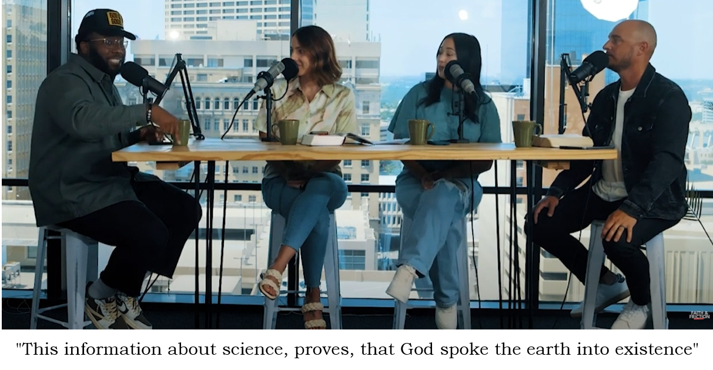

```{r setup, include=FALSE}
knitr::opts_chunk$set(echo = FALSE)

library(metathis)

meta() %>% meta_social(image = "https://jmdavis0352.github.io/What-are-we-doing/Stheory.png")


```

## The Initial Assertion

Starting around [20:18 time stamp](https://youtu.be/hV5c8TXUwuc?t=1218) the host on the far left states that

```{r assertion, out.width = 900,fig.cap= "Screen shot from 'Faith and Friction' podcast season 1, episode 3 titled 'New Age'; Source: https://youtu.be/hV5c8TXUwuc?t=1218" }


```

No it doesn't.

This "information about science" is almost entirely false and does not prove that the Northwest Semitic High Deity El (and/or the [probably] southern storm deity Yahweh who [probably] was imported from nomads integrating with cultures in the Southern Levant in the late 2nd Millennium BCE and who [probably] became conflated with El in the early 1st Millennium BCE)^[For discussions on the history of the patron Israel see @romer_invention_2015 or @wright_why_2023 or many other books and papers.] "spoke the Earth into existence". 

**This discussion *profoundly* misunderstands and misrepresents science in general while particularly misunderstanding and misrepresenting particle physics, quantum mechanics, and string theory. **

Pastor Jason MacKay (host on the far right) goes on:

>Physicists were trying to go "what is the material building block of all of the material physical world?" and so they would smash atoms together and then have electrons and neutrons and they'd smash them together and they're getting down to the smallest particles in our known universe. They, through quantum physics, discovered that the smallest building blocks of our universe are not material at all, they're vibrating strings...

No they didn't. The assertion in the last sentence is entirely false. 

But we'll come back to this because, as with most false assertions that require but a few lines to damage the worldviews of untold thousands of consumers, a proper rebuttal requires tens of pages that are too long, no one will read, but that I feel compelled to write anyway -- because I think it is a fundamentally critical requirement that in order for societies to flourish, their citizens and leaders make decisions via reasoning that is logically valid, based on premises that are true. 

## A Short Particle Physics Background and the Problems with the Initial Assertion

When MacKay describes particle accelerators smashing protons and neutrons together "getting down to the smallest particles in our known universe" he is basically correct in how these systems function. But, to properly understand the problems in this discussion, we'll need a little more knowledge. 

### The Background

The highest energy accelerator at present is the Large Hadron Collider (LHC) -- a 27km tunnel located at the border of France and Switzerland that contains 96 tons of superfluid Helium-4 and operates at 1.9 degrees Kelvin (-456.25 degrees F, colder than the universe, which comes in around 2.7K). LHC collides many different particles but most of the collisions are protons which (at peak energies) travel at 99.9999991% the speed of light in opposite directions. This is very fast. The difference between this speed and the speed of light is about 6.7 mph -- a brisk jog, bordering on a run. These protons could get to Neptune and back in about 10 hours [@atlas_forward_physics_new_2015]. Thinking in common units for speed, these protons are traveling over 186,000 miles per second. The collisions occur at particle energies of 14 Tera electronvolts (TeV)^[The simple version is that an eletronVolt is a measure of kinetic energy.] and allow physicists to test predictions from quantum mechanics and particle physics, and to explore the nature of matter in the very early universe (billionths of a second after the initial singularity -- the "Big Bang"). 

```{r LHC, fig.cap= "LHC ring with detectors and sub-rings annotated. Credit: Maximilien Brice (CERN), via: https://supernova.eso.org/exhibition/images/cern-aerial-cc/" }


```

Our best understanding of the building blocks of the universe is the [Standard Model of particle physics](https://en.wikipedia.org/wiki/Standard_Model). The Standard model includes quantum mechanics, and successfully describes 3 of the 4 fundamental forces (electromagnetism, the Strong nuclear force and the Weak nuclear force). Evidence that suggests the Standard Model is a reasonable description of the natural world is very strong, but Prior to 2013, the Standard Model was still missing empirical verification of a big piece.  

The design of LHC was influenced by the prediction of a boson with significant implications for the status of Physics in the 1960's, the so-called "Higgs boson"^[Yes, popular media call this the "God Particle" -- I hope we can all guess what physicists generally think of that name -- the name originates from a book by physicist Leon Lederman published in 1993, titled "The God Particle". Lederman's proposed title was "The Goddamn Particle" because of "frustration with regards to how difficult it was to detect"  [@lea_higgs_2022] but the publishers changed it. Almost certainly because they predicted better sales with the modified title.] . In the 1960's, known particles were calculated to be massless at high energies (according to the math of the Standard Model), but according to the data ((we can measure them) and the math, these particles have mass at lower energies -- so a mechanism was required through which high energy particles gained mass upon energy loss. 

Developed by Peter Higgs and five other physicists who wrote the papers in the 1960's [@higgs_broken_1964], the Higgs mechanism was the mathematical model that proposed mass-gain through interaction with a potential field and the existence of a corresponding particle (The Higgs field and Higgs boson). Within the lambda Cold Dark Matter model (ΛCDM - currently the leading formulation of "Big Bang" theory), matter interacted with the Higgs field 10<sup>-12</sup> seconds after the initial singularity (the bang) to gain mass as the universe expanded and individual particle energies fell. The mathematics of the Higgs mechanism and the Standard Model only broadly limit potential mass ranges for the Higgs Boson, but the math does specifically require particular properties for a given mass, which would decay into different particles in certain ways with known probabilities (from Standard Model calculations). This theoretical work in the 1960's defined possible decay patterns that would be detectable by plausibly feasible equipment. That equipment wouldn't exist until the 1980s when accelerators become powerful enough to reach energies that began to overlap with the range of the possibilities for the Higg's boson. 

The search for the Higg's boson began in earnest in the early 1980's with the design of the Superconducting Super Collider in Dallas, TX. This project was designed specifically to search for the Higg's and would have accelerated protons to energies of up to 20 TeV, but the project was plagued by budget issues and Congress killed it in 1993. The search continued at CERN's Large Electron-Positron Collider (LEP), where LHC is today, which was not specifically designed to search for it, but no detection occurred. These experiments did however give us lower bounds for Higg's mass -- the data from LEP suggested a mass greater thatn 114.4 $GeV/c^2$^[1 GeV/c2 = 1.78266192×10<sup>-27</sup> kg]. The Tevatron at FermiLab in Chicago took up the search in 2001 -- but it's detectors would  most likely only identify the Higg's if its mass fell between 140 - 180 $GeV/c^2$. The Tevatron at FermiLab operated until 2011 when LHC came online -- no Higg's detection was identified.

LHC initial runs in 2011 and 2012 led to confirmation that the Higgs boson exists [@the_atlas_collaboration_observation_2012] with further data precisely calculating the mass to 125.35 (+- .0.15 GeV) [@cms_collaboration_cms_2019]. My friend Philip (we were at Georgia Tech together -- he was a physics major but somehow ended up a medical doctor) and I had a bet going on whether they would find it -- I can't remember who won but both of us were kind of hoping they wouldn't find it, because that would firmly reject the Standard Model and all of particle physics would be have to be re-examined, which would have been exciting. But the confirmation was equally exciting because it was such a superlative example of scientific discovery, a superlative example of what science proving something actually looks like. With confirmation of the Higgs particle's existence -- the Standard Model was further empirically confirmed and it remains our best understanding of particle physics. 

```{r higgs, out.width = "90%", fig.cap="Data from the LHC detectors indicating a particle with a mass of ~ 125 GeV from [@cms_collaboration_cms_2019]. This is what it looks like when science proves something -- 40 years of unimaginably difficult and painstaking experiments, technological advancements, budget advocacy, and dedication were required to find that little bump in the data that indicate particle decays predicted for a Higg's boson with a mass of ~125 GeV back in the 1960's, when such detections weren't even phsically possible."}


```

The Standard Model works very well, and has been overwhelmingly confirmed experimentally, but there are good reasons to think it is incomplete in the way that Newtonian gravity is incomplete. The Standard models represents particle physics, quantum mechanics, and describes the electromagnetic and nuclear forces -- but it does not encompass gravitation, our best understanding of which is Einstein's General Theory of Relativity. General Relativity is incompatible with quantum mechanics. While both the Standard Model and General Relativity are overwhelmingly supported by experimentation as being accurate representations of the natural world -- their incompatibility suggests that we still lack some understanding, or that the two models are both in some ways incomplete.

Physicists are still seeking a complete "theory of everything" that coherently describes all four fundamental forces along with particle physics -- string theories are an attempt, but **string theories are not remotely related to discoveries emerging from particle accelerator experiments. **

### The Problems

Jason MacKay's statement that physicists were looking for "material" building blocks of the "material" world but then they "found" that such things "weren't material at all" implies that, prior to some recent discovery related to quantum physics - physicists had believed that the observable universe was entirely "material". 

**This is false.** Physicists and scientists have recognized energy as part of the natural world for over a millennium. The first theories of light emerged in Greece in the 5th century. An 11th century scientist living in present day Iraq (Ibn al-Haytham) developed experimental frameworks and used mathematics to describe nature, including early developments in optics and the nature of light including the suggestion that light moves very quickly but slows down in mediums like water. He was probably the first person to propose that we see objects because light from those objects enters our eyes. The first rigorous measurement of the speed of light occurred in 1676, when Ole Rømer observed that the orbital period of Jupiter's moon Io seemed shorter when Earth was approaching Jupiter versus when Earth was moving away -- his calculation estimated the speed of light within about 25% of its actual value. Newtons's theory of Gravitation requires that force is an immaterial action that operates instantaneously over any distance, and that all masses in the universe exert gravitational forces on each other^[With observations from nature we know this is not correct and these observations precisely correspond to mathematics in the General Theory of Relativity -- gravity moves at the speed of light and certain types of events, like the closer orbit of two neutron stars, should actually produce waves in spacetime that can be measured doing with the right insturments -- instruments like LIGO [(Laser Interferomter Gravitational-Wave Observatory)](https://www.ligo.caltech.edu/). Data processing for LIGO occurs at the University of Alabama in Huntsville and the first direct detection of Gravitational Waves in 2015 [@ligo_lab_gravitational_2016] -- almost exactly 100 years after they were predicted by the Theory of General Relativity -- is another brilliant example of what science proving something actually looks like. The orbit of a particular pair of neutron stars was observed to be decaying in the 1982. The energy loss matched what was predicted in General Relativity and the mathematics of that system provided a specific wave signature to search for -- resulting in the direct measurement in 2015. I remember the news.].

**McKay's statement that scientists** 

>through quantum physics discovered that the smallest building blocks of our universe are not material at all, they're vibrating strings

**is entirely false.** 

Vibrating strings have not been discovered as a result of particle accelerator experiments. They have not been discovered at all.

The strings he describes are the basis of a broad category of theories called string theory (within this umbrella reside bosonic string theory, superstring theory -- typically what is meant by capital S String Theory, and M-theory which are different formulations of the same fundamental framework). 

String theory has not been confirmed. Strings have not been discovered and the energies required to directly detect them are not feasible for any foreseeable future of human civilization (because strings are small -- one physicist put it this way: an atom is small relative to the size of the solar system in the same way that a string is small relative to the size of an atom). While there are other ways sting theories could be experimentally confirmed there is as yet no evidence to suggest that string theory is in any way related to the natural world. Complete formulations of String Theory that accurately describe the universe have not yet been developed. 

At the Strings 2024 conference last year, theoretical physicist Nima Arkami Hamed sadly noted that “String theory is spectacular. Many string theorists are wonderful. But the track record for qualitatively correct statements[from string theory constructions] about the universe is really garbage” [@woit_strings_2024]. 

But even if there was strong evidence that string theory was an accurate representation of the real physical world, the claims in this video would still not be supported by string theory. 


Mackay's response to the question about whether these strings were "like fibers" is entirely inaccurate. He states the strings are not like fibers, but "like sound". The "strings" in string theory are relativistic 1 dimensional massless constructs where the transverse velocity of the string wave is always equal to the speed of light. Sound is a mechanical wave that must propagate through a physical medium (air, water etc. there is no sound in space -- star wars is incorrect). In string theory, strings oscillate to create nodes in the wave that quantize into particles [only physicists who study string theory actually know what this means], but the mathematics requires that the ends of the strings (in open string theory) are fixed in different so called "D-branes" which are dimensions of spacetime -- this is why string theories require that spacetime has many extra dimensions (between 10 and 26 depending on which flavor you like). Our current best understanding of spacetime is Einstein's General Theory of Relativity -- which requires that spacetime is a 4 dimensional construct (3 spatial dimensions as you normally think of them + a time dimension -- because space and time are completely intertwined and one affects the other--- the evidence that General Relativity describes the real world is overwhelmingly strong -- we can measure precisely the predicted displacement of light through mass imposed spacetime curvature - we can measure precisely the predicted time dilation between two atomic clocks traveling at different velocities -- the GPS in your phone has to account for time dilation using math from Relativity because the clock in your phone's processor runs at a different rate than the one on the GPS satellites - because the satellites are going "faster" in a "flatter" spacetime curvature), but anyway -- 1 dimensional massless strings that are small compared to an atom the way an atom is small compared to the solar system, vibrating at the speed of light between compactified (the math requires the extra spatial dimension to be extremely small -- otherwise we would notice them -- the specific geometries that specific string theories propose for how these extra dimensions "roll up" so to speak is called compactification) spatial dimensions so that they can quantize into particles and photons is not in fact "like sound"; it is entirely unrelated to sound. But Mackay needs them to be like sound, or would like to imagine that they are like sound because....

The Hebrew word in Genesis for God "said" is אֲמַר (amara) within the phrase וַיֹּ֥אמֶר אֱלֹהִ֖ים יְהִ֣י (way-yō-mer - the pronunciation changes in the phrase -- indicated by the vowel markings around the Hebrew consonants). This word/phrase occurs almost 2000 times in the Hebrew bible and is the same word used to describe humans saying things to other humans (e.g. Genesis 22:5 "Abraham said to his young men" - "way-yō-mer ’aḇ-rā-hām ’el- nə-‘ā-rāw". There is no sense of the Hebrew that imparts any meaning other than an anthropomorphic creature activating throat structures to produce sounds waves that communicate to other creatures via phonetic language. These content creators are superimposing a superficially and erroneously constructed, imaginative framework on the text to create meaning that isn't there by appropriating sciency words that can be vaguely associated with Bible words to make it seem to anyone who doesn't already have a basic understanding of physics, cognitive linguistics, and Hebrew that late Bronze age mythology is still relevant. I'm certain no one who finds this video compelling imagines that string theory supports the truth of the claim that when the Babylonian Gods tested Marduk by demanding he: 

>Speak and let the constellation [of stars] vanish!
Speak to it again and let the constellation reappear

that he did in fact speak commands and made whole constellations of stars vanish and re-appear with the power of his words and all the lesser gods acknowledged his supremacy. Surely we don't think string theory is evidence that Marduk actually exists and can speak stars in and out of existence. That's obvious nonsense right? It's centuries older than the creation accounts in Genesis (yes there are two -- the older of these starts in the second half of Genesis 2:4 with "in the day that the Lord God made the earth and the heavens..." [KJV]) but Bablyonians were still practicing this religion contemporaneously when Israel and Judah were worshiping Yahweh and Asherah and feeding Yahweh lamb and wine and grains twice a day -- just like the Bablyonians fed their gods bulls and lambs fish and grains and beer twice a day. 

There is no sense of string theory in which the strings vibrate in way to make them "look and feel and sound like wood". Again string oscillation nodes quantize into Standard Model particles (quarks, gluons, protons, electrons, photons etc.), through specific compactified dimensional geometries that string theorists propose by developing exquisitely difficult mathematics. Wood does not have a vibrational frequency that emerges from string theory. 

Nothing in this discussion provides evidence that God (or any god) exists- it only contains *assertions* -- assertions that because these science words can be associated with these Bible words, the Bible words are proven by science. But if we put aside all of the above and grant for a moment that string theory was already confirmed, that it definitely described the natural world, and let's even grant that the link between Hebrew words describing people talking and 1 dimensional massless relativistic string oscillation was valid -- ALL of the rest of science still rejects the notion that a creator god who lives in space (or maybe in the compactified D-branes, or maybe outside of spacetime entirely) whiffed the earth into existence. Science requires a 4.5 billion year old earth and a 13.7 billion year old universe. Science has to reject the notion that female humans were created by modifying the meat from a male humans side (a better translation for the Hebrew word that was historically translated as "rib" -- more like side, flank  -- like a side of beef). Fundamentally science rejects supernatural claims that have no objective predictive value for describing the nature of the physical universe. But these content creators do not need to actually prove anything, or even make any real argument -- because they did not produce this video to convince skeptics -- they produced it to entertain, comfort, validate, and re-assure believers.  

If science proves God exists, wouldn't we expect that scientists are the God-believingist group of people? What do we actually find if we examine that question? Why do we suppose scientists actually are among the least likely people on the planet to believe that any of the gods exist? (many gods are still active in various religions across the planet -- do you believe in those other gods? Why not?) 


Suggested reading specifically related to this comment

On Hebrew:
https://biblehub.com/hebrew/vaiyomer_559.htm
https://biblehub.com/text/genesis/22-5.htm

On the Creation accounts in Genesis
https://www.thetorah.com/article/genesis-two-creation-accounts-compiled-and-interpreted-as-one

On The Babylonian Creation Myth (Enuma Elish)
https://faculty.gvsu.edu/websterm/Enuma_Elish.html

On String Theory and particle physics
https://physics.mit.edu/wp-content/uploads/2021/01/physicsatmit_04_vibratingstrings.pdf
https://www.math.columbia.edu/~woit/wordpress/?p=14059
https://www.math.columbia.edu/~woit/wordpress/?p=13953
https://www.math.columbia.edu/~woit/wordpress/?p=8214
https://www.astronomy.com/science/string-theory-is-not-dead-yet/
https://en.wikipedia.org/wiki/String_theory
https://en.wikipedia.org/wiki/Large_Hadron_Collider
https://en.wikipedia.org/wiki/Double-slit_experiment 
https://en.wikipedia.org/wiki/Quantum_state
https://cms.cern/news/cms-precisely-measures-mass-higgs-boson#:~:text=CMS%20physicists%20recently%20measured%20the,uncertainty%20of%20roughly%200.1%25!
https://atlas.cern/updates/feature/higgs-boson
https://royalsocietypublishing.org/doi/10.1098/rsta.2014.0384#:~:text=The%20mass%20of%20the%20Higgs,GeV%20%5B10%2C11%5D.
https://en.wikipedia.org/wiki/Higgs_boson
https://inspirehep.net/files/d7f44d26b641bff6e31705bf01cb5e41

On the notion that science proves god exists and the effect that should have on scientist's religiousity, but that isn't observed
--Ecklund, E, D Johnson, C Scheitle, K Matthews, and S Lewis. 2016. “Religion Among Scientists in International Context: A New Study of Scientists in Eight Regions.” Socius 2. https://doi.org/10.1177/2378023116664353.
--Larson, E, and L Witham. 1998. “Leading Scientists Still Reject God.” Nature 394 (313). https://doi.org/10.1038/28478.
--Pew Research Center. 2009. “Religion and Science in the United States.” Pew Research Center. https://www.pewresearch.org/religion/2009/11/05/scientists-and-belief/.


Distill is a publication format for scientific and technical writing, native to the web.

Learn more about using Distill at <https://rstudio.github.io/distill>.


